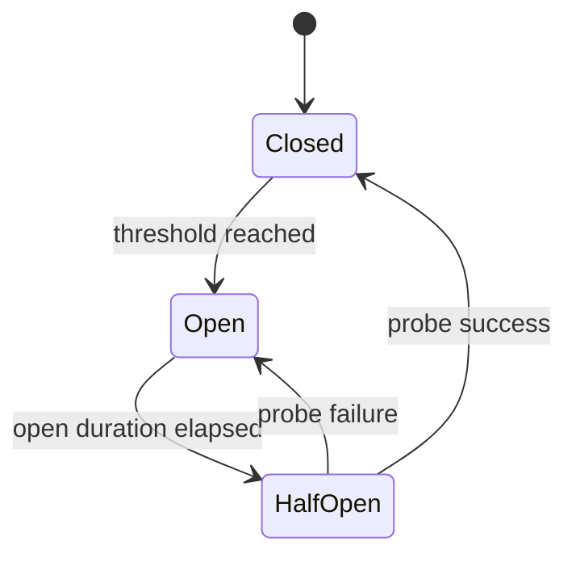

# Circuit Breakers

Circuit breakers are in-memory per provider/model.

Counted failures:

- connection failure
- timeout
- provider 5xx/unavailable
- repeated rate limiting
- invalid upstream response

Not counted:

- caller cancellation
- caller authorization failure
- invalid request
- unsupported capability
- Moira configuration validation failure

Circuit state is not synchronized across service instances in Phase 3.
