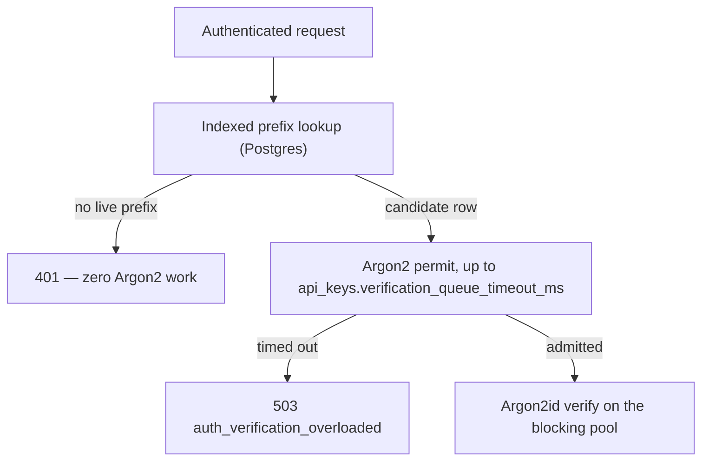
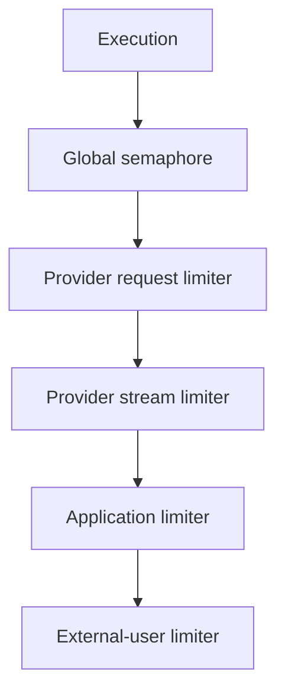

# Concurrency And Backpressure

Moira has **two** independent concurrency controls, and they sit on opposite sides of
authentication. Everything below the first heading runs before an actor exists; everything below
the second cannot run until one does.

## 1. The credential-hashing gate (authentication)

Every API-key check — `X-Consumer-Key`, `X-Moira-System-Key`, and the invite-token lookup behind
`POST /api/v1/admin/admin-invites/preview` and `.../redeem` — runs Argon2id against the stored
hash. Every key mint and rotation runs the same primitive to produce one. That work is
memory-hard by design: **19 MiB resident per operation**, at the OWASP-recommended parameters
(`m=19456` KiB, `t=2`, `p=1`).

It runs on tokio's **blocking** pool, never on a runtime worker thread, and is bounded by a
semaphore inside `ApiKeyHasher` (`src/security/api_keys.rs`) that every credential path shares by
construction.

### The bound, and where the number comes from

| Setting | Default | What it decides |
|---|---|---|
| `api_keys.verification_concurrency` | derived: one per core, clamped to `[1, 8]` | concurrent Argon2 operations, and therefore peak resident arena |
| `api_keys.verification_queue_timeout_ms` | `250` | how long a request waits for a permit before a `503` |

The bound is chosen from **CPU** and then checked against memory. Argon2id at `p=1` is
single-threaded per call, so permits beyond the core count buy zero throughput and cost 19 MiB
each. Rust reads the cgroup CPU quota, so the shipped chart's `resources.limits.cpu: "2"`
(`charts/moira/values.yaml`) derives **2 permits — a 38 MiB peak, 1.9% of the chart's
`limits.memory: 2Gi`**. `Settings::validate` refuses a configured value above 64, where the peak
would be 1,216 MiB, 59% of that limit.

`replicaCount: 1` is enforced (`charts/moira/templates/_helpers.tpl`), so there is no horizontal
escape hatch: raise `resources.limits.cpu` **and** `api_keys.verification_concurrency` together,
or leave the bound derived. Both are read once, at startup — a `resources` change restarts the
pod, which is when the new core count is picked up.

### The 503, and what it does not mean

`503` with `error.code = "auth_verification_overloaded"` means the request waited a whole
`verification_queue_timeout_ms` for a permit and never got one. **The presented credential was
never checked**, so this is not an authentication failure and rotating the key will not help.
It is always an error, never a silent `Ok(false)` — answering "invalid credential" about a
credential nobody looked at would surface an overload as a `401`.

It is declared on every operation whose `security` block names `systemKeyAuth` or
`consumerKeyAuth`. `GET /health/live`, `GET /health/ready`, `GET /metrics` and `GET /docs`
authenticate no API key, take no permit, and do not declare it — which is the point of running the
hashing off the runtime in the first place: probes keep answering while authenticated traffic is
queued.

Watch `moira_api_key_verification_total{operation="verify",outcome="shed"}` for the condition and
`moira_api_key_verification_queue_seconds` for the rise that precedes it. Key **minting** draws on
the same gate and is labelled `operation="mint"`: a shed spike beside mint traffic is somebody
rotating keys, not an authentication overload, and it clears on its own. See
[prometheus.md](prometheus.md).

### One coupling the arithmetic above does not price

The permit is acquired *before* `tokio::task::spawn_blocking`, so it is held for the queue wait in
tokio's blocking pool plus the Argon2 work — not the Argon2 work alone. That pool is shared: it
also serves `getaddrinfo` for every provider call and JWKS fetch. If it ever saturates, gate
permits are held far longer than the tens of milliseconds that make `250` ms a sensible timeout,
and authenticated traffic sheds for a reason with nothing to do with credentials.

It needs roughly 512 concurrent blocking tasks against a `global_execution_concurrency` of 100, so
it is remote. It is recorded because the alternative — acquiring the permit *inside* the closure —
is strictly worse: it parks a blocking thread per waiter and silently restores the 512-thread pool
as the real bound, which is the failure the gate exists to prevent. If this is ever suspected, the
tell is `moira_api_key_verification_queue_seconds` rising while `operation="verify"` admissions
stay flat.

### Why a bounded wait rather than an instant refusal

`ConcurrencyController` below uses `try_acquire_owned` and refuses immediately. That is right for
permits held for seconds to minutes of upstream provider work and wrong here, where a permit is
held for tens of milliseconds: instant shedding at a bound of 2 would return `503` to a
well-behaved caller's two-request burst. Queueing without a bound is the other wrong answer — the
only backstop would be the route timeout, which is never below 30 s. Same primitive, different
holding time, different policy.

## 2. Execution limits (after authentication)

Phase 3 uses in-memory hierarchical concurrency limits. These key on the resolved application and
external user, so they structurally cannot bound work that happens before an actor exists — which
is why the gate above is a separate control rather than an earlier tier of this one.

Acquisition order is stable: global, provider request, provider stream,
application, external user. A streaming request consumes both provider request
and provider stream capacity. Permits cover the complete active upstream attempt
and are released before retry backoff or provider fallback.

Dynamic provider/application/user limiter maps are bounded. Internal event streams use bounded Tokio channels configured by `runtime.internal_stream_queue_capacity`.

These controls, rate limits, and circuit state are process-local. Production MVP
validation therefore requires exactly one API replica.
