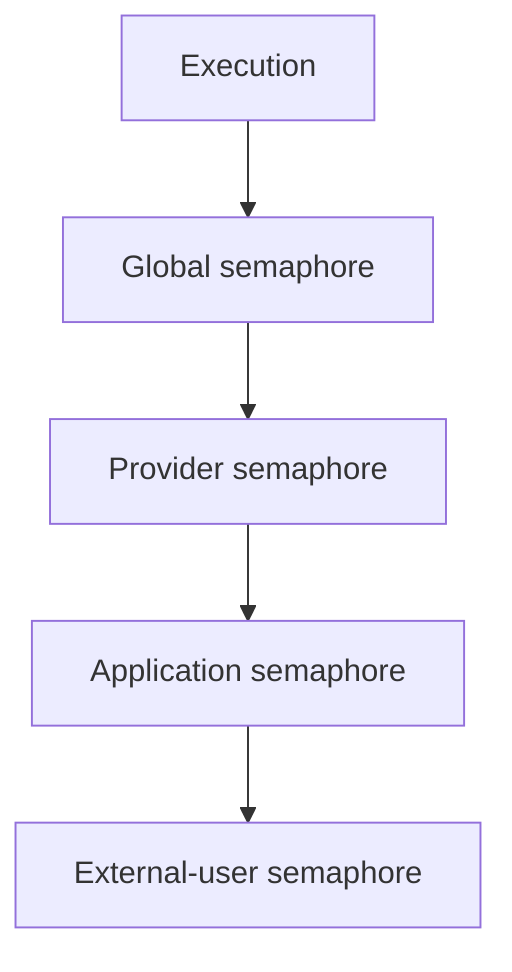

# Concurrency And Backpressure

Phase 3 uses in-memory hierarchical concurrency limits.

Acquisition order is stable: global, provider, application, external user. Permits are owned and released on success, error, timeout, or cancellation drop.

Dynamic provider/application/user limiter maps are bounded. Internal event streams use bounded Tokio channels configured by `runtime.internal_stream_queue_capacity`.
