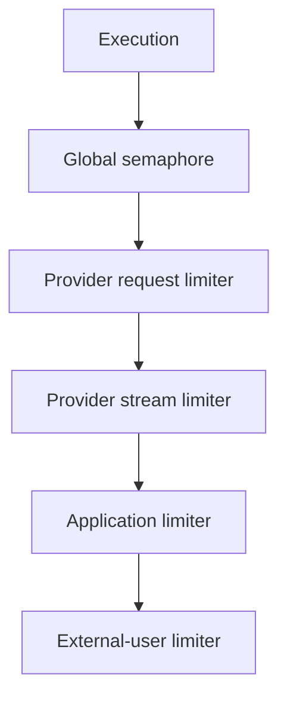

# Concurrency And Backpressure

Phase 3 uses in-memory hierarchical concurrency limits.

Acquisition order is stable: global, provider request, provider stream,
application, external user. A streaming request consumes both provider request
and provider stream capacity. Permits cover the complete active upstream attempt
and are released before retry backoff or provider fallback.

Dynamic provider/application/user limiter maps are bounded. Internal event streams use bounded Tokio channels configured by `runtime.internal_stream_queue_capacity`.

These controls, rate limits, and circuit state are process-local. Production MVP
validation therefore requires exactly one API replica.
