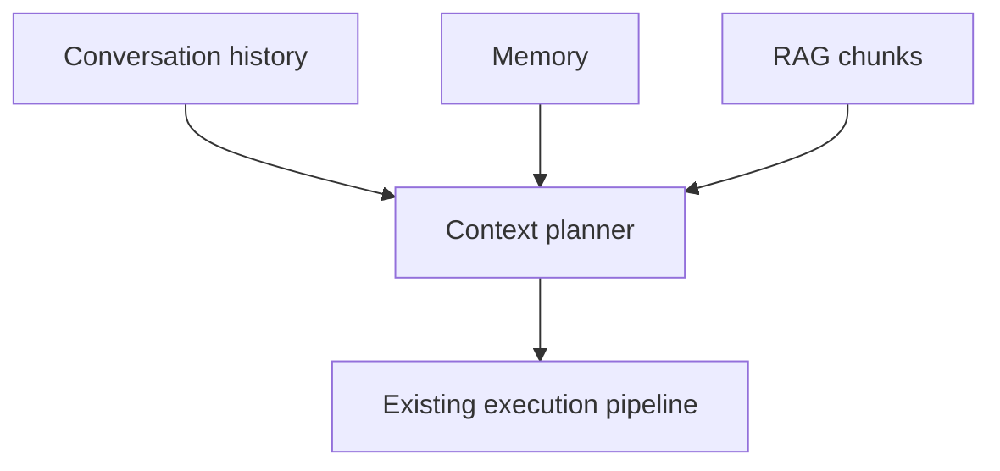

# Context Planning

Implemented in `src/application/context_planner.rs` (pure assembly and budgeting) and
`ConversationService::plan_context` (retrieval I/O and row writes). Plan 11 Sub-Phase D.

## Two different orders

`ContextPlanner::deterministic_phase_five_order()` is a **drop-priority** order, most protected
first — *not* the order messages appear on the wire. Read as a wire order it says the current
input comes second, before any history, which is not how a chat completion is shaped.

1. protected instructions
2. current input
3. tool state
4. recent messages
5. conversation summary
6. retrieved memory
7. retrieved RAG
8. older history

`ContextPlanner::wire_order()` is the assembly order: conversation summary, recent messages,
retrieved memory, retrieved RAG — then the caller's own messages, last.

`ContextPlanner::optional_drop_order()` is the exact reverse of the priority order's optional
tail: retrieved RAG, retrieved memory, conversation summary, recent messages. Neither
`protected_instructions` nor `current_input` appears in it at all — they are not droppable, so
there is no code path that could drop them. `the_drop_order_is_the_reverse_of_the_priority_order`
pins the relationship so the two cannot drift apart.

## What the planner does

1. Reads the conversation policy and the retrieval policy.
2. Loads bounded recent history, excluding the turn this request just wrote.
3. Loads the latest non-superseded `conversation_summaries` row. Sub-Phase E writes that table
   now — see `docs/conversation-summarization.md`. The read was wired one wave ahead of the
   writer, deliberately, because the summary's position in the drop order is meaningless
   untested and adding it later would have changed the drop order silently. Nothing in this
   step changed when the writer landed, which is what that ordering bought.
4. Embeds the current turn and runs both retrieval arms, when enabled.
5. Budgets, dropping optional sections in the documented order.
6. Writes one `context_plans` row and one `retrieval_runs` row.

`history_strategy = 'recent_messages'` suppresses the summary block even when one exists.
`full_until_limit` reads 4x `maximum_recent_messages`, capped at 200 — the token budget is the
real bound, and reading an unbounded conversation to then discard most of it is a
denial-of-service shape, not a feature.

When nothing is planned, no `context_plans` row is written. A row of empty arrays on every
unretrieved turn would bloat the table and make the diagnostic surface useless.

## Failure behaviour

`application_embedding_policies.failure_behavior` decides what a retrieval failure does:

- `continue_without_semantic_retrieval` (the default) degrades: the turn proceeds without
  retrieved content and the caller gets `200` with empty citations. *A broken vector index must
  never take down the execution path.*
- `fail_request` surfaces `422`/`503 retrieval_unavailable`.
- **Any other value is treated as the default.** The column has no check constraint, so a typo is
  storable, and turning a typo into a `503` on the response path would be the worst reading of an
  ambiguous setting. `an_unrecognised_failure_behavior_is_treated_as_the_permissive_default`
  pins it.

`context_length_exceeded` is not subject to this: it is a caller-input problem, not a retrieval
outage, and degrading it would mean silently truncating the caller's own turn.

## Security

See [`rag-security.md`](./rag-security.md) for the prompt-injection boundary. It is the
security-critical property of this sub-phase.
