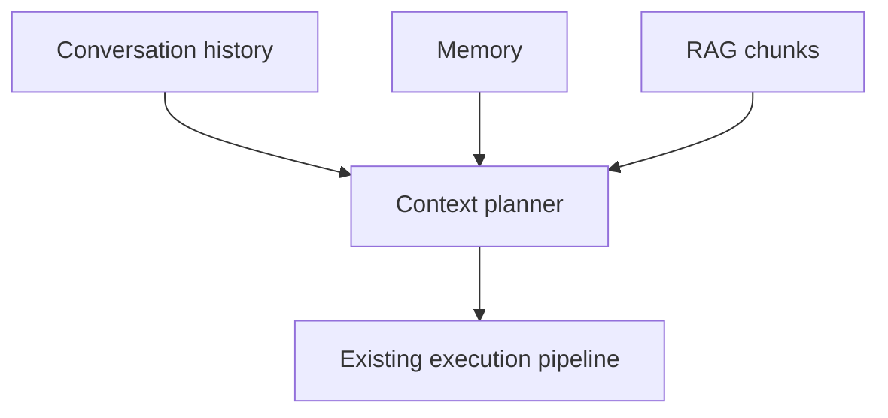

# Context Planning

Phase 5 introduces a context-planning boundary. The deterministic priority order is:

1. protected instructions
2. current input
3. tool state
4. recent messages
5. conversation summary
6. retrieved memory
7. retrieved RAG
8. older history

The current code records the boundary and ordering but does not yet inject memory/RAG context into the live prompt.

