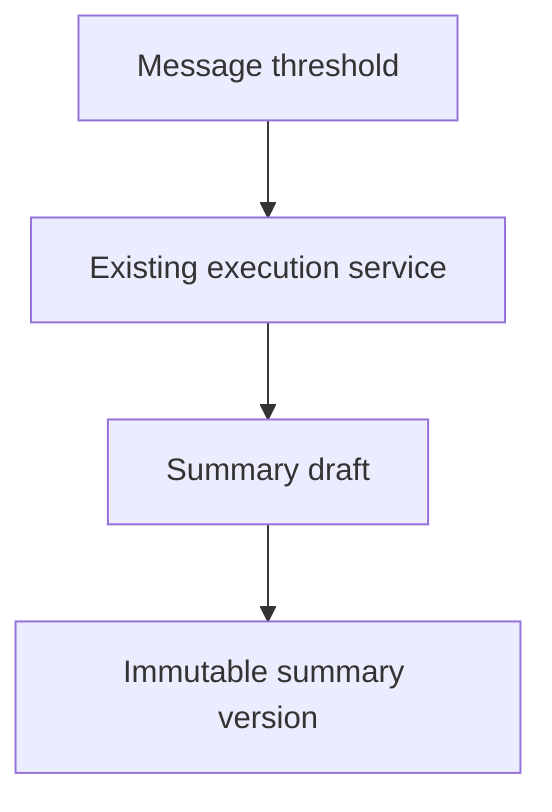

# Conversation Summarization

Conversation summaries are modeled as immutable records in `conversation_summaries` with coverage boundaries and supersession.

Automatic summarization execution is not enabled yet. The schema and policy fields are in place for a summarizer that uses the existing execution service, not direct provider calls.

