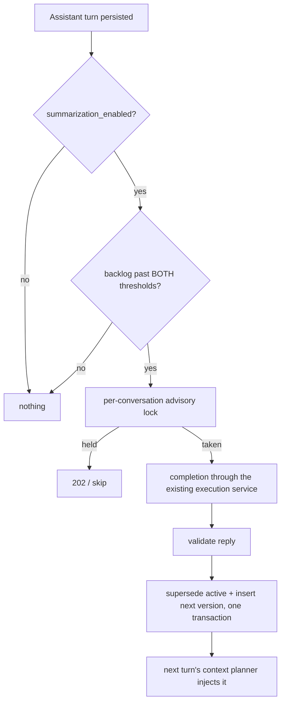

# Conversation Summarization

Conversation summaries are immutable rows in `conversation_summaries` with coverage boundaries and
supersession. Plan 11 Sub-Phase E implements them; before it, the table had two readers and no
writer.

## Two entry points

| | Manual | Automatic |
|---|---|---|
| Trigger | `POST /api/v1/conversations/{id}/summarize` | after an assistant turn is persisted |
| Scope | `moira:conversations:write` | none — it is not a caller action |
| Thresholds | bypassable with `{"force": true}` | always enforced |
| Failure | `502 summarization_failed` | recorded on the metric and the audit row; the caller's response is untouched |

The scope check lives on the endpoint, not on the operation. The automatic path runs with whatever
key issued `POST /api/v1/responses` — typically `moira:responses:create` and nothing else — so
putting `moira:conversations:write` in the shared body would have made automatic summarization
silently never run while every flag said it was on.

## What `force` does not bypass

- **`summarization_enabled`.** An operator's switch is not a threshold, and the endpoint is
  caller-plane: the caller is not the operator.
- **An empty backlog.** `conversation_summary_boundary_unique (conversation_id,
  covers_through_sequence)` makes a second summary at the same boundary unrepresentable. The check
  is stated in code so this arrives as a `409 summarization_not_needed` rather than a database
  error at 500.

Both thresholds must be met, not either: `minimum_messages_since_summary` is a floor on how small
an increment is worth a model call, and `summary_trigger_tokens` is the trigger. A chatty
conversation of 500 one-word turns does not summarize, and neither does one large exchange.

## Coverage

A run reads at most 200 messages after the active summary's `covers_through_sequence`, **oldest
first**, and sets the new boundary from the newest message it actually read. A long backlog
therefore takes several runs and never leaves a hole — reading the tail instead would advance the
boundary over messages no summary ever saw.

## Prompt boundary

Moira's summarization instruction is the only `System` message. The transcript and the *previous
summary* are both `User` messages carrying explicit labels. The previous summary is treated as
untrusted even though Moira produced it: it is a model artefact of user content, and folding it
into the instruction slot is the only way an injection could escalate across summarization
generations rather than dying with the turn that carried it.

## Concurrency

One session-scoped advisory lock per conversation, taken in PostgreSQL's two-argument
`(int, int)` lock space — which never overlaps the `bigint` space every other advisory lock in
this repository uses, so a key derived from a conversation id cannot collide with a declared one.
The lock is held on a connection detached from the pool, so dropping it (including while
unwinding) releases the lock. A second request while it is held gets `202` with `Retry-After`.

The lock is an optimisation, not the correctness boundary. Two runs that somehow raced would still
be refused a duplicate row by `conversation_summary_boundary_unique`.

## Storage and hashing

`summary_hash` is `request_hash` over the summary bytes — an unkeyed content address, admitted by
finding F14's per-table rule because it is not caller-visible, never a caller-supplied lookup key,
and never compared across applications. It is deliberately **absent** from
`ConversationSummaryRecord`: publishing it would make it an offline oracle over candidate summary
plaintexts.

`summary_text` on the API record is optional, mirroring `ConversationMessageRecord.content`: "a
summary exists" and "the summary text is available" are two separate facts.

## Known limits

- Summarization runs **inline**, not on the queue, because `run_supervisor` still wires
  `queue::StubJobDispatcher` — an enqueued run would be claimed and dropped. It moves behind
  `conversation-summarization-retry` the moment a real dispatcher lands.
- There is no `conversation_summarization_runs` table, so a failed automatic run is visible on
  `moira_summarization_runs_total{outcome="failed"}` and in `audit_logs`, but is not individually
  retryable or inspectable the way `memory_extraction_runs` is.
- The summary body is not screened for credential-like text. A rejected summary would not advance
  the coverage boundary, so a conversation containing one screened token would re-trigger a model
  call every turn forever. The instruction asks the model not to include secrets, and the leak
  suites assert summary text reaches neither logs nor audit rows. This reverses the moment a runs
  table exists to bound the retry.
- `conversation_content_persistence` **is** honoured, as of finding F32's fix. The message path
  enforces it in `add_message` and the summary write enforces it here: under a policy that does
  not admit plaintext, `summary_text_plain` is null while `covers_through_sequence`,
  `summary_hash` and `token_count` are still written. The run happened and really does cover that
  backlog; recording the boundary without the body is the honest outcome.

  Under a *steady* `none`/`metadata_only` this branch is never reached — messages carry no
  plaintext, so `build_summarization_plan` refuses before any model call. It is reached when a
  conversation accumulated plaintext under `plain_content` and the operator then tightened the
  policy, which is the case `a_summary_is_withheld_when_the_policy_no_longer_admits_plaintext`
  drives.
- `encrypted_content` **does not encrypt**, and the admin API refuses it
  (`conversation_content_persistence_unsupported`, 422). No cipher is wired to the
  `content_encrypted`/`summary_text_encrypted` columns on any table. A policy row that already
  holds the value keeps parsing and fails closed — no plaintext is written under it.
