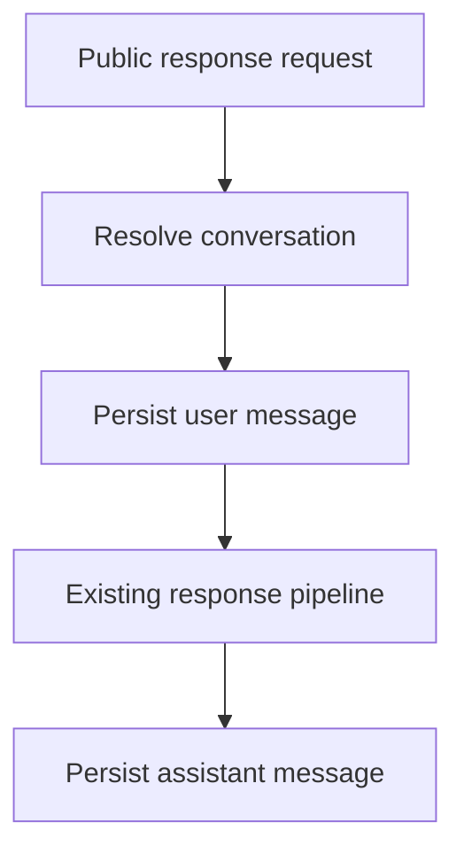

# Conversations

Conversations are ordered, application-bound interaction history. They are distinct from long-term memory and RAG documents.

Conversation ownership is always scoped by `application_id` and may also include `external_tenant_id` and `external_user_id` from authenticated identity. Request bodies do not override identity.

Messages use transactionally allocated `sequence_number` values. Direct assistant-message creation is denied for ordinary callers.

