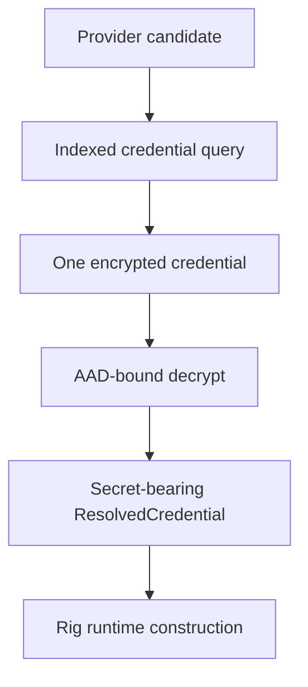

# Runtime Credential Resolution

Credential resolution runs after a specific provider/model candidate is selected.

Resolution precedence:

1. Explicit authorized stored credential.
2. User + application + tenant.
3. User + application.
4. User + tenant.
5. User.
6. Application + tenant.
7. Application.
8. Tenant.
9. Global.

Only the selected credential is decrypted. Decrypted values are kept inside runtime construction/execution and are redacted from `Debug`.
