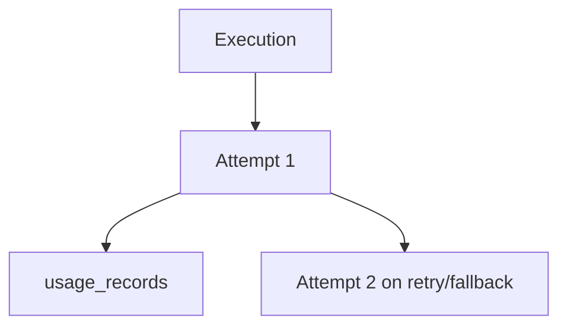

# Execution Attempts And Usage

Runtime persistence is split by responsibility:

- `execution_attempts` stores each upstream attempt.
- `usage_records` stores normalized usage for every attempt the provider **reported usage for** —
  which is every successful attempt, plus the one failure class that is raised after a complete,
  billed reply (see below).

Stored fields include selected route, provider, model, credential id, latency, status, safe failure class, provider status code, and normalized usage.

## A failed attempt that still costs tokens

Most failures happen before or instead of a reply — a timeout, a refused connection, a 500 — so
the provider reported nothing, the attempt row's token columns stay `NULL` and no `usage_records`
row is written. `UsageSummary` is all-`Option`, and all-`NULL` there means *unknown*, not *zero*.

One failure class is different: `structured_output_invalid` raised on the *reply*
([#80](https://github.com/nurcahyo/moira/issues/80)). The model answered, the provider counted and
will invoice the tokens, and Moira refuses the answer because it is not JSON. That attempt records
the provider's real counts and writes a `usage_records` row, exactly as it did when the same
request still succeeded — otherwise a caller could obtain unmetered provider work by pointing a
schema at a backend that does not honour it. The row carries
`metadata.attempt_outcome = "failed"` and `metadata.failure_class`, so a billing job can tell a
metered refusal from a metered answer without joining back to `execution_attempts`.

A failure raised *mid*-stream deliberately does not do this: it is retryable and
fallback-eligible, so its partial counts would be added to whatever the retry reports, and it was
never a metered success to begin with.

Not stored:

- prompt body
- provider secret
- raw authorization header
- raw provider response body
- full JWT claims

When pricing is unavailable, estimated costs remain `null`.
