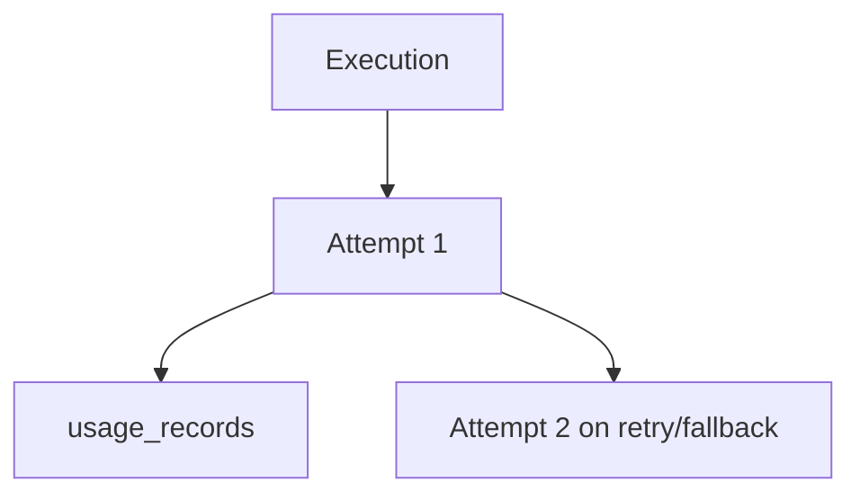

# Execution Attempts And Usage

Runtime persistence is split by responsibility:

- `execution_attempts` stores each upstream attempt.
- `usage_records` stores normalized usage for successful attempts.

Stored fields include selected route, provider, model, credential id, latency, status, safe failure class, provider status code, and normalized usage.

Not stored:

- prompt body
- provider secret
- raw authorization header
- raw provider response body
- full JWT claims

When pricing is unavailable, estimated costs remain `null`.
