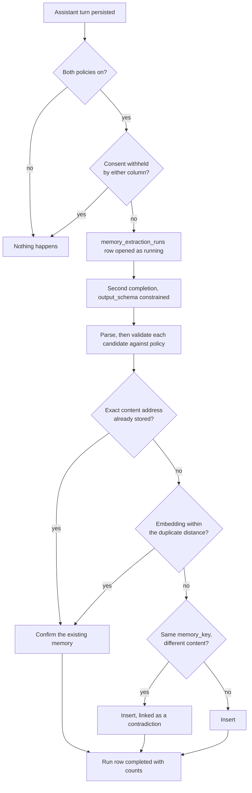

# Memory Extraction

Automatic memory extraction is **implemented** (plan 11 Sub-Phase F) and **off by default**.
Nothing changes for an application until an operator turns it on.

## Turning it on

Four switches, all of which must be on, plus consent:

| Setting | Table | Default |
|---|---|---|
| `enabled` | `application_memory_policies` | `false` |
| `automatic_extraction_enabled` | `application_memory_policies` | `false` |
| `memory_enabled` | `application_conversation_policies` | `false` |
| `memory_extraction_enabled` | `application_conversation_policies` | `false` |

## Consent is read from two columns, and the stricter one wins

`application_memory_policies.consent_mode` and
`application_conversation_policies.memory_consent_mode` are independent columns over the same
four values, both defaulting to `'explicit_only'`, and nothing in the schema makes them agree.
Extraction takes the **more restrictive** of the two:

| Effective mode | What extraction does |
|---|---|
| either column `disabled` | nothing at all — no memory, and **no run row**, because the row would itself record that the conversation was read for extraction |
| either column `explicit_only` | writes `status = 'candidate'`, which retrieval never serves; the caller confirms through `PATCH /api/v1/memories/{id}` |
| both `application_managed` / `automatic_with_user_controls` | writes `status = 'active'` |

## Cost

Extraction issues a **second completion call per assistant turn**, through the same route the
caller's own turn used — same provider, same credential, same model policy. There is no separate
extraction route today; see the reversal condition on `ConversationExecutionLink::route_hint`.

**Extraction is not the only inline call on that path.** `record_assistant_response` awaits
extraction and then, on the next line, `maybe_summarize_after_turn` — which is *also* inline
(`docs/conversation-summarization.md`, "Known limits") and makes its own completion call. So the
per-turn model cost is:

| Turn | Provider calls |
|---|---|
| both features off — the defaults | 1 |
| extraction on | 2 |
| summarization on, and the backlog past **both** its thresholds | 2 |
| both on, backlog past both thresholds | **3** |

Extraction's cost is per turn. Summarization's is amortised — a run happens only once
`minimum_messages_since_summary` and `summary_trigger_tokens` are both crossed, so it is roughly
one extra call per `summary_trigger_tokens` of conversation, not one per turn. An application
with both switched on should budget for *at least* double the per-turn model cost and latency,
with a third call on the turns that trigger a summary.

Three consequences worth planning for (findings F28 and F34):

- **Permit demand doubles per turn, and triples on a turn that also summarises.** Each extra call
  takes a permit from the same per-provider / per-application / per-user pool the caller's own
  request used. The permits are taken **one after another and never held together**: the caller's
  is released before extraction starts, and extraction's before summarization starts, so there is
  no deadlock. Under saturation the extra call is simply refused — recorded as
  `extraction_call_failed`, or for summarization as a
  `moira_summarization_runs_total{outcome="failed"}` increment — leaving the response untouched.
- **On the streaming path, the terminal event is delayed.** Tokens stream live and are unaffected,
  but `response.completed` is emitted *after* both extraction and summarization finish, so a
  client that waits for it sees the last token, then a pause of one extraction round-trip — two
  round-trips on a turn that also summarises — then completion.
- **A conversation-linked turn also pays database round-trips.** Summarization's read path runs on
  every such turn even when the feature is off. Finding F37 cut that from six round-trips to three
  by hoisting the `summarization_enabled` gate above the backlog reads; the remaining three are
  the authorization predicate, the policy upsert and the conversation anchor.

## What it will not write

Each candidate is validated independently, and a refusal costs one `rejected_count`, never the
run:

- a `memory_type` outside `allowed_memory_types`, or one the schema does not declare;
- a `sensitivity` outside `allowed_sensitivity_levels`;
- a `confidence` below `minimum_extraction_confidence`, or one that is not a finite number in `[0, 1]`;
- empty content, or content over 4 KiB — two orders of magnitude below the ceiling for
  caller-supplied memories, because this content is model-supplied;
- content that looks like credential material, using the same needle list the manual memory path
  applies;
- anything past the sixteenth candidate in one run.

Per-reason counts land on `memory_extraction_runs.metadata`. They are deliberately **not** metric
labels — see `ALLOWED_LABEL_KEYS` in `src/infra/metrics.rs`.

## Failure is invisible to the caller

Extraction cannot change a response. A failed extractor, an unparseable reply, or a database
error leaves the response exactly as the model produced it and records the reason on
`memory_extraction_runs.failure_class`. That is why the three `moira_memory_extraction_*` metric
families exist: without them, "extraction silently stopped working" and "nobody enabled
extraction" look identical.

The values that column can hold are:

| value | meaning |
|---|---|
| `structured_output_invalid` | the model replied, and the reply was not the declared envelope |
| any `ExecutionFailureClass` code — `provider_upstream_error`, `provider_timeout`, `capacity_exhausted`, `route_not_found`, … | the extraction call reached the execution kernel and that is what it reported |
| `extraction_call_failed` | there was no execution to ask: no database pool, the execution service could not be constructed, or `execute` itself returned an error |

Recording the execution's own class is finding F29's third precondition. Before it, every one of
those cases was flattened to `extraction_call_failed`, so "the model did not comply" and "the call
did not happen" were indistinguishable on the row that exists to tell them apart.

## The prompt boundary

The transcript handed to the extractor is untrusted user content. Moira's guarantee is structural
and is stated exactly:

- Moira's extraction instruction is the **only** `System` message.
- The transcript is **only ever** a `User` message, carrying an explicit non-instruction label.
- A stored turn claiming the `system` role is rendered as `user`, the same downgrade the context
  planner applies to replayed history.

What this does **not** claim is that the model obeys the boundary — model behaviour is outside
Moira's boundary. The boundary is therefore defended twice: whatever the extractor returns still
has to clear the application's policy, so a transcript that talks the extractor into proposing a
`restricted` memory still gets it rejected where the policy does not allow `restricted`. Injection
here can waste a run; it cannot widen a policy.

## Isolation

Every dedupe and contradiction lookup binds `application_id` in the same query, through one shared
predicate constant. This is load-bearing rather than incidental: `memory_records.content_hash` is
an **unkeyed content address** (finding F14), which is only safe while it is never compared across
applications. A dedupe that could reach another application's rows would be an existence oracle
over that application's memories.

Explicit memory creation continues to reject secret-like content and to record safe audit metadata.
Extraction's own audit row carries counts only — never the transcript, never the extracted text.

## Not yet built

- **The `memory-extraction-retry` worker.** The name is registered and metric-seeded, but the
  queue's dispatcher is still `StubJobDispatcher`, so a failed run is not retried. It is recorded
  on the run row and nowhere else.
- **Semantic contradiction detection.** The heuristic is `memory_key` equality with a differing
  content address, which is what the plan specifies for the initial implementation. Two memories
  that contradict each other under different keys are not detected.
- **A configurable near-duplicate threshold.** It is a code constant; see decision D-F1.
