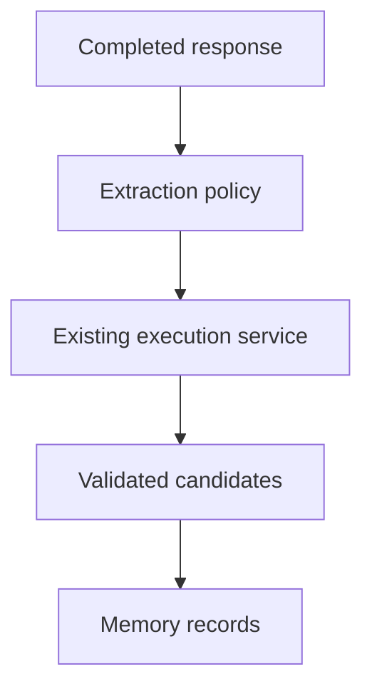

# Memory Extraction

Memory extraction is modeled through `memory_extraction_runs` and source references on `memory_records`.

Automatic extraction is not active yet. Explicit memory creation rejects secret-like content and records safe audit metadata.

