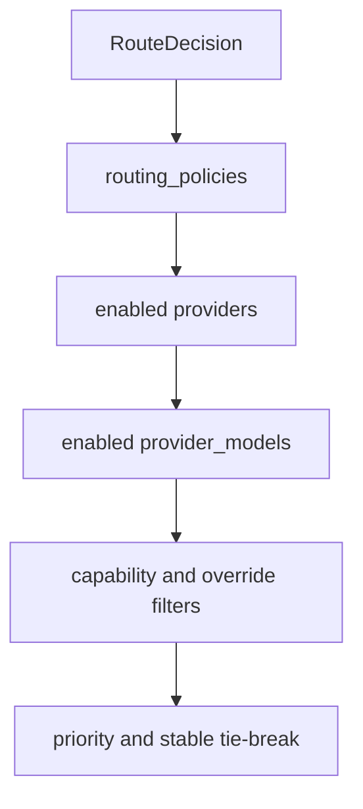

# Model Routing

Model routing answers which configured provider/model should execute a selected route.

Candidates are loaded from `routing_policies` joined to `providers`, `provider_models`, and `provider_runtime_policies`.

Hard filters:

- active route policy
- active provider
- active model
- active runtime policy
- application and tenant scope compatibility
- required capabilities
- authorized provider/model override

Ranking is deterministic: policy scope specificity, priority ascending, weight descending, provider id, then model id. Weighted routing is represented in policy data and excluded when weight is zero, but priority fallback remains the default behavior.

## Context router (issue #213, MVP-static slice)

The ranked candidate list `list_model_candidates` returns is fixed before the fallback loop
starts and is not reordered by request-level signals in this slice. `ExecutionOptions.priority`
and `ExecutionOptions.complexity_hint` exist on the wire, gated by the same authorization posture
as `route_hint`/`model_hint` (`moira:execution:override-priority` /
`moira:execution:override-complexity-hint`), but do not change candidate ordering yet — the
weighted `cost_weight`/`latency_weight`/`quality_weight` scoring consumer, gated by
`routing_policies.scoring_enabled`, is deferred work.

Each candidate's 0-based position (`candidate_rank`), score (always `null` in this slice) and
`selection_reason` (`priority` | `explicit_hint` | `scored` | `fallback_after_failure`) are
recorded on the `execution_attempts` row that attempt wrote, and the full ranked list is emitted
once per execution as a `CandidateRanked` runtime event — see [retry and fallback](retry-and-fallback.md)
for how `selection_reason` relates to the fallback loop, and `application_routing_defaults`
(`PUT /api/v1/admin/applications/{id}/routing-defaults`) for the per-application priority default
a caller's `priority` falls back to.
