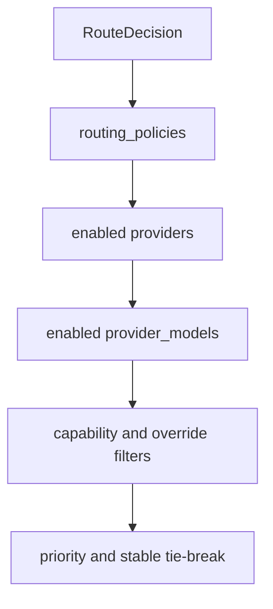

# Model Routing

Model routing answers which configured provider/model should execute a selected route.

Candidates are loaded from `routing_policies` joined to `providers`, `provider_models`, and `provider_runtime_policies`.

Hard filters:

- active route policy
- active provider
- active model
- active runtime policy
- application and tenant scope compatibility
- required capabilities
- authorized provider/model override

Ranking is deterministic: policy scope specificity, priority ascending, weight descending, provider id, then model id. Weighted routing is represented in policy data and excluded when weight is zero, but priority fallback remains the default behavior.
