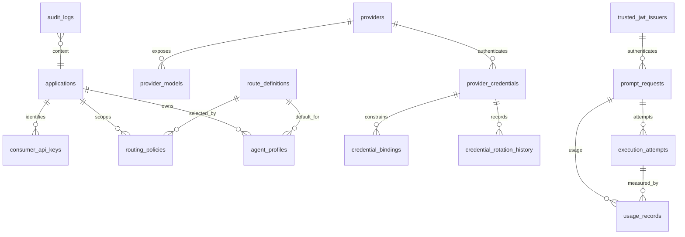
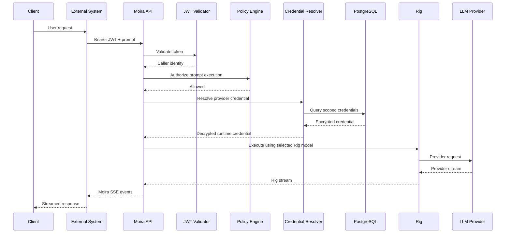
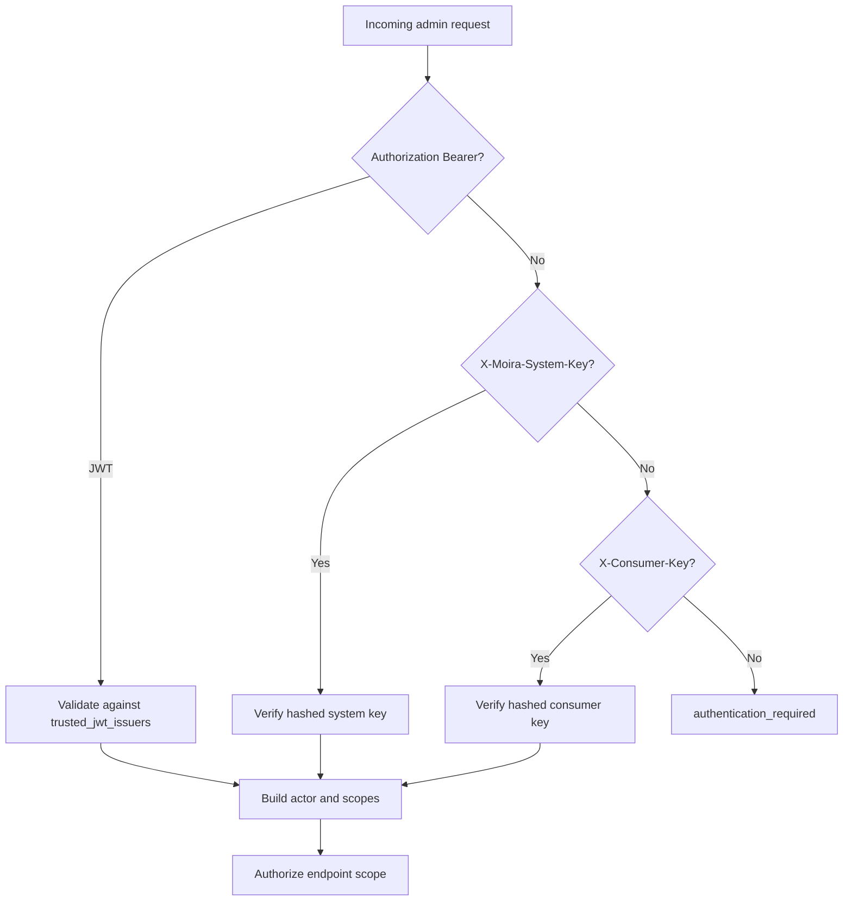
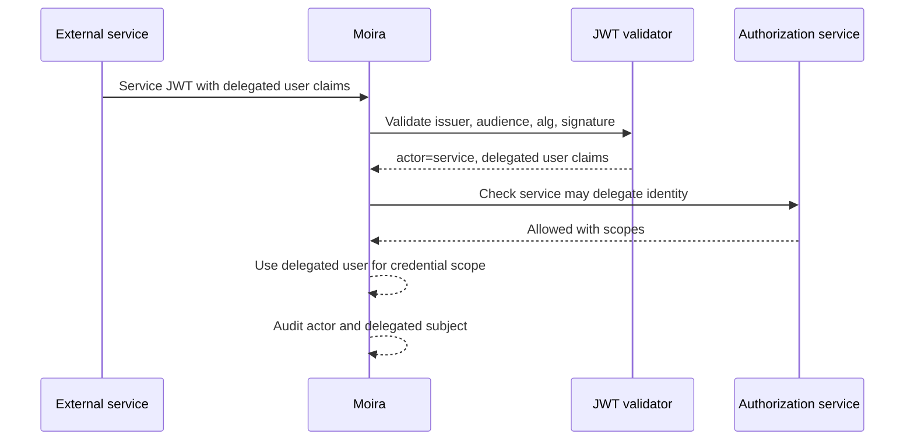
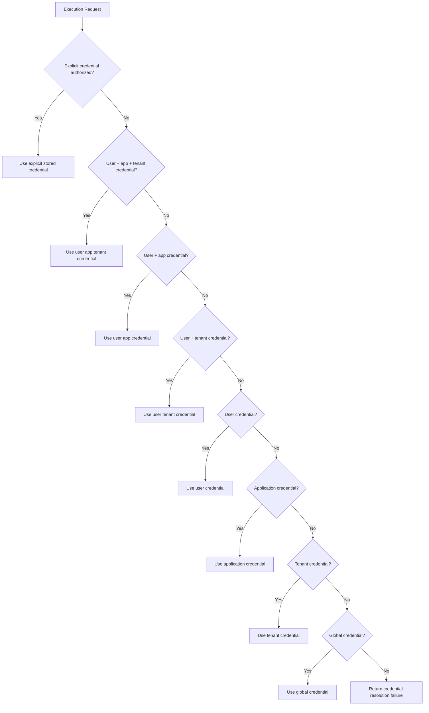

# Moira Security, Auth, Credentials, Schema, and OpenAPI Design

Status: design proposal, pending approval.

This document responds to "Moira Engineering Specification Part 2" and intentionally stops at the approval gate. It does not add migrations or production implementation.

## 1. Repository Audit

### 1.1 Existing workspace structure

Moira is currently a single Rust crate under `/Users/nalhide/Project/motrait/moira`.

```text
src/
  app/
  config/
  domain/
  http/
  infra/
  orchestration/
  security/
  error.rs
migrations/
config/
docs/
skills/
```

The local project-structure rule keeps Moira as orchestration over Rig. The existing docs already name the same boundaries in `docs/project-structure.md`.

### 1.2 Existing crates and modules

`Cargo.toml` defines one package, `moira`, using Axum 0.8, SQLx 0.8, jsonwebtoken 9, AES-GCM, reqwest, and `rig-core = 0.40`. There is no workspace member split today.

Current module ownership:

- `src/app/state.rs`: process composition, HTTP client, PostgreSQL pool, cipher, runtime cache, admin auth, caller auth.
- `src/config/settings.rs`: static process config from TOML and `MOIRA__` env.
- `src/domain/models.rs`: provider, credential summary, audit, health, and OpenAI-compatible chat request structs.
- `src/http`: route registration plus admin, chat, and health handlers.
- `src/infra`: database connection, migrations, PostgreSQL listener, row mapping.
- `src/orchestration`: runtime provider cache, provider lookup, credential lookup, base URL normalization, OpenAI-compatible execution.
- `src/security`: JWT extraction/validation and AES-GCM credential encryption.

### 1.3 Existing database models and migrations

Two migrations exist:

- `0001_extensions.sql` enables `pgcrypto` and `vector`.
- `0002_runtime_config.sql` creates `tenants`, `applications`, `providers`, `provider_credentials`, `routing_policies`, and `audit_events`.

Important current schema traits:

- `tenants.id` and `applications.id` are `text` primary keys.
- `providers` has `tenant_id`, `application_id`, `kind`, `base_url`, `default_model`, `enabled`, and non-secret `metadata`.
- `provider_credentials` stores encrypted provider secret material as `key_id`, `nonce_base64`, and `ciphertext_base64`; scope is `owner_scope + owner_id`.
- `routing_policies` maps tenant/application scope to provider/model default.
- `audit_events` is a minimal audit table.
- Runtime config cache invalidation uses PostgreSQL `NOTIFY` on provider, credential, and routing policy changes.

### 1.4 Existing authentication code

Admin and caller auth live in `src/security/auth.rs`.

- Admin auth can be disabled. When disabled, every admin request becomes `dev-admin` with `moira.admin`.
- Admin auth, when enabled, accepts only `Authorization: Bearer <jwt>` and validates against a statically configured JWKS URL, issuer, audience, and one required scope.
- Caller auth can trust dev headers: `x-moira-user-id`, `x-moira-tenant-id`, `x-moira-application-id`.
- Caller auth, when enabled, also validates a statically configured bearer JWT.
- The current `Actor` contains `subject`, `tenant_id`, `application_id`, roles, and scopes. It does not separate `subject` from `external_user_id`, `external_tenant_id`, or delegated identity.
- JWKS documents are fetched on every validation call. There is no database-driven trusted issuer registry or bounded JWKS cache.

### 1.5 Existing provider configuration code

Provider configuration is mostly database-driven already:

- Admin handlers create, read, update, disable, and list providers.
- Provider base URLs are normalized to an OpenAI-compatible `/v1` URL.
- Runtime provider definitions are cached by UUID with TTL and invalidated through PostgreSQL notifications.
- Credential resolution supports explicit raw API key header, then user/application/tenant/global credential fallback.

Current provider execution only supports OpenAI-compatible, OpenAI, and local provider kinds. Other enum values exist, but execution returns a bad request for them.

Rig detail currently confirmed from local code: `rig-core 0.40.0` is installed, and the current executor uses `rig_core::providers::openai::Client::builder().api_key(...).base_url(...).build().completions_api()` to derive a base URL, then sends OpenAI-compatible HTTP requests with `reqwest`. Broader Rig streaming/execution APIs should be inspected again before implementation, and no design below assumes a new Rig abstraction.

### 1.6 Existing HTTP endpoints

Phase 2 routes:

```text
GET  /health/live
GET  /health/ready
GET  /openapi.json
GET  /docs
GET  /api/v1/admin/audit-events
POST /api/v1/admin/applications
POST /api/v1/admin/providers
POST /api/v1/admin/providers/{provider_id}/models
POST /api/v1/admin/provider-credentials
```

### 1.7 Existing OpenAPI integration

There is no OpenAPI dependency in `Cargo.toml`, no `utoipa` or `aide` wiring, and no `/openapi.json` or `/docs` route.

### 1.8 Architectural conflicts with this specification

- Current version prefix is split between `/v1` and `/admin/v1`; the new spec requires `/api/v1` and `/api/v1/admin`.
- Existing schema has a `tenants` table with a tenant `name`; the new spec says Moira must not force tenant profile data.
- Existing `applications` uses external text IDs directly and lacks internal ID, external key/slug, status, and soft deletion.
- Existing credential scope is `owner_scope + owner_id`, so it cannot represent user credentials constrained by both application and tenant.
- Existing credential schema supports only a single API-key-like secret shape.
- Existing explicit prompt override accepts raw `X-Moira-Provider-Api-Key`; the new spec says raw provider secrets must be disabled by default and available only behind a separate admin capability.
- Existing admin auth supports only static JWKS JWT or disabled dev mode; it does not support system keys, consumer keys, database-driven trusted issuers, hashed key storage, rotation, revocation, or per-endpoint scopes.
- Existing caller auth allows body-independent dev header trust and lacks authoritative claim mapping, delegated identity, issuer configuration, or impersonation controls.
- Existing authorization is one required admin scope, not endpoint-specific authorization.
- Existing audit logging is too small for the required actor/delegation/request/result/IP/user-agent contract.
- Existing SSE returns `provider_chunk` events containing raw provider bytes instead of Moira-owned event names and normalized payloads.
- Existing errors lack `request_id` and `details`, and error codes do not match the required catalog.
- Existing JWKS validation fetches on each request and accepts algorithms from JWK metadata rather than a configured allow-list.
- Existing provider URL validation allows arbitrary URLs and needs SSRF controls before exposing admin-configurable providers in production.

### 1.9 Missing components

Missing components include:

- Application registry API with internal UUID and external key.
- Provider model registry.
- Provider credential lifecycle APIs for create, list, read, patch, rotate, validate, enable, disable, delete.
- Credential type system beyond plain API-key-like data.
- Credential fingerprinting, masking, validation status, health, quota, capability, and priority fields.
- System API keys and consumer API keys with secure hashing.
- Trusted JWT issuers stored in PostgreSQL.
- JWKS cache with refresh-on-unknown-kid behavior.
- Authorization policy layer and endpoint matrix.
- Delegated identity model.
- Idempotency-key storage.
- Rate limit interface and bounded implementation.
- OpenAPI generation and interactive docs.
- Normalized `/api/v1/responses` and `/api/v1/responses/stream` contracts.
- Moira-owned SSE event mapping.
- Full audit log schema and helpers.
- SQL repositories for repeated persistence behavior.
- Integration/security/concurrency test suites.

### 1.10 Recommended changes

Make the next phase an append-only production-contract migration plus thin Rust module expansion, not a rewrite. Keep existing files and add structured modules around them:

- Add schema in a new migration, preserving existing tables where feasible and migrating behavior gradually.
- Move endpoint paths to `/api/v1` while keeping temporary compatibility routes only if approved.
- Introduce `CallerIdentity` separately from current `Actor`; preserve `Actor` for admin compatibility until replaced.
- Replace raw provider-key prompt override with stored credential ID selection plus authorization.
- Add `SecretCipher` envelope versions and KMS/provider interfaces without changing Rig boundaries.
- Add `AuthService`, `JwtIssuerStore`, `ApiKeyVerifier`, `AuthorizationService`, `CredentialResolver`, `AuditSink`, `IdempotencyStore`, and `RateLimiter` as Moira services.
- Add OpenAPI through `utoipa` plus `utoipa-swagger-ui` or Scalar, subject to approval.

## 2. Architecture Gap Analysis

The repository has the right high-level layering but only a foundation implementation. The major gap is not module placement; it is production contract depth:

| Area | Current | Required |
| --- | --- | --- |
| Identity | `Actor.subject`, static claims | `CallerIdentity`, opaque external IDs, delegated identity |
| Admin auth | Optional static JWKS | System keys, consumer keys, signed JWT, DB-backed JWKS |
| Authorization | One admin scope | Per-endpoint scopes |
| Credentials | API key-like secret by owner | Typed, scoped, constrained, rotated, validated credentials |
| Encryption | Local AES-GCM master key | Versioned envelope encryption with KMS/Vault option |
| API versioning | `/v1`, `/admin/v1` | `/api/v1`, `/api/v1/admin` |
| SSE | Raw provider chunks | Moira event contract |
| OpenAPI | None | Complete OpenAPI 3.1 |
| Audit | Minimal | Actor, delegated actor, result, request ID, source, safe metadata |
| Scalability | Pg pool, simple cache | Bounded streams, rate limits, JWKS cache, idempotency, circuit breakers |

## 3. Proposed Module Boundaries

```text
src/domain/
  auth.rs                 CallerIdentity, AuthenticatedActor, Permission, Scope
  applications.rs         application API/domain structs
  credentials.rs          provider credential API/domain structs
  errors.rs               ErrorResponse and ErrorCode schemas
  jwt.rs                  trusted issuer domain structs
  providers.rs            provider/model domain structs
  responses.rs            response request/response/SSE structs
  pagination.rs

src/http/
  routes.rs               top-level /api/v1 composition
  extractors.rs           request id, idempotency key, auth extractors
  admin/
    applications.rs
    providers.rs
    provider_credentials.rs
    keys.rs
    jwt_issuers.rs
    audit.rs
  responses.rs
  health.rs
  openapi.rs

src/infra/
  db.rs
  pg_rows.rs
  repositories/
    applications.rs
    providers.rs
    credentials.rs
    keys.rs
    jwt_issuers.rs
    idempotency.rs
    audit.rs

src/security/
  authn.rs                auth mechanism selection
  authz.rs                scope/permission checks
  api_keys.rs             key generation, hashing, verification
  jwt.rs                  validation, JWKS cache, claim extraction
  crypto.rs               SecretCipher trait and local AES-GCM implementation
  envelope.rs             envelope payload versions
  masking.rs              fingerprint and masked secret utilities

src/orchestration/
  runtime_factory.rs      Rig client construction and the execution boundary
  runtime_cache.rs        runtime provider-config cache
  provider_url.rs         provider base-URL normalisation
  controls.rs             concurrency, rate limits, circuit breakers, handle cache
```

> **This section is a design-time proposal, not the shipped tree.** For the layout as it
> actually stands, `docs/project-structure.md` is authoritative. The `src/orchestration/`
> block above is kept current because the placement rule below depends on it; the other
> blocks are the original proposal and several of their files were never created.
>
> Two files this section used to list — `resolver.rs` and `executor.rs` — were deleted by
> plan 06 module 9 after both were proved to have no callers. Provider and credential
> resolution lives in `src/infra/repositories/runtime.rs`
> (`resolve_runtime_credential`); route policy and model selection live in
> `src/application/execution.rs`; SSE event mapping lives in `src/http/public.rs` over the
> stream items produced by `src/orchestration/runtime_factory.rs`.

Placement rule: Rig usage stays behind `src/orchestration/runtime_factory.rs`, which owns
every `rig_core` import on the execution path and hands the rest of the process
Moira-shaped types. Nothing under `src/domain/` may import `rig_core` at all. Provider
selection, credential priority, and runtime config remain Moira behavior. `CLAUDE.md` and
`.claude/skills/moira-rig-integration/SKILL.md` state the same boundary; if this line ever
disagrees with them, they win.

## 4. PostgreSQL Entity Relationship Design



Design stance:

- Moira owns application records, provider records, credentials, routes, audit, and execution history.
- Moira does not own tenant or user profile records.
- `external_tenant_id` and `external_user_id` are bounded opaque strings stored on scoped resources and logs.
- Existing `tenants` should not be the source of truth for tenants in the new model.

## 5. Complete Proposed SQL Schema

This schema is proposed for an append-only migration. Names are final-design candidates, not applied migrations.

```sql
create extension if not exists pgcrypto;

create table applications (
    id uuid primary key default gen_random_uuid(),
    external_application_key varchar(128) not null,
    display_name varchar(200) not null,
    status varchar(32) not null default 'active'
        check (status in ('active', 'disabled', 'deleted')),
    metadata jsonb not null default '{}'::jsonb,
    created_at timestamptz not null default now(),
    updated_at timestamptz not null default now(),
    deleted_at timestamptz
);

create unique index applications_external_key_unique
    on applications (lower(external_application_key))
    where deleted_at is null;

create table providers (
    id uuid primary key default gen_random_uuid(),
    provider_key varchar(128) not null,
    provider_kind varchar(64) not null check (provider_kind in (
        'openai_compatible',
        'openai',
        'anthropic',
        'gemini',
        'deepseek',
        'azure_openai',
        'local',
        'custom'
    )),
    display_name varchar(200) not null,
    base_url text,
    status varchar(32) not null default 'active'
        check (status in ('active', 'disabled', 'deleted')),
    default_timeout_ms integer not null default 120000 check (default_timeout_ms > 0),
    metadata jsonb not null default '{}'::jsonb,
    created_at timestamptz not null default now(),
    updated_at timestamptz not null default now(),
    deleted_at timestamptz
);

create unique index providers_provider_key_unique
    on providers (lower(provider_key))
    where deleted_at is null;

create index providers_status_idx on providers (status);

create table provider_models (
    id uuid primary key default gen_random_uuid(),
    provider_id uuid not null references providers(id) on delete cascade,
    model_key varchar(200) not null,
    display_name varchar(200),
    status varchar(32) not null default 'active'
        check (status in ('active', 'disabled', 'deprecated')),
    max_input_tokens integer check (max_input_tokens is null or max_input_tokens > 0),
    max_output_tokens integer check (max_output_tokens is null or max_output_tokens > 0),
    capabilities jsonb not null default '{}'::jsonb,
    metadata jsonb not null default '{}'::jsonb,
    created_at timestamptz not null default now(),
    updated_at timestamptz not null default now(),
    unique (provider_id, model_key)
);

create table route_definitions (
    id uuid primary key default gen_random_uuid(),
    route_key varchar(128) not null,
    display_name varchar(200) not null,
    status varchar(32) not null default 'active'
        check (status in ('active', 'disabled', 'deleted')),
    provider_id uuid references providers(id) on delete restrict,
    provider_model_id uuid references provider_models(id) on delete restrict,
    policy jsonb not null default '{}'::jsonb,
    metadata jsonb not null default '{}'::jsonb,
    created_at timestamptz not null default now(),
    updated_at timestamptz not null default now(),
    deleted_at timestamptz
);

create unique index route_definitions_route_key_unique
    on route_definitions (lower(route_key))
    where deleted_at is null;

create table provider_credentials (
    id uuid primary key default gen_random_uuid(),
    provider_id uuid not null references providers(id) on delete cascade,
    credential_type varchar(64) not null check (credential_type in (
        'api_key',
        'oauth2',
        'bearer_token',
        'basic_auth',
        'custom_headers',
        'azure_openai',
        'service_account'
    )),
    scope_type varchar(32) not null check (scope_type in (
        'global',
        'tenant',
        'application',
        'user'
    )),
    external_tenant_id varchar(256),
    application_id uuid references applications(id) on delete cascade,
    external_user_id varchar(256),
    display_name varchar(200) not null,
    secret_ciphertext bytea not null,
    secret_nonce bytea not null,
    secret_encrypted_dek bytea,
    secret_kek_id varchar(200) not null,
    secret_encryption_version integer not null check (secret_encryption_version > 0),
    secret_fingerprint varchar(128) not null,
    masked_secret varchar(128) not null,
    status varchar(32) not null default 'active'
        check (status in ('active', 'disabled', 'expired', 'deleted', 'validation_failed')),
    priority integer not null default 100 check (priority >= 0),
    expires_at timestamptz,
    last_validated_at timestamptz,
    last_used_at timestamptz,
    metadata jsonb not null default '{}'::jsonb,
    created_at timestamptz not null default now(),
    updated_at timestamptz not null default now(),
    deleted_at timestamptz,
    constraint provider_credentials_scope_check check (
        (scope_type = 'global'
            and external_tenant_id is null
            and application_id is null
            and external_user_id is null)
        or (scope_type = 'tenant'
            and external_tenant_id is not null
            and application_id is null
            and external_user_id is null)
        or (scope_type = 'application'
            and application_id is not null
            and external_user_id is null)
        or (scope_type = 'user'
            and external_user_id is not null)
    )
);

create unique index provider_credentials_active_scope_unique
    on provider_credentials (
        provider_id,
        credential_type,
        scope_type,
        coalesce(external_tenant_id, ''),
        coalesce(application_id::text, ''),
        coalesce(external_user_id, ''),
        priority
    )
    where deleted_at is null and status <> 'deleted';

create index provider_credentials_resolution_idx
    on provider_credentials (
        provider_id,
        status,
        scope_type,
        external_user_id,
        application_id,
        external_tenant_id,
        priority
    )
    where deleted_at is null;

create index provider_credentials_fingerprint_idx
    on provider_credentials (secret_fingerprint)
    where deleted_at is null;

create table credential_bindings (
    id uuid primary key default gen_random_uuid(),
    credential_id uuid not null references provider_credentials(id) on delete cascade,
    provider_model_id uuid references provider_models(id) on delete cascade,
    route_definition_id uuid references route_definitions(id) on delete cascade,
    capability varchar(128),
    status varchar(32) not null default 'active'
        check (status in ('active', 'disabled')),
    policy jsonb not null default '{}'::jsonb,
    created_at timestamptz not null default now(),
    updated_at timestamptz not null default now(),
    constraint credential_binding_target_check check (
        provider_model_id is not null
        or route_definition_id is not null
        or capability is not null
    )
);

create index credential_bindings_credential_idx
    on credential_bindings (credential_id, status);

create table trusted_jwt_issuers (
    id uuid primary key default gen_random_uuid(),
    issuer text not null,
    jwks_url text not null,
    expected_audiences text[] not null default '{}',
    allowed_algorithms text[] not null default array['RS256'],
    subject_claim varchar(128) not null default 'sub',
    user_id_claim varchar(128),
    tenant_id_claim varchar(128),
    application_id_claim varchar(128),
    roles_claim varchar(128),
    scopes_claim varchar(128),
    delegated_user_id_claim varchar(128),
    delegated_tenant_id_claim varchar(128),
    delegated_application_id_claim varchar(128),
    actor_type_claim varchar(128),
    clock_skew_seconds integer not null default 60 check (clock_skew_seconds >= 0),
    jwks_cache_ttl_seconds integer not null default 300 check (jwks_cache_ttl_seconds > 0),
    status varchar(32) not null default 'active'
        check (status in ('active', 'disabled', 'deleted')),
    metadata jsonb not null default '{}'::jsonb,
    last_refreshed_at timestamptz,
    created_at timestamptz not null default now(),
    updated_at timestamptz not null default now(),
    deleted_at timestamptz
);

create unique index trusted_jwt_issuers_issuer_unique
    on trusted_jwt_issuers (issuer)
    where deleted_at is null;

create table system_api_keys (
    id uuid primary key default gen_random_uuid(),
    key_prefix varchar(32) not null,
    secret_hash text not null,
    secret_hash_algorithm varchar(64) not null,
    secret_fingerprint varchar(128) not null,
    display_name varchar(200) not null,
    status varchar(32) not null default 'active'
        check (status in ('active', 'revoked', 'expired', 'deleted')),
    scopes text[] not null default '{}',
    expires_at timestamptz,
    last_used_at timestamptz,
    created_at timestamptz not null default now(),
    updated_at timestamptz not null default now(),
    rotated_at timestamptz,
    revoked_at timestamptz,
    deleted_at timestamptz,
    metadata jsonb not null default '{}'::jsonb
);

create unique index system_api_keys_prefix_unique
    on system_api_keys (key_prefix)
    where deleted_at is null;

create index system_api_keys_fingerprint_idx
    on system_api_keys (secret_fingerprint)
    where deleted_at is null;

create table consumer_api_keys (
    id uuid primary key default gen_random_uuid(),
    application_id uuid references applications(id) on delete cascade,
    key_prefix varchar(32) not null,
    secret_hash text not null,
    secret_hash_algorithm varchar(64) not null,
    secret_fingerprint varchar(128) not null,
    display_name varchar(200) not null,
    status varchar(32) not null default 'active'
        check (status in ('active', 'revoked', 'expired', 'deleted')),
    scopes text[] not null default '{}',
    expires_at timestamptz,
    last_used_at timestamptz,
    created_at timestamptz not null default now(),
    updated_at timestamptz not null default now(),
    rotated_at timestamptz,
    revoked_at timestamptz,
    deleted_at timestamptz,
    metadata jsonb not null default '{}'::jsonb
);

create unique index consumer_api_keys_prefix_unique
    on consumer_api_keys (key_prefix)
    where deleted_at is null;

create index consumer_api_keys_application_idx
    on consumer_api_keys (application_id, status)
    where deleted_at is null;

create table routing_policies (
    id uuid primary key default gen_random_uuid(),
    policy_key varchar(128) not null,
    external_tenant_id varchar(256),
    application_id uuid references applications(id) on delete cascade,
    route_definition_id uuid references route_definitions(id) on delete restrict,
    provider_id uuid references providers(id) on delete restrict,
    provider_model_id uuid references provider_models(id) on delete restrict,
    priority integer not null default 100 check (priority >= 0),
    status varchar(32) not null default 'active'
        check (status in ('active', 'disabled', 'deleted')),
    policy jsonb not null default '{}'::jsonb,
    created_at timestamptz not null default now(),
    updated_at timestamptz not null default now(),
    deleted_at timestamptz,
    constraint routing_policy_target_check check (
        route_definition_id is not null
        or provider_id is not null
        or provider_model_id is not null
    )
);

create index routing_policies_lookup_idx
    on routing_policies (
        status,
        application_id,
        external_tenant_id,
        priority
    )
    where deleted_at is null;

create table agent_profiles (
    id uuid primary key default gen_random_uuid(),
    profile_key varchar(128) not null,
    application_id uuid references applications(id) on delete cascade,
    external_tenant_id varchar(256),
    display_name varchar(200) not null,
    default_route_definition_id uuid references route_definitions(id) on delete restrict,
    status varchar(32) not null default 'active'
        check (status in ('active', 'disabled', 'deleted')),
    instructions jsonb not null default '{}'::jsonb,
    tools jsonb not null default '[]'::jsonb,
    metadata jsonb not null default '{}'::jsonb,
    created_at timestamptz not null default now(),
    updated_at timestamptz not null default now(),
    deleted_at timestamptz
);

create unique index agent_profiles_scope_key_unique
    on agent_profiles (
        lower(profile_key),
        coalesce(application_id::text, ''),
        coalesce(external_tenant_id, '')
    )
    where deleted_at is null;

create table idempotency_records (
    id uuid primary key default gen_random_uuid(),
    idempotency_key varchar(255) not null,
    caller_fingerprint varchar(128) not null,
    operation varchar(128) not null,
    request_hash varchar(128) not null,
    status varchar(32) not null default 'in_progress'
        check (status in ('in_progress', 'completed', 'failed')),
    response_status integer,
    response_body jsonb,
    locked_until timestamptz not null,
    expires_at timestamptz not null,
    created_at timestamptz not null default now(),
    updated_at timestamptz not null default now()
);

create unique index idempotency_records_unique
    on idempotency_records (idempotency_key, caller_fingerprint, operation);

create table prompt_requests (
    id uuid primary key default gen_random_uuid(),
    request_id varchar(64) not null unique,
    idempotency_record_id uuid references idempotency_records(id) on delete set null,
    actor_subject varchar(256),
    actor_type varchar(32),
    delegated_subject varchar(256),
    external_user_id varchar(256),
    external_tenant_id varchar(256),
    application_id uuid references applications(id) on delete set null,
    trusted_jwt_issuer_id uuid references trusted_jwt_issuers(id) on delete set null,
    route_definition_id uuid references route_definitions(id) on delete set null,
    provider_id uuid references providers(id) on delete set null,
    provider_model_id uuid references provider_models(id) on delete set null,
    credential_id uuid references provider_credentials(id) on delete set null,
    requested_model varchar(200),
    selected_model varchar(200),
    status varchar(32) not null default 'started'
        check (status in ('started', 'completed', 'failed', 'cancelled')),
    stream boolean not null default false,
    request_metadata jsonb not null default '{}'::jsonb,
    error_code varchar(128),
    started_at timestamptz not null default now(),
    completed_at timestamptz
);

create index prompt_requests_actor_idx
    on prompt_requests (application_id, external_tenant_id, external_user_id, started_at desc);

create index prompt_requests_status_idx
    on prompt_requests (status, started_at desc);

create table execution_attempts (
    id uuid primary key default gen_random_uuid(),
    prompt_request_id uuid not null references prompt_requests(id) on delete cascade,
    attempt_number integer not null check (attempt_number > 0),
    provider_id uuid references providers(id) on delete set null,
    provider_model_id uuid references provider_models(id) on delete set null,
    credential_id uuid references provider_credentials(id) on delete set null,
    status varchar(32) not null default 'started'
        check (status in ('started', 'completed', 'failed', 'cancelled')),
    error_code varchar(128),
    safe_error_message text,
    latency_ms integer check (latency_ms is null or latency_ms >= 0),
    metadata jsonb not null default '{}'::jsonb,
    started_at timestamptz not null default now(),
    completed_at timestamptz,
    unique (prompt_request_id, attempt_number)
);

create table usage_records (
    id uuid primary key default gen_random_uuid(),
    prompt_request_id uuid not null references prompt_requests(id) on delete cascade,
    execution_attempt_id uuid references execution_attempts(id) on delete set null,
    application_id uuid references applications(id) on delete set null,
    external_tenant_id varchar(256),
    external_user_id varchar(256),
    provider_id uuid references providers(id) on delete set null,
    provider_model_id uuid references provider_models(id) on delete set null,
    input_tokens bigint not null default 0 check (input_tokens >= 0),
    output_tokens bigint not null default 0 check (output_tokens >= 0),
    total_tokens bigint not null default 0 check (total_tokens >= 0),
    cached_input_tokens bigint not null default 0 check (cached_input_tokens >= 0),
    cost_micro_usd bigint check (cost_micro_usd is null or cost_micro_usd >= 0),
    metadata jsonb not null default '{}'::jsonb,
    created_at timestamptz not null default now()
);

create index usage_records_scope_created_idx
    on usage_records (application_id, external_tenant_id, external_user_id, created_at desc);

create table audit_logs (
    id uuid primary key default gen_random_uuid(),
    occurred_at timestamptz not null default now(),
    request_id varchar(64),
    actor_type varchar(32),
    actor_subject varchar(256),
    delegated_subject varchar(256),
    external_user_id varchar(256),
    external_tenant_id varchar(256),
    application_id uuid references applications(id) on delete set null,
    resource_type varchar(128) not null,
    resource_id varchar(256),
    action varchar(128) not null,
    result varchar(32) not null check (result in ('success', 'denied', 'failed')),
    source_ip inet,
    user_agent text,
    metadata jsonb not null default '{}'::jsonb
);

create index audit_logs_occurred_at_idx on audit_logs (occurred_at desc);
create index audit_logs_actor_idx on audit_logs (actor_subject, occurred_at desc);
create index audit_logs_resource_idx on audit_logs (resource_type, resource_id, occurred_at desc);
create index audit_logs_action_idx on audit_logs (action, occurred_at desc);

create table oauth_token_state (
    id uuid primary key default gen_random_uuid(),
    credential_id uuid not null references provider_credentials(id) on delete cascade,
    access_token_ciphertext bytea,
    access_token_nonce bytea,
    refresh_token_ciphertext bytea,
    refresh_token_nonce bytea,
    token_type varchar(64),
    scopes text[] not null default '{}',
    expires_at timestamptz,
    metadata jsonb not null default '{}'::jsonb,
    created_at timestamptz not null default now(),
    updated_at timestamptz not null default now()
);

create table credential_rotation_history (
    id uuid primary key default gen_random_uuid(),
    credential_id uuid not null references provider_credentials(id) on delete cascade,
    old_secret_fingerprint varchar(128),
    new_secret_fingerprint varchar(128) not null,
    rotated_by_subject varchar(256),
    rotated_at timestamptz not null default now(),
    expires_at timestamptz,
    metadata jsonb not null default '{}'::jsonb
);

create table provider_health (
    id uuid primary key default gen_random_uuid(),
    provider_id uuid not null references providers(id) on delete cascade,
    status varchar(32) not null check (status in ('healthy', 'degraded', 'unavailable')),
    checked_at timestamptz not null default now(),
    latency_ms integer check (latency_ms is null or latency_ms >= 0),
    error_code varchar(128),
    metadata jsonb not null default '{}'::jsonb
);

create index provider_health_latest_idx
    on provider_health (provider_id, checked_at desc);

create table rate_limit_counters (
    id uuid primary key default gen_random_uuid(),
    limiter_key varchar(256) not null,
    window_start timestamptz not null,
    window_seconds integer not null check (window_seconds > 0),
    count bigint not null default 0 check (count >= 0),
    expires_at timestamptz not null,
    created_at timestamptz not null default now(),
    updated_at timestamptz not null default now(),
    unique (limiter_key, window_start, window_seconds)
);

create index rate_limit_counters_expires_at_idx
    on rate_limit_counters (expires_at);
```

## 6. Index and Constraint Explanation

- Case-insensitive unique indexes on application, provider, route, and agent keys prevent duplicate active resources without blocking future soft-deleted replacements.
- Credential scope check constraints enforce global, tenant, application, and user semantics in the database.
- Credential resolution index aligns with lookup filters: provider, status, scope, user, app, tenant, priority.
- Secret fingerprint indexes allow duplicate detection and audit correlation without exposing secrets.
- API key prefix indexes support fast candidate lookup before constant-time hash verification.
- Prompt and usage indexes support customer support queries by application, tenant, user, and time.
- Audit indexes support recent event review, actor investigation, and resource history.
- JSONB remains for metadata, claims/policy extensions, and provider-specific capabilities, not for core relational joins.

## 7. Authentication Flow Diagrams

### 7.1 Prompt execution with external JWT



### 7.2 Admin authentication mechanism selection



### 7.3 Delegated identity



## 8. Authorization Matrix

| Endpoint group | Methods | Auth schemes | Required scopes |
| --- | --- | --- | --- |
| `/health/live` | GET | none | none |
| `/health/ready` | GET | deployment-configurable | none or `moira:admin` |
| `/openapi.json`, `/docs` public subset | GET | none or bearer | none |
| `/api/v1/admin/applications` | POST, PATCH, DELETE | bearer, system key | `moira:applications:write` |
| `/api/v1/admin/applications` | GET | bearer, system key | `moira:applications:read` |
| `/api/v1/admin/providers` | POST, PATCH, DELETE | bearer, system key | `moira:providers:write` |
| `/api/v1/admin/providers` | GET | bearer, system key, consumer key | `moira:providers:read` |
| `/api/v1/admin/provider-credentials` | POST, PATCH | bearer, system key | `moira:credentials:write` |
| `/api/v1/admin/provider-credentials/{id}/rotate` | POST | bearer, system key | `moira:credentials:rotate` |
| `/api/v1/admin/provider-credentials/{id}/enable`, `/disable` | POST | bearer, system key | `moira:credentials:disable` |
| `/api/v1/admin/provider-credentials` | GET | bearer, system key | `moira:credentials:read` |
| `/api/v1/admin/provider-credentials` | DELETE | bearer, system key | `moira:credentials:delete` |
| `/api/v1/admin/users/{external_user_id}/provider-credentials` | PUT, DELETE | bearer, system key | `moira:credentials:write` or `moira:credentials:delete` |
| `/api/v1/admin/system-keys` | all | bearer, system key | `moira:system-keys:write` or `moira:system-keys:read` |
| `/api/v1/admin/consumer-keys` | all | bearer, system key | `moira:consumer-keys:write` or `moira:consumer-keys:read` |
| `/api/v1/admin/jwt-issuers` | all | bearer, system key | `moira:jwt-issuers:write` or `moira:jwt-issuers:read` |
| `/api/v1/admin/audit-events` | GET | bearer, system key | `moira:audit:read` |
| `/api/v1/responses` | POST | bearer, consumer key plus delegated identity | `moira:prompt` |
| `/api/v1/responses/stream` | POST | bearer, consumer key plus delegated identity | `moira:stream` |
| `/api/v1/models` | GET | bearer, consumer key | `moira:models:read` |
| `/api/v1/usage` | GET | bearer, consumer key | `moira:usage:read` |

`moira:admin` implies all administrative scopes. Consumer keys should never imply `moira:admin`.

## 9. Credential Resolution Algorithm



Resolver inputs:

- Authenticated `CallerIdentity`.
- Requested provider, model, route, optional stored `credential_id`.
- Application context from claims or validated request match.
- Routing policy output and provider capability requirements.

Resolver filters:

- `provider_id`, enabled status, not deleted, not expired.
- Scope match against `external_user_id`, `external_tenant_id`, and `application_id`.
- Credential type executable by provider kind.
- Provider model or route bindings.
- Capability, model compatibility, health, quota, and policy conditions.

Sort order:

1. Explicit authorized stored credential ID.
2. `scope_type='user'` with user, application, and tenant.
3. `scope_type='user'` with user and application.
4. `scope_type='user'` with user and tenant.
5. `scope_type='user'` with user only.
6. `scope_type='application'` with application and tenant.
7. `scope_type='application'` with application only.
8. `scope_type='tenant'` with tenant only.
9. `scope_type='global'`.

Within a level, sort by `priority asc`, most recent successful validation, and oldest last-used time for distribution.

Output:

```rust
ResolvedCredential {
    credential_id,
    provider_id,
    scope,
    source,
    decrypted_secret,
    metadata,
}
```

The decrypted secret is never logged, serialized, used as a metrics label, or stored in audit metadata.

## 10. Encryption-at-Rest Design

Define `SecretCipher` as a trait, with local and KMS-backed implementations:

```rust
trait SecretCipher {
    async fn encrypt(&self, plaintext: SecretBytes, aad: &[u8]) -> Result<Envelope, CryptoError>;
    async fn decrypt(&self, envelope: &Envelope, aad: &[u8]) -> Result<SecretBytes, CryptoError>;
}
```

Envelope version 1:

```json
{
  "version": 1,
  "algorithm": "AES-256-GCM",
  "kek_id": "kms-or-local-key-id",
  "nonce": "...",
  "encrypted_dek": "...",
  "ciphertext": "..."
}
```

Development may use a local master key, but production must support KMS or Vault. The additional authenticated data should bind:

```text
provider_id
credential_id
credential_type
scope_type
external_tenant_id
application_id
external_user_id
encryption_version
```

System and consumer keys use strong hashing, not reversible encryption. Recommended choices are Argon2id for generated keys or HMAC-SHA-256 with a server-side pepper stored outside the database. Verification must narrow candidates by prefix and use constant-time comparison.

## 11. API Endpoint Inventory

Health:

```text
GET /health/live
GET /health/ready
```

Applications:

```text
POST   /api/v1/admin/applications
GET    /api/v1/admin/applications
GET    /api/v1/admin/applications/{application_id}
PATCH  /api/v1/admin/applications/{application_id}
DELETE /api/v1/admin/applications/{application_id}
```

Providers and models:

```text
POST   /api/v1/admin/providers
GET    /api/v1/admin/providers
GET    /api/v1/admin/providers/{provider_id}
PATCH  /api/v1/admin/providers/{provider_id}
DELETE /api/v1/admin/providers/{provider_id}
POST   /api/v1/admin/providers/{provider_id}/models
GET    /api/v1/admin/providers/{provider_id}/models
PATCH  /api/v1/admin/providers/{provider_id}/models/{model_id}
```

Provider credentials:

```text
POST   /api/v1/admin/provider-credentials
GET    /api/v1/admin/provider-credentials
GET    /api/v1/admin/provider-credentials/{credential_id}
PATCH  /api/v1/admin/provider-credentials/{credential_id}
DELETE /api/v1/admin/provider-credentials/{credential_id}
POST   /api/v1/admin/provider-credentials/{credential_id}/rotate
POST   /api/v1/admin/provider-credentials/{credential_id}/enable
POST   /api/v1/admin/provider-credentials/{credential_id}/disable
PUT    /api/v1/admin/users/{external_user_id}/provider-credentials/{provider}
GET    /api/v1/admin/users/{external_user_id}/provider-credentials
DELETE /api/v1/admin/users/{external_user_id}/provider-credentials/{credential_id}
```

System and consumer keys:

```text
POST   /api/v1/admin/system-keys
GET    /api/v1/admin/system-keys
GET    /api/v1/admin/system-keys/{key_id}
POST   /api/v1/admin/system-keys/{key_id}/rotate
POST   /api/v1/admin/system-keys/{key_id}/revoke
DELETE /api/v1/admin/system-keys/{key_id}
POST   /api/v1/admin/consumer-keys
GET    /api/v1/admin/consumer-keys
GET    /api/v1/admin/consumer-keys/{key_id}
POST   /api/v1/admin/consumer-keys/{key_id}/rotate
POST   /api/v1/admin/consumer-keys/{key_id}/revoke
DELETE /api/v1/admin/consumer-keys/{key_id}
```

JWT issuers:

```text
POST   /api/v1/admin/jwt-issuers
GET    /api/v1/admin/jwt-issuers
GET    /api/v1/admin/jwt-issuers/{issuer_id}
PATCH  /api/v1/admin/jwt-issuers/{issuer_id}
DELETE /api/v1/admin/jwt-issuers/{issuer_id}
POST   /api/v1/admin/jwt-issuers/{issuer_id}/refresh-jwks
POST   /api/v1/admin/jwt-issuers/{issuer_id}/enable
POST   /api/v1/admin/jwt-issuers/{issuer_id}/disable
```

Execution:

```text
POST /api/v1/responses
POST /api/v1/responses/stream
GET  /api/v1/models
GET  /api/v1/usage
```

Documentation:

```text
GET /openapi.json
GET /docs
```

## 12. OpenAPI Schema Design

Use `utoipa` plus either `utoipa-swagger-ui` or Scalar unless a different maintained Axum-compatible library is approved.

Expose OpenAPI 3.1 with:

- Security schemes: `bearerAuth`, `systemKeyAuth`, `consumerKeyAuth`.
- Components for pagination, error model, applications, providers, models, credentials, API keys, JWT issuers, response request, response result, usage, and SSE payloads.
- Request validation reflected in schema constraints: bounded strings, nullable fields, status values, credential types, scopes, and examples.
- `ListResponse<T>` using `{ "data": [], "pagination": { "next_cursor": null, "has_more": false } }`.
- Admin docs hidden by default unless `MOIRA_DOCS__EXPOSE_ADMIN=true`.
- SSE endpoint documented with event names and JSON event payload schema.
- `429` rate-limit response documented with `Retry-After` and optional `X-RateLimit-*`.

OpenAPI security schemes:

```yaml
bearerAuth:
  type: http
  scheme: bearer
  bearerFormat: JWT
systemKeyAuth:
  type: apiKey
  in: header
  name: X-Moira-System-Key
consumerKeyAuth:
  type: apiKey
  in: header
  name: X-Consumer-Key
```

## 13. SSE Event Contract

All stream events use:

```json
{
  "request_id": "req_...",
  "response_id": "resp_...",
  "sequence": 1,
  "timestamp": "2026-07-23T00:00:00Z",
  "type": "response.started",
  "payload": {}
}
```

Event names:

```text
response.started
routing.started
routing.completed
response.output_text.delta
response.tool_call.started
response.tool_call.delta
response.tool_call.completed
response.tool_result
response.usage
response.completed
response.failed
heartbeat
```

Rules:

- Authenticate and authorize before sending the SSE response.
- Increment `sequence` for every non-heartbeat event.
- Use bounded channel capacity per stream.
- Stop upstream execution when the client disconnects.
- Emit exactly one terminal success, failed, or cancelled event.
- Convert provider/Rig errors to safe `response.failed` payloads.
- Never forward raw provider event bytes as public events.

## 14. Error-Code Catalog

Error response shape:

```json
{
  "error": {
    "code": "credential_not_found",
    "message": "The requested provider credential was not found.",
    "request_id": "req_01J...",
    "details": {}
  }
}
```

Catalog:

| Code | Status |
| --- | --- |
| `authentication_required` | 401 |
| `invalid_token` | 401 |
| `token_expired` | 401 |
| `unknown_issuer` | 401 |
| `authorization_denied` | 403 |
| `invalid_request` | 400 |
| `validation_failed` | 422 |
| `resource_not_found` | 404 |
| `resource_conflict` | 409 |
| `credential_not_found` | 404 |
| `credential_expired` | 403 |
| `credential_disabled` | 403 |
| `credential_resolution_failed` | 422 |
| `provider_unavailable` | 503 |
| `model_unavailable` | 422 |
| `rate_limit_exceeded` | 429 |
| `quota_exceeded` | 429 |
| `upstream_error` | 502 |
| `request_cancelled` | 499 or 400 |
| `internal_error` | 500 |

Database, encryption, JWT internals, stack traces, provider secrets, and complete upstream bodies must not be exposed.

## 15. Threat Model

| Threat | Mitigations |
| --- | --- |
| Stolen provider credentials | envelope encryption, KMS/Vault, no plaintext responses, masked summaries, short in-memory lifetime, rotation history |
| Stolen system keys | hashed storage, prefixes, revocation, expiration, scoped keys, audit, rate limits |
| Replay attacks | `Idempotency-Key`, JWT exp/nbf validation, bounded idempotency records, request hash conflict detection |
| JWT forgery | issuer registry, audience validation, algorithm allow-list, JWKS kid lookup, no `alg=none`, cached refresh controls |
| Confused deputy | delegated identity requires trusted service actor and scope, audit both actor and delegated subject |
| User impersonation | body identity cannot override authenticated claims; service impersonation is explicit and scoped |
| Privilege escalation | endpoint authorization matrix, least-privilege key scopes, deny by default |
| Tenant data leakage | scope filters in SQL, policy checks, no tenant profile ownership, careful audit metadata |
| Credential enumeration | stable 404/403 behavior, no secret-derived details, rate limits |
| Timing attacks | constant-time key verification, candidate lookup by prefix only |
| SSRF through provider URLs | URL scheme allow-list, block localhost/link-local/metadata IPs by default, optional egress allow-list |
| Malicious custom headers | normalize and deny sensitive outbound headers, store custom header secrets encrypted |
| Log leakage | redaction layer, safe metadata allow-list, no JWT or secret logging |
| Prompt metadata leakage | metadata size and key allow-list, per-tenant/application access checks |
| Database compromise | KMS-held KEK, hashed API keys, audit trail, short token TTLs |
| Compromised app admin | scoped admin permissions, approvals for global credentials, audit review, key rotation |

## 16. Testing Strategy

Unit tests:

- Credential scope validation.
- Credential resolution priority and filters.
- Authorization matrix behavior.
- Claim extraction and delegated identity rules.
- Secret masking and fingerprinting.
- API key hashing and constant-time verification.
- Error mapping and request ID propagation.
- Route policy validation.

Integration tests:

- PostgreSQL migrations.
- Encrypted credential lifecycle.
- System-key authentication.
- Consumer-key authentication.
- JWT/JWKS validation and refresh-on-unknown-kid.
- User, application, tenant, and global credential fallback.
- Revoked, disabled, expired, and validation-failed credentials.
- Admin endpoint authorization.
- OpenAPI generation includes all routes.

Security tests:

- Secrets are returned only once for API keys and never for provider credentials.
- Secrets never appear in logs or audit metadata.
- User cannot read another user's credential.
- Application cannot access another application's credential.
- Body user ID cannot override JWT identity.
- Delegated identity requires trusted service permission.
- Revoked keys and unknown issuers are rejected.
- Invalid audience and algorithm confusion are rejected.

Concurrency tests:

- Credential rotation during execution.
- Concurrent credential resolution.
- JWKS refresh contention.
- Concurrent SSE streams with bounded queues.
- Request cancellation and upstream cancellation.
- Provider circuit breaker behavior.

Baseline audit checks run before this document:

```text
cargo fmt --check
cargo clippy --all-targets -- -D warnings
cargo test
```

Result: all passed, with 6 tests passing.

## 17. Scalability Analysis

Request throughput:

- API instances are stateless if runtime config, idempotency, audit, and prompt records are persisted.
- PostgreSQL writes happen for sensitive admin actions, prompt start/end, attempts, audit, usage, and idempotency.
- Hot paths should keep prompt writes small and avoid synchronous expensive readiness checks.

Concurrent streams:

- SSE memory is roughly per stream: request context, bounded event queue, upstream response buffer, and small audit/usage accumulators.
- Use configurable stream queue size and max concurrent stream limits per instance, provider, tenant, app, and user.

Database pressure:

- Credential resolution should be one indexed query plus one decrypt operation.
- Audit writes are append-only and should be batched only if durability expectations allow it.
- Large audit and usage tables need retention or partitioning once volume is known.

JWT validation and JWKS caching:

- Cache issuer config and JWKS by issuer/kid with TTL.
- Unknown `kid` triggers singleflight refresh to avoid thundering herds.
- Failed JWT validation should be rate-limited by source and issuer.

Credential decryption:

- Prefer decrypt per execution.
- Avoid plaintext secret cache unless benchmarks prove need; if used, enforce tiny TTL, max size, zeroization consideration, and scope isolation.

Provider rate limits:

- Track provider health and backoff.
- Use provider-specific concurrency limiters and circuit breakers.
- Do not retry after unsafe partial stream output.

Horizontal scaling:

- PostgreSQL `NOTIFY` is acceptable for lightweight cache invalidation.
- Redis is the recommended distributed rate-limit backend.
- Idempotency and audit must be PostgreSQL-backed for cross-instance consistency.

Realistic capacity assumptions should be approved before claiming high throughput. Initial benchmark targets should measure RPS for non-streaming prompts, concurrent streams per instance, credential lookup latency, JWKS validation cache hit rate, and provider saturation behavior.

## 18. Ordered Implementation Plan

1. Approve contracts in this document.
2. Add domain types for identity, applications, credentials, keys, JWT issuers, pagination, errors, and SSE events.
3. Add append-only schema migration and row mappings.
4. Implement request ID propagation into error and audit responses.
5. Implement API key generation, hashing, creation, rotation, revocation, and once-only raw key responses.
6. Implement database-backed trusted JWT issuers and JWKS cache.
7. Implement `CallerIdentity` extraction and delegated identity authorization.
8. Implement authorization service and endpoint scopes.
9. Implement application registry endpoints.
10. Implement provider model and route definition endpoints.
11. Implement provider credential lifecycle endpoints with envelope encryption, masking, fingerprints, and audit.
12. Replace raw provider-key prompt override with authorized stored credential selection.
13. Implement full credential resolution algorithm and tests.
14. Add `/api/v1/responses` and `/api/v1/responses/stream`.
15. Normalize SSE events and cancellation behavior.
16. Add idempotency store and middleware for sensitive operations.
17. Add rate-limit abstraction with in-memory development implementation and Redis-ready interface.
18. Add OpenAPI generation and `/openapi.json` plus `/docs` with admin-doc exposure config.
19. Update README and foundation docs after approved implementation.
20. Run the required checks and database migration validation.

## 19. Decisions Requiring Human Approval

- Compatibility routes for `/admin/v1` and `/v1/chat/completions` are out of scope for Phase 2.
- Whether `applications.external_application_key` should be user-supplied slug, externally assigned ID, or both.
- Whether existing `tenants` should be ignored, deprecated, or migrated into opaque `external_tenant_id` references.
- Exact maximum lengths for `external_user_id`, `external_tenant_id`, and application keys.
- KMS/Vault provider choice and local development key policy.
- API key hash algorithm and pepper storage location.
- Whether consumer keys may call execution endpoints directly or only identify applications paired with bearer JWTs.
- Which admin docs can be exposed in non-local environments.
- Whether `request_cancelled` should use non-standard HTTP 499 or a standard 400/408 mapping.
- Rate-limit defaults and Redis adoption timeline.

Approval required before implementation:
- database schema
- identity claim mapping
- credential priority order
- encryption strategy
- administrative authentication mechanisms
- endpoint naming
- authorization scopes
