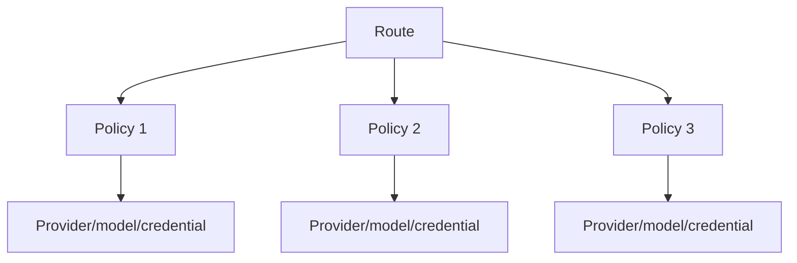

# Provider Pools

Moira models provider pools through routing policies, not a second provider abstraction.

Every pool member remains subject to provider status, model status, credential scope, runtime policy, capacity, and circuit state. A user-scoped credential is never shared across another user's effective pool.
