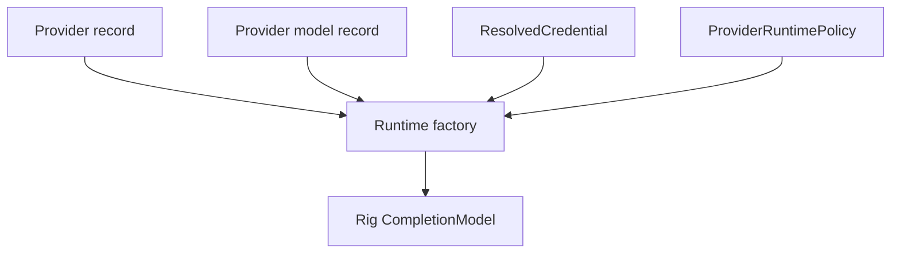

# Provider Runtime Factory

The runtime factory maps database provider configuration into official Rig clients.

The cache key includes provider id/version, model id/version, credential id/version, and runtime policy version. Plaintext secrets are never used as cache keys. Runtime handle construction uses a per-key async lock so concurrent requests for the same key share a single construction path while unrelated keys can proceed independently.

Provider base URLs must already be validated by admin policy. OpenAI-compatible URLs are normalized to `/v1` at the execution boundary.
