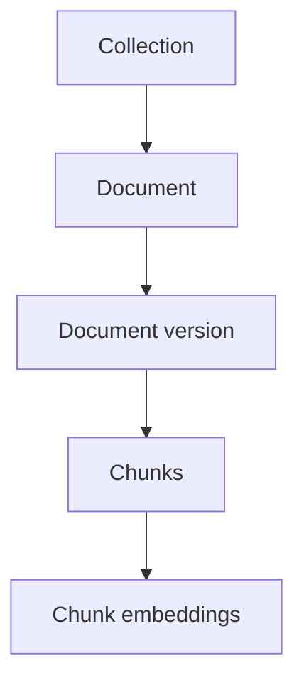

# RAG Architecture

RAG uses separate concepts:

```mermaid
flowchart TD
    A["Collection"] --> B["Document"]
    B --> C["Document version"]
    C --> D["Chunks"]
    D --> E["Chunk embeddings"]
```

Collections are application-bound and may be tenant-visible. Documents and chunks are not memory records.

