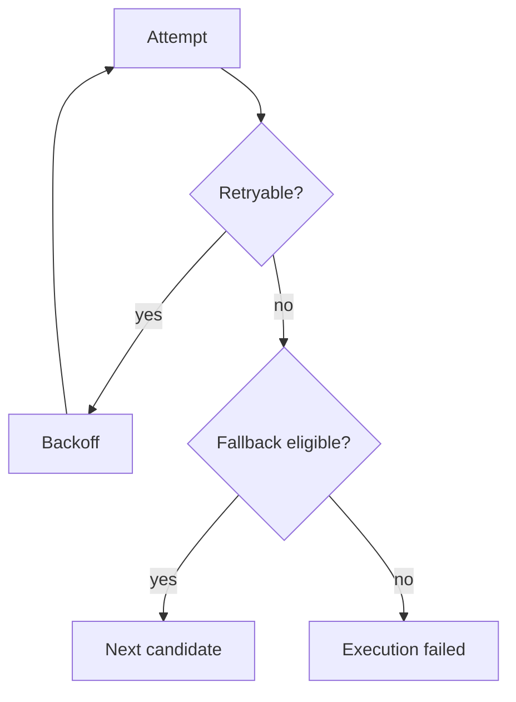

# Retry And Fallback

Retries repeat the same provider/model candidate. Fallback moves to another eligible candidate.

Retryable classes include provider timeout, connection failure, rate limiting, service unavailable, upstream error, circuit open, and capacity exhaustion. Authorization denial, invalid request, invalid credential, unsupported capability, and caller cancellation are not retried.

Each upstream attempt is persisted separately.
