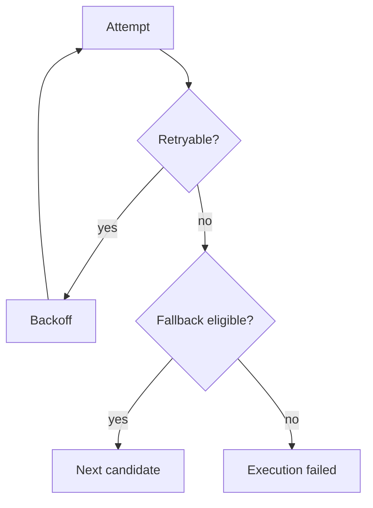

# Retry And Fallback

Retries repeat the same provider/model candidate. Fallback moves to another eligible candidate.

Retryable classes include provider timeout, connection failure, rate limiting, service unavailable, upstream error, circuit open, and capacity exhaustion. Authorization denial, invalid request, invalid credential, unsupported capability, and caller cancellation are not retried.

Each upstream attempt is persisted separately.

Since issue #213, each persisted attempt also carries `candidate_rank`, `candidate_score`
(always `null` in the MVP-static slice) and `selection_reason` — see [model routing](model-routing.md#context-router-issue-213-mvp-static-slice).
The retry/fallback classification in `src/orchestration/controls.rs` (`is_retryable`,
`is_fallback_eligible`) is unaffected by any of this: the context router only changes what order
candidates are tried in before this loop starts, never whether a given failure is retried or
falls back. `FallbackSelected` additionally carries `to_provider_id` and `candidate_rank` for the
candidate being fallen back to.
