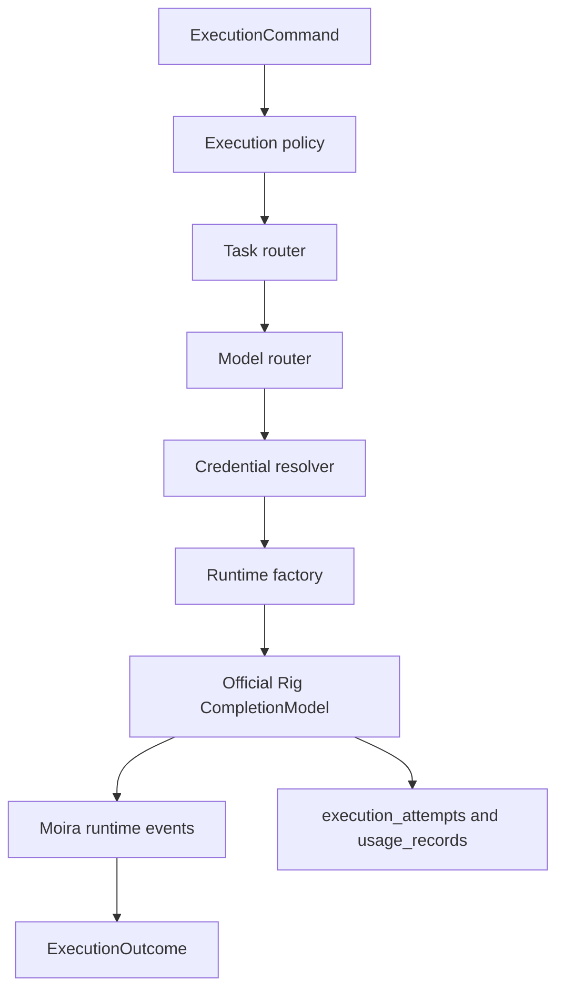

# Runtime Architecture

Phase 3 adds Moira's internal execution kernel without exposing public prompt APIs.

Moira owns identity, application boundaries, routing policy, credential selection, retries, deadlines, circuit breakers, and normalized persistence. Rig owns provider clients, completion models, completion requests, agents, tools, and provider stream parsing.

No prompt body, raw provider response body, provider secret, raw auth header, or full JWT claims are persisted by Phase 3.
