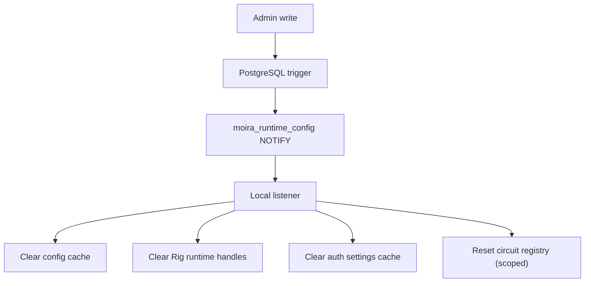

# Runtime Cache Invalidation

Administrative writes invalidate local runtime configuration caches after committed resource changes. PostgreSQL `NOTIFY` on `moira_runtime_config` broadcasts small invalidation hints containing only resource type and resource ID.

Notifications are not a durable event bus. Runtime caches retain TTLs so a missed notification cannot create permanent staleness. Redis is not required in Phase 3.

Invalidation-producing resources include applications, providers, provider models, provider credentials, trusted JWT issuers, system keys, consumer keys, route definitions, routing policies, agent profiles, provider runtime policies, and auth provider settings.

Circuit-breaker state is scoped, not blanket-reset. `providers` and `provider_models` notifications clear the matching breaker entries; the tables listed in `CIRCUIT_UNAFFECTED_RESOURCE_TYPES` (`src/infra/db.rs`) clear none, because their rows cannot change whether a model provider is answering. A resource type the listener does not recognise still falls back to a full reset — an unknown table is treated as unknown rather than assumed harmless. **Attaching the NOTIFY trigger to a new table therefore means classifying it in the same change**, or every write to it discards breaker state that was earned by observing real failures and cannot be rebuilt.

Phase 3 invalidates:

- runtime config cache
- provider runtime handle cache
- auth provider settings cache (the enabled auth methods behind `GET /api/v1/admin/setup/auth-methods`)
- model candidate calculations
- circuit-breaker configuration/state (scoped, as above)

