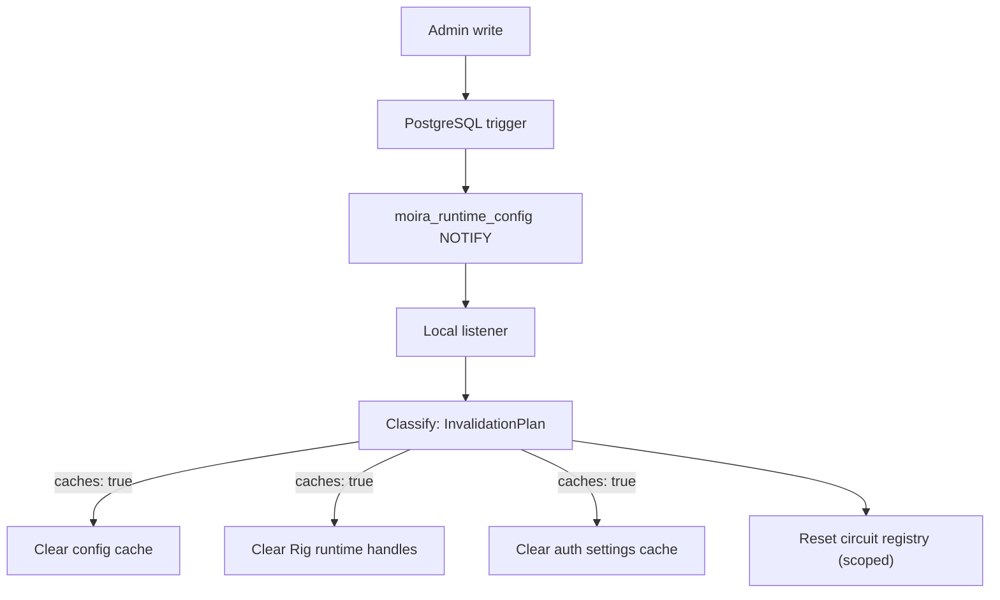

# Runtime Cache Invalidation

Administrative writes invalidate local runtime configuration caches after committed resource changes. PostgreSQL `NOTIFY` on `moira_runtime_config` broadcasts small invalidation hints containing only resource type and resource ID.

Notifications are not a durable event bus. Runtime caches retain TTLs so a missed notification cannot create permanent staleness. Redis is not required in Phase 3.

Invalidation-producing resources include applications, providers, provider models, provider credentials, trusted JWT issuers, system keys, consumer keys, route definitions, routing policies, agent profiles, provider runtime policies, auth provider settings, and the `application_*_policies` family.

The RAG collection and document tables are **not** among them, and were removed from this paragraph by `migrations/0024` (F53). `rag_collections` and `rag_documents` are content, not configuration: a collection row carries `collection_key`, `display_name`, `description`, `status`, `visibility` and `metadata`, and every embedding value an ingestion or retrieval needs comes from `application_embedding_policies`, which is configuration and does invalidate. Neither table is read through any of the three caches below, so ingesting a document announced a change nothing could act on — once per document, on every replica.

The authoritative list is not this paragraph. It is `TRIGGERED_RESOURCE_TYPES` in `src/infra/db.rs`, and that constant is pinned against `pg_trigger` by `tests/runtime_notify_inventory.rs` — in both directions, counted by trigger *function* rather than trigger name. Counting by name is wrong twice over: `auth_provider_settings`'s trigger is called `auth_provider_settings_notify`, and `ALTER TABLE … RENAME` carries a trigger across under its **old** name, which is how three renamed tables sat on this channel unclassified until F52 (`migrations/0023`).

**Every target is scoped, not just the breakers.** One notification is classified into an `InvalidationPlan { caches, circuits }`:

- **Circuit-breaker state.** `providers` and `provider_models` notifications clear the matching breaker entries; the tables in `CIRCUIT_UNAFFECTED_RESOURCE_TYPES` clear none, because their rows cannot change whether a model provider is answering.
- **The three caches.** Cleared together for any configuration change, and not at all for the resource types named in `RUNTIME_DATA_RESOURCE_TYPES` — rows that are per-request data (`conversations`, `memory_records`) or content (`rag_collections`, `rag_documents`) and cannot change anything cached. They share one flag deliberately: the only distinction a payload supports is "this is not configuration at all". Which config table invalidates which cache is a finer question nobody has established, and guessing it is how identity configuration goes stale (CONVENTIONS §7.2).

The two classification lists answer different questions and a table belongs to at most one. `agent_profiles` cannot change provider health, so it is circuit-unaffected — but it is very much configuration and must still clear the caches.

Narrowing is one-way. An unparseable payload, a `resource_id` that is not a UUID, or a resource type the listener does not recognise clears **everything** and resets **every** breaker, exactly as the code behaved before scoping existed. An unknown table is treated as unknown rather than assumed harmless.

**Attaching the NOTIFY trigger to a new table therefore means classifying it in the same change** — `tests/runtime_notify_inventory.rs` fails until the table is added to `TRIGGERED_RESOURCE_TYPES`, and `every_triggered_table_has_a_scope` fails until it is genuinely classified there. Conversely, a table whose rows turn out to be data or content should **lose its trigger** rather than be classified as data while keeping it: a triggered table that clears no cache announces changes nothing acts on. The two halves are deliberately impossible to satisfy separately — adding a name to `TRIGGERED_RESOURCE_TYPES` to silence the inventory test reds `every_triggered_table_has_a_scope` if that name is also in `RUNTIME_DATA_RESOURCE_TYPES`.

Phase 3 invalidates:

- runtime config cache
- provider runtime handle cache
- auth provider settings cache (the enabled auth methods behind `GET /api/v1/admin/setup/auth-methods` and, projected more narrowly, the anonymous `GET /api/v1/admin/setup/sign-in-methods` — one cache serves both, so the two reads cannot drift onto different snapshots of the same rows)
- model candidate calculations
- circuit-breaker configuration/state (scoped, as above)

## The console follows the same shape, without the trigger

The Next.js console (`console/`) keeps its own per-process snapshot of the
resolved auth configuration, and it is a client of Moira's HTTP API rather than
of its database — so it cannot `LISTEN` on this channel. It applies the same two
mechanisms in the same order: `invalidateAuthConfig()` at the one write it owns
(the setup wizard's provisioning route), and a 60-second TTL as the backstop for
every write it cannot see. The TTL is shorter than
`provider_settings_cache_ttl_seconds` deliberately — here it is not behind a
listener that observes every write, so it is the staleness bound an operator
actually experiences. See `docs/console-architecture.md` and issue #152.

