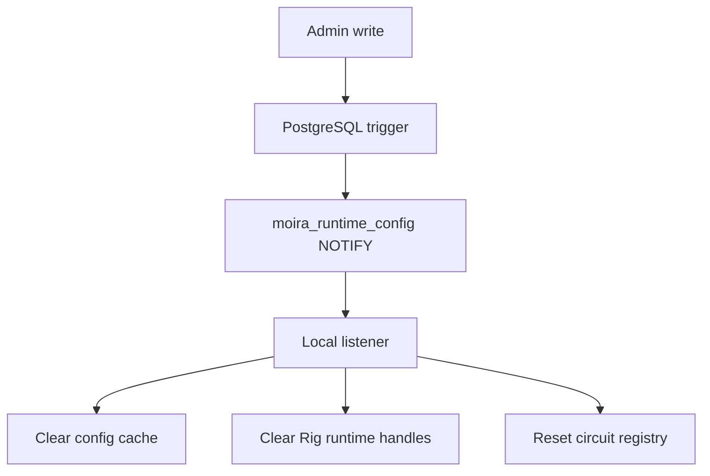

# Runtime Cache Invalidation

Administrative writes invalidate local runtime configuration caches after committed resource changes. PostgreSQL `NOTIFY` on `moira_runtime_config` broadcasts small invalidation hints containing only resource type and resource ID.

Notifications are not a durable event bus. Runtime caches retain TTLs so a missed notification cannot create permanent staleness. Redis is not required in Phase 3.

Invalidation-producing resources include applications, providers, provider models, provider credentials, trusted JWT issuers, system keys, consumer keys, route definitions, routing policies, agent profiles, and provider runtime policies.

Phase 3 invalidates:

- runtime config cache
- provider runtime handle cache
- model candidate calculations
- circuit-breaker configuration/state

