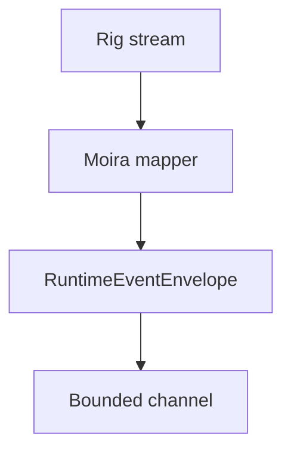

# Runtime Events

Moira exposes an internal event contract for future transports.

Events include execution start, routing start, route selected, model selected, provider attempt started, output text delta, tool call markers, usage update, provider attempt failure, fallback selected, execution completed, and execution failed.

Events include request id, execution id, monotonic sequence, timestamp, event type, and safe payload. They do not include secrets, raw provider headers, or raw upstream error bodies.
