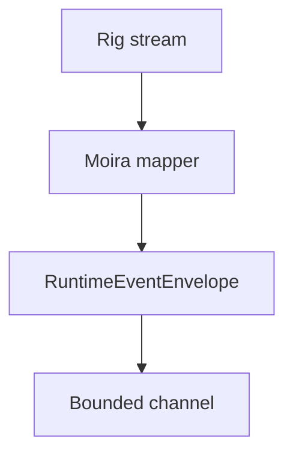

# Runtime Events

Moira exposes an internal event contract for future transports.

Events include execution start, routing start, route selected, agent profile unavailable, model selected, provider attempt started, output text delta, tool call markers, usage update, provider attempt failure, fallback selected, execution completed, and execution failed.

`agent_profile_unavailable` is an **operator** signal. It fires when the selected route's `agent_profile_id` is set but the profile no longer resolves — it has been disabled or soft-deleted, and neither operation clears the route's reference. A route that simply has no profile is the normal case and emits nothing. Its payload carries `reason`, which is `"disabled"` or `"missing"`, plus `agent_profile_id`, `agent_profile_key` (null when the row is gone), `route_id` and `route_key`. The same condition also writes a `warn!` and an `agent_profile.unavailable` audit row against the execution id.

**Since issue #79 the execution is refused, not degraded** — see `docs/agent-profile-resolution.md`. The event therefore accompanies a failed execution rather than a silently degraded successful one, and the caller receives the matching `agent_profile_disabled` / `agent_profile_not_found` error.

Not every runtime event is a public SSE event. `map_runtime_event` in `src/application/public.rs` is exhaustive over this enum and drops the internal terminal events, the tool-call markers and `agent_profile_unavailable` — the last because its payload names an internal route and agent profile, which is admin-plane shape and duplicates what the caller is already told by the terminal `response.failed` error. It reaches operators through `POST /api/v1/admin/runtime/diagnose`, which returns every envelope verbatim.

Events include request id, execution id, monotonic sequence, timestamp, event type, and safe payload. They do not include secrets, raw provider headers, or raw upstream error bodies.
