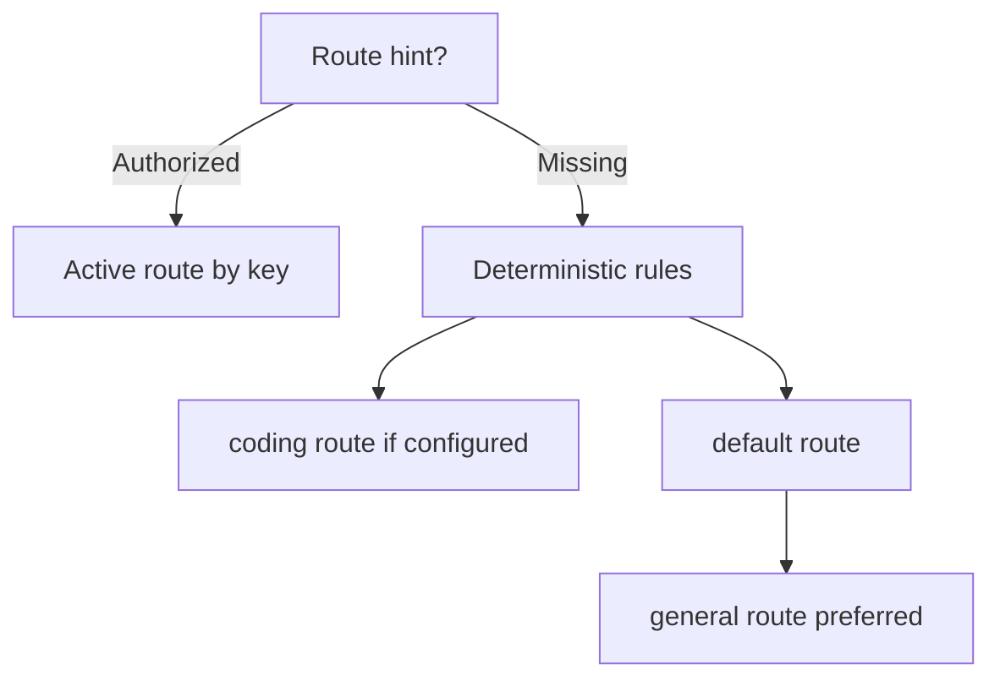

# Task Routing

Task routing answers what kind of task should run.

Precedence:

1. Authorized explicit route hint.
2. Deterministic rule match.
3. Active default route, preferring `general`.
4. Routing failure.

Route definitions live in `route_definitions`. They do not own instantiated Rig agents.
