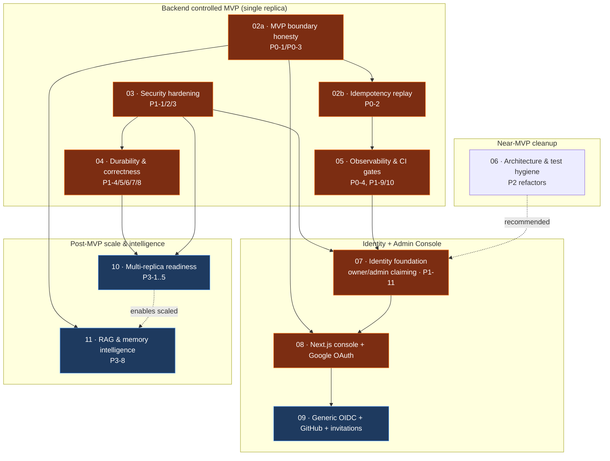

# Roadmap, Dependencies & Identity Decision

Companion to `00-audit-report.md`. Defines iteration ordering, the dependency graph, and the Next.js / identity architecture decision.

---

## 1. Ordering principles

1. **Descope before you build — but fix what you advertise.** The cheapest way to close the P0 truth-in-advertising gaps is to make the API honest (relabel no-op endpoints), not to build the RAG/memory engine: that is **02a**, which unblocks an honest MVP immediately. Where a promise is cheap to *keep* rather than retract, keep it: per decision **D1** (`CONVENTIONS.md` §0) the advertised `Idempotency-Key` is made real in **02b** rather than removed.
2. **Security-critical iterations stay pure.** Auth/credential/middleware hardening (03) and identity foundation (07) contain **no** unrelated refactors. Architecture cleanup (06) is its own iteration.
3. **Backend prerequisites precede UI.** No Next.js line is written until the identity foundation (07) exists in Moira, because "first login becomes admin" is unsafe (§4).
4. **Single-replica MVP first; multi-replica is a distinct, later capability** (10) — the in-memory limiter/circuit state (P3-1) is the principal blocker, with cluster admission, Redis-backed coordination, and worker leader election (P3-2..P3-4) alongside it; all are deliberately deferred.
5. **Small enough to review, complete enough to ship a capability.** Each iteration delivers one coherent, independently shippable slice.

---

## 2. Iteration list

| # | Plan | Title | MVP gate? | Primary findings |
|---|------|-------|-----------|------------------|
| 02a | `02a-mvp-boundary-honesty.md` | MVP boundary honesty & API truth-in-advertising | **MVP gate (P0)** | P0-1, P0-3 |
| 02b | `02b-idempotency-replay.md` | Real idempotency replay for conversation/memory/RAG | **MVP gate (P0)** | P0-2 |
| 03 | `03-security-hardening.md` | Security & credential hardening | **MVP gate (P1)** | P1-1, P1-2, P1-3 |
| 04 | `04-durability-correctness.md` | Durability & correctness | **MVP gate (P1)** | P1-4, P1-5, P1-6, P1-7, P1-8 |
| 05 | `05-observability-ci-gates.md` | Observability & CI/supply-chain gates | **MVP gate (P0-4/P1)** | P0-4, P1-9, P1-10 |
| 06 | `06-architecture-test-hygiene.md` | Architecture & test hygiene | Near-MVP (P2) | P2-1..P2-4, P2-8, P2-9, P2-12, P2-13, P2-14, P3-9 |
| 07 | `07-identity-foundation.md` | Identity foundation: owner/admin claiming | **MVP gate for UI/OAuth (P1)** | P1-11 |
| 08 | `08-nextjs-console-google-oauth.md` | Next.js admin console (BFF) + setup wizard + Google OAuth | MVP gate for UI | P1-11, P0-3 |
| 09 | `09-generic-oidc-github-invitations.md` | Generic OIDC + GitHub + invitations/additional admins | Post-MVP | identity extensibility |
| 10 | `10-multi-replica-readiness.md` | Multi-replica readiness (Redis, admission/lease, leader election, durable workers) | Post-MVP | P3-1..P3-5 |
| 11 | `11-rag-memory-intelligence.md` | RAG & memory intelligence (Phase 5) | Post-MVP | P3-8 |

**MVP is declared shippable after 02a–05 (backend controlled MVP) and, if an admin UI is in scope, 07–08.** 06 is strongly recommended before 07 (a clean `AdminService`/repo-trait surface makes the identity work safer) but is not a hard gate.

---

## 3. Dependency graph

**Critical path to backend MVP:** 02a → 02b → 03 → 04 → 05 (03→04 because middleware/error primitives from 03 are reused; 02a/02b→05 because the spec must be honest *and* its advertised `Idempotency-Key` must be real before the OpenAPI-drift gate locks it). 02a ships first and alone makes the API truthful.
**Critical path to admin UI:** (03, 05) → 07 → 08.

---

## 4. Next.js & identity decision

### 4.1 Current state (Verified)
Moira has **no** human identity: no `users` table, no session/cookie store, no OAuth/OIDC client, no login. It authenticates **machines** three ways — system keys (Argon2id+pepper, bootstrapped via a CLI `bootstrap-system-key`), consumer keys (bound to one application), and trusted JWT issuers (DB-registered, JWKS-validated, per-issuer algorithm allow-list, claims → `Actor`). This shape is decisive: **Moira should consume identity claims, not issue human identity.** Building password/session machinery inside Moira would violate its stated boundary and duplicate what an IdP does better.

### 4.2 Options compared

| # | Approach | Fit for Moira | Verdict |
|---|----------|---------------|---------|
| 1 | **Next.js admin console as a BFF using Better Auth** | BFF holds Moira credentials server-side; browser never sees system keys; human↔BFF via OAuth, BFF↔Moira via existing trusted-JWT. **Verified 2026-07-25: the Auth.js/NextAuth team joined Better Auth (Sept 2025); Auth.js is security-patch-only and Better Auth is recommended for new projects.** Better Auth's `jwt` plugin publishes a JWKS endpoint that Moira's existing `trusted_jwt_issuers` machinery consumes directly — no new trust mechanism. MIT-licensed, free, self-hostable. | **Recommended base** |
| 2 | Next.js + **Google OAuth first** | Verified email, `hd` hosted-domain policy, ubiquitous | **Recommended first provider** (inside option 1) |
| 3 | GitHub OAuth first | Great for developer/self-host deployments but weaker org/email-domain policy | Second provider (09) |
| 4 | Direct OIDC/JWT trust browser→Moira | Browser would hold tokens callable against Moira; larger attack surface; no server-side secret custody | Rejected for MVP; keep as generic-OIDC option (09) via BFF |
| 5 | Moira-managed owner/admin identities (passwords in Moira) | Violates boundary; reintroduces password/session/reset burden | Rejected |
| 6 | **System-key bootstrap → OAuth owner claiming** | Uses the CLI bootstrap that already exists; operator claims the first admin explicitly | **Recommended bootstrap mechanism** (this is iteration 07) |

**Decision: Option 1 (BFF/**Better Auth**) + Option 2 (Google first) + Option 6 (system-key bootstrap → explicit owner claim).** Generic OIDC is delivered in 08 as a baseline via Better Auth's `genericOAuth` plugin; multi-provider OIDC hardening and GitHub (option 3) follow in 09. See `plans/CONVENTIONS.md` §7 for the binding auth architecture. **Known limitation:** Better Auth does not provide enterprise SAML SSO — that path is mode 3 (bring-your-own JWT/JWKS).

### 4.3 Trust boundaries (authoritative)
- **Human → BFF:** OAuth 2.0 / OIDC (Google) with PKCE, `state`, `nonce`, exact redirect-URI allow-list, verified-email required, hosted-domain / allowed-email policy. Better Auth manages this (`trustedOrigins` is its CSRF mechanism; `pkce: true` and `requireIssuerValidation: true` are pinned on `genericOAuth`).
- **BFF → Moira:** the **BFF holds Moira credentials server-side only**. Two supported modes:
  - **Mode A (MVP):** BFF mints/forwards a short-lived JWT for the authenticated human, signed by a key whose JWKS Moira trusts (BFF registered as a `trusted_jwt_issuer`, audience = Moira admin API). Moira maps `(issuer, subject)` → `Actor` and enforces scopes. Gives **per-human audit**. This is why iteration 07 must add `(issuer,subject)`-grant claiming first.
  - **Mode B (fallback):** BFF calls Moira with a server-held admin **system/consumer key** and forwards actor context in audit metadata. Simpler, but coarser audit (all actions attributed to the BFF principal). Use only if 07 slips.
- **Never:** system keys, admin keys, or decrypted provider credentials in the browser, in client-side JS, in `NEXT_PUBLIC_*` env, or in any response the browser receives.

### 4.4 Why "first login automatically becomes admin" is unsafe
- **No verified-email/domain gate** exists in Moira → any Google account (or any account on any provider the BFF trusts) could win.
- **Race / land-grab:** whoever reaches the setup URL first between deploy and claim becomes admin; an attacker who discovers a fresh instance beats the operator.
- **Identity instability:** email is mutable and reassignable; binding admin authority to email alone is unsafe. Authority must bind to **stable `issuer + subject`**, not email.
- **No revocation story** for a wrongly-granted first admin.

**Safe alternative (iteration 07):** the operator uses the **out-of-band bootstrap system key** (a deploy-time secret) to explicitly grant the first admin's `(issuer, subject)` an admin scope, OR redeems a **one-time signed setup token**. Setup-required is detected server-side; the claim is idempotent and audited; verified email + allowed-domain policy is enforced at grant time.

### 4.5 What each identity requirement maps to

| Requirement | Where handled | Iteration |
|-------------|---------------|-----------|
| Setup-required detection | Moira `GET /api/v1/admin/setup/status` — this endpoint **already exists** (`src/http/admin.rs:32-49`) but reports only **structural** readiness (DB/config); 07 adds an identity-claim (`admin_claimed`-style) status alongside it. New claim routes live under `/api/v1/admin/setup/…` — the same admin-prefixed convention as the existing endpoint and as plan 08 adopts. (Whether a minimal unauthenticated claimed-boolean is *also* exposed for the setup wizard is a plan-07 design decision; the structural-readiness check stays operator-authenticated either way) | 07 |
| Database & migration readiness | Migration adds `admin_identities` (issuer+subject grants) + `setup_state` | 07 |
| Root system-key bootstrap | Existing `bootstrap-system-key` CLI (keep) | already exists / 07 documents |
| Initial owner/admin claiming | System-key-gated or one-time-token grant of admin scope to `(issuer,subject)` | 07 |
| Verified email + allowed-email/domain policy | Enforced by BFF (Better Auth `databaseHooks.user.create.before`) **and** re-checked at Moira grant. Policy is **DB-backed in Moira** (`auth_provider_settings.allowed_email_domains`) — the env-var form was withdrawn so there is one source of truth | 07 (policy) / 08 (BFF enforcement) |
| Stable identity (issuer+subject) | `admin_identities (issuer, subject)` unique key; email stored as attribute only | 07 |
| Invitation / additional admins | Existing admin invites a new `(issuer,subject)` grant; email/domain-scoped invite tokens | 09 |
| Session management & logout | Better Auth DB-backed session in BFF (httpOnly, Secure, SameSite); logout clears BFF session; Moira-facing JWTs are short-lived. DB-backed sessions make real remote revocation possible (09) | 08 |
| CSRF, PKCE, state, nonce, redirect validation | Better Auth (`trustedOrigins` + Fetch Metadata; `advanced.disableCSRFCheck` banned by unit test); server actions CSRF-protected | 08 |
| Secure server-side custody of Moira credentials | BFF server env / K8s secret; never `NEXT_PUBLIC_*` | 08 |
| Browser vs BFF trust boundary | §4.3 | 08 |
| Multi-tenant / app-level authz | Moira scopes already model this (`moira:admin`, per-application consumer keys); BFF passes through | 07/08 |
| Account recovery & ownership transfer | System-key re-grant (break-glass) + admin-to-admin transfer flow | 09 |
| Audit | Moira audit log already records actor; per-human audit requires Mode A (07) | 07 |
| Local / air-gapped install | System-key-only path works with **no** OAuth; console optional; generic OIDC can point at an internal IdP | 07 (works headless) / 09 |
| Google / GitHub / generic OIDC / trusted-JWT extensibility | Trusted-JWT-issuer model already generalizes; each provider is BFF config + a Moira issuer registration | 08 (Google) / 09 (rest) |

### 4.6 Explicit milestone statements
- **Backend milestones before any UI work:** 02 (honest API), 03 (auth/credential/middleware hardening), 05 (observability + OpenAPI gate so the console builds against a stable contract), and 07 (identity foundation). 04 is strongly recommended (durability) but not strictly UI-blocking.
- **Iteration that creates the Next.js project:** **08**.
- **Iteration that adds the setup wizard:** **08** (BFF setup wizard driving Moira's 07 setup/claim API).
- **Iteration that adds Google OAuth:** **08**.
- **Iteration that adds generic OIDC:** **09**.
- **Identity features that remain post-MVP:** GitHub provider, invitations/additional-admin flows, ownership transfer, account recovery beyond system-key break-glass (all **09**); anything requiring multi-replica session affinity (**10**).

### 4.7 Decisions still requiring product input
- **Mode A vs Mode B** for BFF→Moira (per-human audit vs simpler integration) — recommend Mode A but it costs iteration 07 work.
- **Allowed-email/domain policy** default (open vs deny-by-default with an operator allow-list) — recommend **deny-by-default**.
- Whether the **admin console ships as part of MVP at all**, or MVP is backend-only (system-key + trusted-JWT) with the console as a fast-follow. Both are viable; 02–05 deliver a backend MVP with no UI dependency.

---

## 5. What MVP can advertise at each stage

- **After 02–05:** "Single-replica self-hosted AI gateway with machine auth (system/consumer keys, trusted JWT), encrypted credentials, atomic admin APIs, `/v1/responses` execution + streaming, observable, honest API surface." No human login; conversation/memory/RAG are persistence primitives.
- **After 07–08:** "…plus a secure admin console with Google sign-in and a guided first-run setup."
- **After 10:** "…horizontally scalable (multi-replica)."
- **After 11:** "…with retrieval-augmented memory and RAG."
