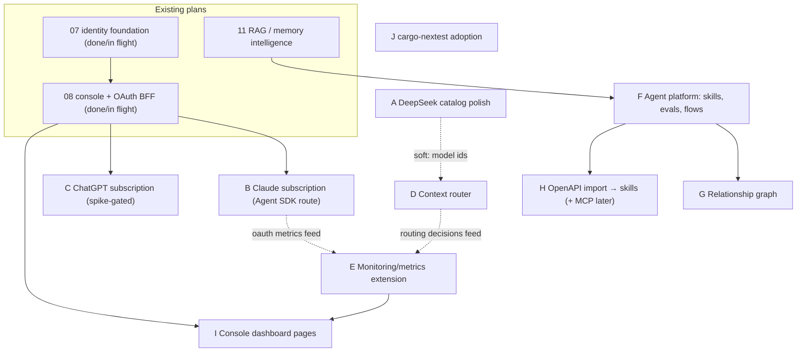

# 12 — Feature Expansion Brainstorm: Providers, Context Router, Agent Platform, Graph, Observability

**Status: BRAINSTORM — not implementation-ready; migration numbers are 00XX placeholders assigned centrally at execution time (plans/README.md item 5).**

This document collects the owner's ten feature requests into one coherent plan-of-plans. It is docs only — no code, no migrations, no renumbering of existing plans. Where it proposes schema or API surface, treat every DDL block as a sketch and every migration filename as a working title. Terminology used consistently throughout: a **skill** is a stored, declarative tool definition; an **agent** is a named profile (`agent_profiles` row); a **flow** is a multi-agent DAG.

Binding context: `plans/CONVENTIONS.md` (gates, i18n, testing, auth architecture) applies to every workstream below. Plans 07/08 (identity + console) are the identity/console substrate; plan 11 (RAG/memory) owns memory and is referenced, never rebuilt, here.

---

## Executive summary

| # | Feature | Proposed approach | MVP / Later | Depends on |
|---|---------|-------------------|-------------|------------|
| 1 | Claude via subscription | Raw OAuth-token reuse against the Messages API is **blocked by Anthropic since Jan 2026 — do not build**. The sanctioned subscription route is **Agent SDK / `claude -p`** (reinstated mid-2026 with usage caveats): either a local OpenAI-compatible sidecar proxy Moira consumes as a normal provider, or a native CLI-forwarding runner (boundary decision — item 1). Long-lived subscription token stored as an `oauth2` credential in the DB; `oauth-token-refresh` worker stays as generic plumbing | MVP = Wave-0 local spike; **decision 1 resolved: sidecar** — build after spike evidence | 08 (console), existing credential machinery, local `claude` CLI |
| 2 | ChatGPT via subscription OAuth | **Do not build execution in this phase** — no rig-core-compatible wire path exists; gate behind a research spike. API-key path already works via `ProviderType::OpenAi` | Later (spike first) | 08, spike outcome |
| 3 | DeepSeek provider | Already functional at the Rig boundary; remaining work is a `provider_models` catalog/seed update (v4 model ids, deprecate legacy aliases) | MVP (trivial) | nothing |
| 4 | Context router (complexity + priority scoring, failover) | Extend `DefaultModelRouter` with a post-fetch re-rank; failover semantics unchanged (already built and tested); wire the dead `cost_weight`/`latency_weight`/`quality_weight` columns | MVP = static priority chains; scoring later | A (soft), existing routing |
| 5 | Complete logging + monitoring in console | Extend `src/infra/metrics.rs` families + Grafana dashboard; console renders existing `/api/v1/usage` + `/api/v1/executions`, deep-links to Grafana. No second telemetry store | MVP | metric names frozen first |
| 6 | Agents, skills, memory, evaluations, flows | Extend `agent_profiles` in place; new `skills`, `eval_suites`/`eval_cases`/`eval_runs`, `agent_flows`/steps/runs tables; flow orchestration is a new **caller** of the existing 11-step pipeline | MVP = CRUD + linear flows + offline evals | 11 (memory), moira-rig-tools loop |
| 7 | Relationship graph | Derived read-only projection over FKs — no stored graph. `GET /api/v1/admin/graph` + console page (react-flow) | MVP = static graph over whatever registries exist | F's schema |
| 8 | OpenAPI spec → skills, MCP question | Import pipeline → `skills` rows (disabled by default) + `skill_http_executors`; **recommendation: DB-stored skills for MVP, MCP server as a later additive phase, MCP-client mode rejected** | Import later-MVP; MCP later | F's `skills` table, tool loop |
| 9 | Parallelizable delivery | Disjoint-file workstreams A–J, staged; last-finisher-integrates rule; central migration-number ledger | — | plans/README.md model |
| 10 | Fast Rust builds | New code in new modules; ≤3 new test binaries; adopt cargo-nextest (workstream J); no new Cargo features | — | — |

---

> **Update 2026-08-14:** all 26 decision items in §7 are **RESOLVED** (interactive owner session — §7 lists the deviations). Owner additions folded in: the MVP → Growth → Enterprise maturity roadmap (§6b) and the skill router + skills-as-guards design (§5).

## Dependency graph

Existing plans are boxed with their numbers; new workstreams are lettered (see the Delivery section for the full workstream table).



`J` has no edges — it is a test-runner swap that can land any time, ideally first.

---

## 1. Subscription providers — Claude (OAuth), ChatGPT (OAuth), DeepSeek (API key)

### Current state

More of this is already in place than the brainstorm assumed. `provider_credentials.credential_type` already accepts `'oauth2'` (migration `0003_security_foundation.sql:141-149`), `CredentialType::Oauth2` already carries `access_token`/`refresh_token`/`token_type`/`expires_at` (`src/domain/admin.rs:387-392`), and `src/security/crypto.rs::credential_secret_field()` already maps `Oauth2 → "access_token"` as the single bearer secret every execution path reads — so the encryption, AAD binding (`credential_aad()`, same file), and masking (`src/security/masking.rs`) machinery is provider-agnostic and OAuth-aware today, not something to invent. `src/infra/workers.rs` already reserves the job name `"oauth-token-refresh"` (`WORKER_JOB_NAMES`, `enabled_by_default: false`) with a `WorkerSpec` wired only to `queue::StubJobDispatcher` — as is **every** queue-dispatched job name in `WORKER_JOB_NAMES` today: `run_supervisor` (`src/infra/workers.rs:254`) wires the single generic `StubJobDispatcher` for all of them, and `StubJobDispatcher::dispatch` (`src/infra/workers/queue.rs:108-124`) only validates the name and marks the job complete — no per-job logic exists for any name, including plan 11's four retry jobs. The only worker with real logic today is the leader-elected `retention-cleanup` sweep, which bypasses the generic dispatcher entirely. Whoever builds `oauth-token-refresh` (or any other real per-job dispatcher) is building the **first** real `JobDispatcher` in the codebase, not copying an established pattern — size it accordingly. `RuntimeFactory::build_completion_model` (`src/orchestration/runtime_factory.rs:93-183`) already has a working `ProviderType::DeepSeek` arm that builds a native `rig_core::providers::deepseek::Client` — DeepSeek is functionally done at the Rig boundary today. Anthropic's arm currently gates on `CredentialType::ApiKey` only (line 112). Nothing refreshes any OAuth2 credential yet, and no console OAuth flow exists for any provider — `app/(console)/settings/llm/page.tsx` is API-key only.

### Proposed design

**Schema.** No change is needed to `provider_credentials` or its encryption path — `oauth2` is already a valid `credential_type`, and `credential_aad()`/`credential_secret_field()` already cover it generically (confirmed by reading `src/security/crypto.rs:93-134`; this is a different, older, simpler AAD mechanism than migration `0027`'s content-envelope/`AadProfile` keyring, which is scoped to the five *content* tables and does not apply here). One new migration is needed for OAuth-flow staging state, `00XX_provider_oauth_flow_state.sql` (placeholder pending central numbering; repo's highest today is `0027`):

```sql
-- Only needed if device-code polling state must survive across console
-- replicas without sticky sessions (see decision 3). Not needed for
-- MVP if console holds flow state in-process / in a signed cookie.
create table if not exists provider_oauth_flows (
    id uuid primary key default gen_random_uuid(),
    provider_id uuid not null references providers(id) on delete cascade,
    flow_type varchar(32) not null check (flow_type in ('pkce_browser', 'device_code')),
    initiated_by uuid not null,           -- admin identity id
    state text not null unique,           -- PKCE `state` / device-flow correlation id
    code_verifier_encrypted bytea,        -- PKCE only, sealed like any other secret
    device_code_encrypted bytea,          -- device-code only
    user_code varchar(32),                -- device-code only; shown to the operator, not secret
    poll_interval_seconds integer,
    status varchar(32) not null default 'pending'
        check (status in ('pending', 'completed', 'expired', 'failed')),
    expires_at timestamptz not null,
    created_at timestamptz not null default now(),
    completed_at timestamptz
);
create index if not exists provider_oauth_flows_expiry_idx
    on provider_oauth_flows (expires_at) where status = 'pending';
```

Rows are short-lived (10-15 min TTL) and swept by the already-reserved `retention-cleanup` worker, not a new job name.

If the owner decides ChatGPT-subscription execution is worth building at all (see risks), it needs its own `provider_type` because its wire format cannot share `RuntimeFactory`'s OpenAI arm — that requires extending the `provider_type` CHECK constraint in a migration, adding `ChatGptOauth` to `ProviderType` (`src/domain/admin.rs:106-115`), and initially wiring it to the same `Err(AppError::Config(...))` refusal pattern `ProviderType::Custom` already uses (line 179-181) — visible and selectable, but fails closed until a real client exists. Anthropic needs **no** new `provider_type`: it stays `'anthropic'`, discriminated by `credential_type = 'oauth2'` vs `'api_key'`, exactly the axis `require_credential_type()` already branches on.

**Module placement** (per `docs/project-structure.md`):

- `src/orchestration/runtime_factory.rs` — **[SUPERSEDED by the ToS timeline below — do not build; kept as mechanics documentation.]** Raw subscription-token calls to the Messages API from non-Claude-Code clients have been blocked at the API layer since ~Jan 2026, so this bullet records how the raw path *would* have wired, for the record only: extend the `ProviderType::Anthropic` arm's `require_credential_type` allow-list to include `CredentialType::Oauth2`; when the resolved credential is `Oauth2`, additionally call rig-core's existing `AnthropicBuilder::anthropic_beta("oauth-2025-04-20")` (`rig-core-0.40.0/src/providers/anthropic/client.rs:171` — verified in the vendored crate, this is a real builder method, not a workaround). `Client::builder().api_key(secret)` already emits the value under the `x-api-key` header regardless of key shape (`AnthropicKey::into_header`, same file, line ~59), which matches the OAuth access-token requirement — **no custom `reqwest::Client` and no manual header injection are needed for Anthropic**, only a conditional beta-header call gated on `credential_type`. This keeps the Moira/Rig boundary intact: Rig still owns the wire client, Moira still owns which credential feeds it.
- `src/infra/workers/` — new dispatcher module (e.g. `oauth_refresh.rs`) implementing the existing `queue::JobDispatcher` trait (`src/infra/workers/queue.rs:91`) for the job name `"oauth-token-refresh"`, replacing the stub. Scans `provider_credentials` where `credential_type = 'oauth2'` and `expires_at < now() + threshold`, decrypts `refresh_token` via `crypto.rs`, calls the provider's token endpoint with `grant_type=refresh_token`, re-encrypts, and updates the row. Flip `enabled_by_default: true` once built.
- `src/infra/repositories/runtime.rs` (`resolve_runtime_credential`) — no change expected; it already resolves by scope/priority independent of credential type.
- `src/security/crypto.rs` — no change; `credential_aad`/`credential_secret_field` are already OAuth-shaped.
- Console: extend `app/(console)/settings/llm/page.tsx` with "Connect Claude subscription" / "Connect ChatGPT subscription" actions beside the existing API-key form; new BFF-only routes `app/api/settings/llm/oauth/[provider]/start/route.ts` and `.../callback/route.ts` (PKCE) plus `.../poll/route.ts` (device-code). These perform the entire OAuth dance server-side — authorize redirect, PKCE `code_verifier`/`state` in a short-lived signed httpOnly cookie, token exchange — and finish by calling Moira's **existing** `POST /api/v1/admin/provider-credentials` with `credential_type: "oauth2"` and the exchanged token bundle. **No new Moira HTTP endpoint is required for storage or rotation** — `docs/provider-credential-management.md`'s five endpoints already accept and version this shape. New i18n keys go in `console/lib/i18n/catalog.en.ts` per the existing guard.
- DeepSeek: zero `runtime_factory.rs` work. Remaining effort is a `provider_models` catalog/seed update — add `deepseek-v4-flash` and `deepseek-v4-pro`, and document `deepseek-chat`/`deepseek-reasoner` as deprecated legacy aliases (per-vendor deprecation dated 2026-07-24) in provider docs. This is an operational task, not a design item.

**API endpoints (new, console-only):**

- `POST /api/settings/llm/oauth/{provider}/start` → `provider ∈ {claude, chatgpt}`; returns the authorize redirect URL, sets PKCE state cookie.
- `GET /api/settings/llm/oauth/{provider}/callback` → exchanges code server-side against the hardcoded Anthropic/OpenAI token endpoints (never an admin-supplied URL — see risks), then calls Moira's existing credential-create endpoint.
- `GET /api/settings/llm/oauth/{provider}/poll` → device-code variant, polls the provider's token endpoint until the user completes the browser step.

No new Moira admin endpoints are proposed for MVP.

### ToS risk framing, per provider

This framing is deliberately blunt and must not be softened in later revisions.

**2026 policy timeline for Claude subscription auth (verified 2026-08-14):** Anthropic began blocking subscription OAuth tokens from non-Claude-Code clients at the API layer on ~Jan 9 2026, and on Feb 19-20 2026 clarified that Free/Pro/Max OAuth tokens are licensed exclusively to Claude Code and claude.ai ([Winbuzzer](https://winbuzzer.com/2026/02/19/anthropic-bans-claude-subscription-oauth-in-third-party-apps-xcxwbn/), [GIGAZINE](https://gigazine.net/gsc_news/en/20260220-anthropic-third-party-block/)). Anthropic then **reinstated third-party agent usage on Claude subscriptions, with conditions**: the sanctioned route is authenticating the subscription **through the Agent SDK** — the path hermes-agent and OpenClaw use, "routing as Claude Code" — currently gated to Max plans with usage-credit caveats ([VentureBeat](https://venturebeat.com/technology/anthropic-reinstates-openclaw-and-third-party-agent-usage-on-claude-subscriptions-with-a-catch), [hermes-agent provider docs](https://hermes-agent.nousresearch.com/docs/integrations/providers)). The planned June 15 2026 move of Agent SDK / `claude -p` / third-party usage onto a separate credit pool was **cancelled**; that usage stays on the subscription ([TechTimes](https://www.techtimes.com/articles/317625/20260602/anthropic-ends-subscription-subsidy-agents-june-15-credit-pool-replaces-flat-rate-access.htm), [Digital Applied](https://www.digitalapplied.com/blog/anthropic-claude-credit-overhaul-june-15-2026)). Consequence for this plan: **the raw-token option (Moira calling the Messages API directly with a subscription token) is dead and stays dead**; the live options are:

| Provider | Option A: official API key | Option B: subscription via Agent SDK / CLI forwarding | Option C: subscription via local sidecar proxy | Option D: raw OAuth token against the API |
|---|---|---|---|---|
| **Claude** | Sanctioned, zero ambiguity, works today via existing `'anthropic'` + `ApiKey`. | **Sanctioned as of mid-2026** (Max plan, usage-credit caveats, policy volatile). Moira spawns the real `claude` CLI / Agent SDK per request (`claude -p --output-format stream-json`); the CLI is the authenticated client, so no fingerprint mimicry is involved. Cost: this would be Moira's **first non-Rig execution backend** — an explicit boundary decision (item 1), plus a `claude` binary requirement on the deployment host. | Run a hermes-proxy-style sidecar ([hermes proxy](https://hermesagents.net/blog/hermes-proxy-claude-pro-aider-cline-codex)) exposing a local OpenAI-compatible endpoint backed by the subscription session; Moira registers it as an ordinary OpenAI-compatible provider. **Zero new Moira execution code, Rig boundary fully intact**; costs an extra runtime dependency, and compliance rides on the sidecar's own use of the sanctioned route. | Blocked at the API layer since ~Jan 2026 and prohibited by the Consumer Terms. **Do not build.** Mechanics retained above for the record only. |
| **ChatGPT** | Sanctioned via `api.openai.com`, already representable as `ProviderType::OpenAi`. | Same shape via Codex CLI (`codex exec`), which signs in with a ChatGPT account. No explicit Anthropic-style third-party clause, but general ToS treats subscriptions as personal/single-user; the OSS ecosystem self-restricts to personal use. Same first-non-Rig-backend cost as Claude's B. | Same sidecar pattern — hermes proxy also fronts ChatGPT Pro sessions. | `chatgpt.com/backend-api/codex` is a bespoke, reverse-engineered wire format with no rig-core provider — hand-rolling a client for it is exactly the "parallel LLM abstraction" `CLAUDE.md` forbids, on top of the ToS posture. **Do not build.** |
| **DeepSeek** | Sanctioned, plain API key; no OAuth/subscription concept exists at the platform at all. | N/A. | N/A. | N/A. |

**Recommendation:** ship DeepSeek and Claude/ChatGPT-via-API-key now (DeepSeek needs no code, Claude/ChatGPT already work through the existing `ApiKey` paths). For the subscription ask, run the **Wave-0 local spike** (phasing below) to prove options B and C end-to-end on the owner's machine, then sign off decision 1 choosing between them — the working hypothesis is **C (sidecar) first**, because it needs no new Moira execution code and leaves the Rig boundary untouched, with **B (native Agent SDK runner)** as the fallback if the sidecar's operational cost or stability is unacceptable. Do **not** build ChatGPT-subscription execution in this phase (spike later, same decision shape). The `oauth2` credential plumbing (DB storage, `oauth-token-refresh` worker) is still worth building generically: a long-lived subscription token (e.g. `claude setup-token` output) stored encrypted as an `oauth2` credential satisfies the owner's "OAuth tokens in the database" requirement and feeds either B or C. Never send Claude-Code-mimicking fingerprint headers (`x-app: cli`, `user-agent: claude-cli/...`) from Moira's own HTTP clients — impersonating the client remains a violation and is plausibly the exact signal enforcement keys on; option B avoids this entirely because the real client does the talking.

**Testing policy for this workstream (owner-approved 2026-08-14):** local smoke tests MAY use a real API key or the locally installed `claude` CLI on the owner's machine. CI has **no `claude` binary and no real keys** — any test exercising the real CLI or a live provider must be env-gated opt-in that **skips (never fails) when absent**, following the existing DB-test gating pattern (`CONVENTIONS.md` §3); CI coverage for these paths comes from the repo's scripted OpenAI-compatible Axum test server. No CI gate may ever depend on the `claude` binary existing.

### Phasing

**MVP (this sub-slice):**

1. DeepSeek catalog update (`deepseek-v4-flash`/`deepseek-v4-pro` provider_models, deprecation note) — no runtime code.
2. **Wave-0 local spike (blocking):** prove the sanctioned subscription route end-to-end on the owner's machine — (a) `claude -p --output-format stream-json` forwarding, and (b) a local OpenAI-compatible sidecar registered as an ordinary provider. Uses the real CLI or a real API key per the owner-approved testing policy above; produces the evidence for decision 1.
3. Decision 1 signed off (sidecar vs native runner vs API-key-only) with spike evidence attached.
4. Build the chosen shape. Sidecar = configuration + docs only (register the local endpoint as an OpenAI-compatible provider; document the sidecar's lifecycle in `docs/`). Native runner = a new, explicitly bounded non-Rig execution backend — scope it as its own numbered plan, not a sub-item here.
5. Build the real `oauth-token-refresh` `JobDispatcher`, generic over `credential_type = 'oauth2'` (not Claude-specific), flip its `enabled_by_default` to `true` — noting (current-state section above) this is the **first** real `JobDispatcher` in the codebase.
6. Console: a "Connect Claude subscription" surface that stores a long-lived subscription token (e.g. `claude setup-token` output) through the existing credential-create endpoint as `credential_type: "oauth2"`. The full browser PKCE dance moves to **Later** — it is only needed if the native-runner path with Moira-held short-lived tokens is chosen.

**Later:**

- ChatGPT OAuth execution path, contingent on a research spike into whether `backend-api/codex` can be wrapped without violating the Rig boundary (may mean: don't, and wait for an upstream rig-core provider instead).
- Device-code flow (Claude and, if ever built, ChatGPT) for headless setup.
- `provider_oauth_flows` durable table — only if/when console runs multiple replicas without sticky sessions makes in-process flow state unsafe.
- Pairing OAuth-header drift detection with the separately-reserved but also-unbuilt `"provider-health-check"` worker job.

Decisions for this section: consolidated items **1–5**. Risks: consolidated items **R1–R6, R20**.

---

## 2. Context router — complexity/priority scoring + failover cascade

### Current state

Moira already has most of the *mechanism* this feature needs; what's missing is the *scoring*. Model routing (`docs/model-routing.md`) ranks candidates from `routing_policies` by policy scope specificity, `priority` ascending, `weight` descending, then provider/model id — and `routing_policies` (migration `0005_provider_runtime.sql`) already carries `cost_weight`, `latency_weight`, `quality_weight` columns that are written by the admin API (`src/infra/repositories/runtime.rs`) but **never read** by the candidate query (`PgRuntimeRepository::list_model_candidates`, `src/infra/repositories/runtime.rs:1052-1110`) — they don't even appear in its `SELECT` list. Fallback across candidates, retry within a candidate, per-provider/model circuit breakers, and a committed-output clamp (`events.mark_output_committed()` flips `failure.fallback_eligible = false` once any byte has streamed — `src/application/execution.rs` around the `RuntimeStreamItem::OutputTextDelta` arm and pinned by tests `timeout_after_stream_output_cannot_retry_or_fallback` / `"committed output must never be sent to a fallback provider"`) are all already built and tested. `RuntimeEventType::FallbackSelected` is already emitted per fallback hop. So this section is an extension of existing routing, not a new subsystem — it must not create a second candidate-selection path alongside `DefaultModelRouter`.

### Design: where it sits

Extend, don't duplicate:

- **Task router** (which route) is unchanged — complexity/priority never picks the *route*, only ranks candidates within the route model routing already resolved.
- **Model router** (`DefaultModelRouter::select_candidates`, `src/application/execution.rs`) gets a second ranking stage. Today: SQL `order by` does scope → priority → weight → provider id → model id, and returns up to `maximum_eligible_model_candidates`. The context router adds a **post-fetch re-rank** in Rust (not SQL) that folds in a computed score, because complexity depends on the *request* (input length, tool use, structured output, declared tier), which SQL can't see without passing the whole request in as bind parameters — cleaner to fetch the eligible pool by the existing hard filters, then re-sort in application code.
- **Agents are untouched**: `preamble`/`temperature`/`max_tokens` selection stays profile-driven and fail-closed per `docs/agent-profile-resolution.md`. The context router never substitutes for an agent; it only orders which provider/model serves the chosen route+agent.
- Module placement per `docs/project-structure.md`: scoring function lives in `src/orchestration/` (candidate ranking is Moira runtime behavior, sibling to `runtime_cache.rs`/`controls.rs`), invoked from `src/application/execution.rs` where `select_candidates` already runs. New DB columns/tables via `src/infra/repositories/runtime.rs` + a migration. Domain types (score inputs, tier enum) in `src/domain/runtime.rs` alongside `ExecutionOptions`/`ModelCandidate`.

### Scoring model

The formula below should be treated as a **strawman** (see consolidated risk R8) — the owner may prefer pure priority-tier selection with no numeric score, or something learned; the shape is flagged, not settled.

Two independent inputs, combined into one sort key:

**Complexity** (per-request, computed, not stored):

- input length: sum of message content chars (reuse the existing `estimate_tokens` over/counting heuristic from context budgeting — `docs/context-budgeting.md` — don't build a second estimator)
- tool declaration present (`CompletionRequest.tools` non-empty) — Moira doesn't execute a tool loop yet (plan 11 marks Rig's Agent/tool path out of scope), but `tools` can still be non-empty on the wire once `moira-rig-tools` lands, so this signal should be wired but is inert (always 0) until tools ship
- structured output requested (`command.options.output_schema.is_some()`)
- user-declared tier: `ExecutionOptions.complexity_hint: Option<ComplexityTier>` (`Trivial | Standard | Heavy`), caller-supplied, overridable only by an authorized caller the same way `route_hint`/`model_hint` already are (`identity` scopes gate the *_hint fields today; same gate applies here)

Complexity buckets into a small ordinal (e.g. `Low | Medium | High`) rather than a continuous score — continuous complexity scoring against provider capability is a research problem the owner did not ask for; an ordinal is enough to prefer a cheaper/faster model row for `Low` and a stronger one for `High`.

**Priority** (per-request or per-application, not computed):

- `ExecutionOptions.priority: Option<i32>` header-equivalent field on `ExecutionCommand`, same shape as `max_fallbacks`/`allow_fallback` today
- falls back to `application_routing_defaults.default_priority` (new column) when the caller doesn't set one — this is the "per-application config" half of the ask
- priority is *not* the same as `routing_policies.priority` (which ranks policy rows against each other for the same request); request priority instead selects which `cost_weight`/`latency_weight`/`quality_weight` blend to apply — e.g. high-priority requests weight `quality_weight`/`latency_weight` over `cost_weight`, low-priority (batch) requests invert that

**Combined score**: for each candidate already surviving the existing hard filters, `score = (cost_weight * cost_factor + latency_weight * latency_factor + quality_weight * quality_factor)` where the three `*_factor` values come from `provider_models`/`provider_runtime_policies` (a model row would need new optional columns — see schema below — to carry a declared cost-per-token and a rolling p50 latency; quality is operator-declared, not measured, in MVP). Complexity tier picks which factor dominates the weighted sum (e.g. `High` complexity zeroes `cost_weight`'s contribution); request priority scales the whole score's tie-break aggressiveness. This score is used **only** as an additional tie-break key after `priority asc` — it does not override an operator's explicit `routing_policies.priority`, it only reorders same-priority rows, so existing deployments with a single priority tier see no behavior change until they opt in (`routing_policies.scoring_enabled boolean default false` — consolidated decision 6).

### Schema sketch

```sql
-- Extends provider_models: declared cost/quality the operator sets, not measured.
alter table provider_models
    add column if not exists cost_per_1k_input_tokens double precision,
    add column if not exists cost_per_1k_output_tokens double precision,
    add column if not exists declared_quality_tier smallint
        check (declared_quality_tier between 1 and 5);

-- Rolling latency observed by Moira itself (not operator-declared) — populated by
-- the same code path that already records execution_attempts durations.
create table if not exists provider_model_latency_stats (
    provider_id uuid not null references providers(id) on delete cascade,
    provider_model_id uuid not null references provider_models(id) on delete cascade,
    p50_latency_ms integer,
    p95_latency_ms integer,
    sample_count bigint not null default 0,
    updated_at timestamptz not null default now(),
    primary key (provider_id, provider_model_id)
);

-- Opt-in switch per routing policy row, and the complexity->weight-profile mapping.
alter table routing_policies
    add column if not exists scoring_enabled boolean not null default false;

create table if not exists application_routing_defaults (
    application_id uuid primary key references applications(id) on delete cascade,
    default_priority integer not null default 100,
    complexity_weight_profile jsonb not null default '{}'::jsonb,
    -- e.g. {"low": {"cost": 1.0, "latency": 0.5, "quality": 0.1},
    --       "high": {"cost": 0.1, "latency": 0.5, "quality": 1.0}}
    updated_at timestamptz not null default now()
);

-- Per-attempt record of which candidate served and why, joined to the
-- existing execution_attempts row (adds columns rather than a new table,
-- since one attempt already = one candidate today).
alter table execution_attempts
    add column if not exists candidate_rank integer,
    add column if not exists candidate_score double precision,
    add column if not exists selection_reason varchar(64);
    -- 'priority' | 'explicit_hint' | 'scored' | 'fallback_after_failure'
```

### API surface

- `PATCH /api/v1/admin/routing-policies/{id}` gains optional `scoring_enabled` (already a PATCH-able resource, extend the existing DTO — see `moira-openapi` skill before touching this).
- `PUT /api/v1/admin/applications/{id}/routing-defaults` (new) for `application_routing_defaults` — console-editable from `settings/llm`.
- `provider_models` create/update DTOs gain optional `cost_per_1k_input_tokens`, `cost_per_1k_output_tokens`, `declared_quality_tier`.
- `ExecutionOptions` (public execution DTO) gains optional `priority: i32` and `complexity_hint: ComplexityTier`. Both optional, both defaulted, so this is additive to the public contract — no breaking change to `POST /api/v1/responses`.
- Diagnostic: extend the existing `POST /api/v1/admin/runtime/diagnose` output (already returns runtime events, per plan 11's diagnostic endpoints) to include `candidate_rank`/`candidate_score`/`selection_reason` for the last N attempts of an execution, rather than inventing a new endpoint.

### Failover semantics

No change to the retryable/fallback-eligible classification already pinned in `src/orchestration/controls.rs` (`is_retryable`, `is_fallback_eligible`) — reuse it as-is:

- **Fallback-eligible today** (and unchanged): `CredentialNotFound`, `ProviderTimeout`, `ProviderConnectionFailed`, `ProviderRateLimited` (429), `ProviderUnavailable`, `ProviderUpstreamError` (5xx), `CircuitOpen`, `CapacityExhausted`. This directly satisfies the owner's failover ask — a timeout or provider error already shifts to the next candidate rather than returning an error, and the context router only changes the order candidates are tried in.
- **Not fallback-eligible** (and must stay that way): auth/authz failures (`ProviderAuthenticationFailed`, `RouteForbidden`, `CredentialForbidden`), request-shape failures (`InvalidExecutionRequest`, `ModelCapabilityMismatch`, `StructuredOutputInvalid` — deliberately excluded per the documented reasoning in `controls.rs`, a caller's bad schema must not walk the whole chain), and `RequestCancelled`. The context router must not add a "content policy" class that doesn't already exist — if the owner wants a distinct content-policy-refusal failover exclusion, that's a new `ExecutionFailureClass` variant decided under `moira-rig-errors-testing`, not something this section should invent ad hoc (consolidated decision 9).
- **Retry vs. fallback interaction**: unchanged — retry stays "same candidate, backoff," fallback stays "next candidate." The context router only changes *which order* candidates are tried in, not *whether* a failure is retried before it's given up on for that candidate. No double-retry risk because the existing loop structure (retry loop nested inside the fallback loop, `src/application/execution.rs`) doesn't change; scoring only changes what `select_candidates` returns before that loop starts.
- **Circuit breaker interaction**: unchanged. A scored-down candidate can still be skipped by its own circuit being open (existing `CircuitOpen` fallback-eligible path) independent of score. Scoring and circuit state are orthogonal — a high-scoring candidate whose circuit is open is not selected; this needs no new code because circuit state is already checked before an attempt starts, upstream of where scoring only affects ordering.
- **Committed-output rule**: unchanged, already enforced. Once `events.mark_output_committed()` has fired (first streamed delta/tool-call reached the caller), `failure.fallback_eligible` is force-cleared to `false` regardless of failure class, and this is already tested (`timeout_after_stream_output_cannot_retry_or_fallback`, the `"committed output must never be sent to a fallback provider"` assertion). The context router does not touch this path — it only orders candidates *before* the first attempt starts, never mid-stream.

### Observability of routing decisions

Partially exists (`RuntimeEventType::FallbackSelected` per hop) and needs extension, not creation:

- Extend the `FallbackSelected` event payload (currently `{"from_provider_id": ...}` in some emit sites, `{"from_provider_id": ..., "failure_class": ...}` in others — worth unifying while touching this) to also carry `to_provider_id`, `candidate_rank`, `candidate_score`.
- Add a `CandidateRanked` runtime event (new, low-cardinality — one per execution, not per candidate) recording the ordered candidate list and scores at selection time, so an operator can see *why* candidate 2 was tried before candidate 1 even on a success (today `FallbackSelected` only fires on failure; a scored ranking that changes success-path ordering is otherwise invisible).
- `execution_attempts.candidate_rank`/`candidate_score`/`selection_reason` (schema above) make this queryable after the fact without replaying runtime events, consistent with "each attempt persisted separately" (`docs/retry-and-fallback.md`).
- Console dashboard (§6) surfaces this as a per-execution timeline: candidate list with scores, which one served, which ones were skipped and why (circuit open vs. lower score vs. capability mismatch) — this is a read-only view over `execution_attempts` + the new columns, no new write path.

### Phasing

**MVP (static priority chains):**

- `application_routing_defaults` table + `default_priority` only (no complexity scoring yet)
- `ExecutionOptions.priority` field, plumbed through but only used to pick between two operator-predefined weight profiles (e.g. "cost-optimized" vs "quality-optimized" `routing_policies` priority orderings an admin sets up manually today) — i.e. MVP priority is a **selector between existing static chains**, not a scoring function
- `execution_attempts` columns + `FallbackSelected` payload extension (cheap, high observability value, no ranking logic needed)
- No `cost_per_1k_*`, no `declared_quality_tier`, no latency stats table yet

**Later (learned/complexity scoring):**

- `complexity_hint` + input-length/tool/structured-output signals → ordinal complexity tier
- `provider_model_latency_stats` populated from real attempt durations (needs a background aggregation job, not request-path code — and note §1's correction: no real `JobDispatcher` exists in the tree yet, so whichever workstream builds its worker first is building the first one)
- The weighted `cost_factor`/`latency_factor`/`quality_factor` scoring function itself, gated by `routing_policies.scoring_enabled`
- Possibly: per-application override of the weight profile via `complexity_weight_profile` JSONB, rather than the two fixed MVP profiles

Decisions for this section: consolidated items **6–9**. Risks: consolidated items **R7–R11**.

---

## 3. Agent platform — agents, skills, memory, evaluations, multi-agent flows

### Current state

`agent_profiles` (migration `0005`) already models a single-step, operator-configured agent: `profile_key`, `display_name`, `preamble`, `temperature`, `max_tokens`, plus three placeholder JSONB columns — `tool_policy`, `context_policy`, `memory_policy` — that are initialized to `{}` and never read by execution code (`src/application/execution.rs` carries a pinning test documenting this). A `route_definitions` row can name one agent; resolution is fail-closed (`docs/agent-profile-resolution.md`): active and usable, `409` if disabled, `404` if missing/deleted. There is no skill registry, no evaluation table, and no multi-step orchestration concept anywhere in the schema or code. Plan 11 (not yet built) adds conversations, memory (four scopes, four consent modes), and RAG (collections/documents/chunks/embeddings), but explicitly stops at direct completion — Rig's Agent/tool-calling path is out of scope for plan 11 (plan 11:309). This section's job is to make the three placeholder JSONB columns real and add the missing registries, without inventing a second "agent" concept beside `agent_profiles`, a second memory store beside plan 11's, or a parallel LLM abstraction beside Rig.

### Design principle: extend, don't duplicate

- **Agents = `agent_profiles`, extended, not replaced.** No new top-level "agent" table. `agent_profiles` gains real content in its existing placeholder columns (skill refs, memory policy that is actually read, eval-suite refs) plus a route/model reference. Model/route selection stays owned by `route_definitions` and the existing task/model routers — an agent does not pick its own model outside that pipeline.
- **Skills are declarative tool definitions**, not code. A skill row describes a tool's name, JSON-Schema parameters, and an invocation target (HTTP call spec, or later an MCP server reference). Moira stores and serves skill definitions; it does not execute arbitrary caller-supplied code. At the Rig boundary, an agent's bound skills become exactly the `ToolDefinition`s Rig already knows how to carry on a `CompletionRequest` (`moira-rig-tools`) — Moira still owns *which* tools are visible for a given execution; Rig still owns the wire encoding and the tool-call loop.
- **Memory = plan 11's memory, referenced, not rebuilt.** An agent's `memory_policy` resolves to plan 11's scope model (`conversation` / `user_application` / `tenant_application` / `application`) and consent mode — an agent gets a *selection* into plan 11's `memory_records`/`application_memory_policies`, not its own store. This plan adds zero new memory tables.
- **Evaluations are graded checks run against executions**, referencing `execution_id`/`conversation_id` rows that already exist (or will, in plan 11) rather than duplicating conversation/execution history.
- **A flow is a DAG of steps; each step is a normal execution.** A flow step names an `agent_profiles` row (or, transitively, a route). The orchestrator walks the DAG and calls the *same* 11-step execution pipeline (`RequestNormalizationInterceptor` → … → `AuditInterceptor`) once per step — it does not bypass authorization, rate limiting, budgeting, or audit for step N because step N is "internal." Flow orchestration is a new caller of the existing pipeline, not a parallel one.

### Proposed schema (SQL-ish DDL sketch, new migration, working title `00XX_agent_platform.sql`)

> This is the **single, unified skills schema** for the whole document. §5 (OpenAPI import) extends it with `skill_http_executors` and shares the `skill_import_runs` table below — it does not define a second skills or import table.

```sql
-- Skills: declarative tool definitions.
-- Identity + parameter schema + lifecycle live here; the HTTP call template for
-- invocation_kind = 'http' lives in skill_http_executors (§5), one-to-one.
create table if not exists skills (
    id uuid primary key default gen_random_uuid(),
    skill_key varchar(128) not null,              -- unique-while-active, same pattern as profile_key/route_key
    display_name varchar(200) not null,
    description text,
    parameters_schema jsonb not null,              -- JSON Schema for the tool's arguments (validated at write time)
    invocation_kind varchar(32) not null
        check (invocation_kind in ('http', 'mcp')),  -- http = MVP; mcp = later (see §5)
    source_kind varchar(32) not null default 'manual'
        check (source_kind in ('manual', 'openapi_import')),
    source_import_id uuid references skill_import_runs(id),  -- null unless generated from a spec import
    status varchar(32) not null default 'active'
        check (status in ('active', 'disabled', 'deleted')),
    metadata jsonb not null default '{}'::jsonb,
    created_at timestamptz not null default now(),
    updated_at timestamptz not null default now(),
    deleted_at timestamptz,
    version bigint not null default 1
);
-- unique index on skill_key where deleted_at is null, cursor indexes — same pattern as agent_profiles

-- Spec import runs (unified: serves §5's OpenAPI import pipeline; audit +
-- reprocessing trail, content-addressed to dedupe reuploads)
create table if not exists skill_import_runs (
    id uuid primary key default gen_random_uuid(),
    application_id uuid not null references applications(id),
    source_kind varchar(32) not null check (source_kind in ('openapi', 'json_api_spec')),
    source_filename text,
    spec_url text,                                  -- null if uploaded inline
    spec_hash varchar(128) not null,                 -- content-addressed, same discipline as memory_records
    spec_version text,                               -- '3.0.3' / '3.1.0'
    raw_spec_ref text,                               -- pointer to stored spec body; not inlined, specs can be MB-sized
    status varchar(32) not null default 'pending'
        check (status in ('pending', 'running', 'completed', 'failed')),
    operation_count integer,
    skills_created integer not null default 0,
    skills_updated integer not null default 0,
    error_summary text,                              -- sanitized; no raw parser internals reach the caller
    metadata jsonb not null default '{}'::jsonb,
    created_by uuid not null,
    created_at timestamptz not null default now(),
    completed_at timestamptz
);

-- agent_profiles gains real content in its existing placeholder columns; additive columns via ALTER:
alter table agent_profiles
    add column if not exists route_id uuid references route_definitions(id),
    add column if not exists eval_suite_ids uuid[] not null default '{}';
-- tool_policy jsonb becomes: {"skill_ids": [uuid, ...], "tool_choice": "auto"|"required"|"none"}
-- memory_policy jsonb becomes: {"scope": "conversation"|"user_application"|"tenant_application"|"application",
--                                "consent_mode": "...", "retrieval_top_k": n}  -- mirrors plan 11's own enums; validated against them at write time
-- context_policy stays plan-11-owned (context budgeting knobs); unchanged scope here

-- Evaluation suites and cases (offline test suites; MVP)
create table if not exists eval_suites (
    id uuid primary key default gen_random_uuid(),
    suite_key varchar(128) not null,
    display_name varchar(200) not null,
    status varchar(32) not null default 'active'
        check (status in ('active', 'disabled', 'deleted')),
    metadata jsonb not null default '{}'::jsonb,
    created_at timestamptz not null default now(),
    updated_at timestamptz not null default now(),
    deleted_at timestamptz,
    version bigint not null default 1
);

create table if not exists eval_cases (
    id uuid primary key default gen_random_uuid(),
    suite_id uuid not null references eval_suites(id) on delete cascade,
    input jsonb not null,                            -- prompt/messages fixture
    expectation jsonb not null,                       -- grading spec: exact_match | contains | llm_judge | schema_valid
    metadata jsonb not null default '{}'::jsonb,
    created_at timestamptz not null default now()
);

-- Evaluation runs (offline suite runs AND online sampled scoring share this table)
create table if not exists eval_runs (
    id uuid primary key default gen_random_uuid(),
    suite_id uuid references eval_suites(id),          -- null for pure online sampling not tied to a suite
    agent_profile_id uuid references agent_profiles(id),
    trigger_kind varchar(32) not null
        check (trigger_kind in ('offline_manual', 'offline_ci', 'online_sampled')),
    execution_id uuid,                                 -- set for online: the live execution that was graded
    status varchar(32) not null default 'pending'
        check (status in ('pending', 'running', 'completed', 'failed')),
    score double precision,
    grading_detail jsonb not null default '{}'::jsonb,  -- per-case results for offline; single-execution grade for online
    metadata jsonb not null default '{}'::jsonb,
    created_at timestamptz not null default now(),
    completed_at timestamptz
);

-- Flows: a DAG of steps
create table if not exists agent_flows (
    id uuid primary key default gen_random_uuid(),
    flow_key varchar(128) not null,
    display_name varchar(200) not null,
    status varchar(32) not null default 'active'
        check (status in ('active', 'disabled', 'deleted')),
    metadata jsonb not null default '{}'::jsonb,
    created_at timestamptz not null default now(),
    updated_at timestamptz not null default now(),
    deleted_at timestamptz,
    version bigint not null default 1
);

create table if not exists agent_flow_steps (
    id uuid primary key default gen_random_uuid(),
    flow_id uuid not null references agent_flows(id) on delete cascade,
    step_key varchar(128) not null,                    -- unique within flow
    agent_profile_id uuid not null references agent_profiles(id),
    depends_on varchar(128)[] not null default '{}',    -- step_keys within the same flow; MVP = linear chain only
    condition jsonb,                                    -- later: predicate over prior step outputs; null in MVP
    input_mapping jsonb not null default '{}'::jsonb,    -- how prior step output(s) feed this step's input
    step_kind varchar(32) not null default 'sequential'
        check (step_kind in ('sequential', 'parallel')), -- MVP enforces sequential only at the app layer
    created_at timestamptz not null default now()
);

-- Flow execution: one row per flow run, one per step run (so each step is separately auditable
-- and each still produces its own normal execution/audit rows through the existing pipeline)
create table if not exists agent_flow_runs (
    id uuid primary key default gen_random_uuid(),
    flow_id uuid not null references agent_flows(id),
    status varchar(32) not null default 'running'
        check (status in ('running', 'completed', 'failed', 'cancelled')),
    metadata jsonb not null default '{}'::jsonb,
    created_at timestamptz not null default now(),
    completed_at timestamptz
);

create table if not exists agent_flow_step_runs (
    id uuid primary key default gen_random_uuid(),
    flow_run_id uuid not null references agent_flow_runs(id) on delete cascade,
    step_id uuid not null references agent_flow_steps(id),
    execution_id uuid,                                  -- the underlying pipeline execution's id, for audit correlation
    status varchar(32) not null default 'pending'
        check (status in ('pending', 'running', 'completed', 'failed', 'skipped')),
    error_summary text,
    created_at timestamptz not null default now(),
    completed_at timestamptz
);
```

All new tables follow the repo's existing conventions: soft delete + `deleted_at is null` unique indexes where the entity is a named registry (`skills`, `eval_suites`, `agent_flows`), cursor indexes for list pagination, `version bigint` optimistic-concurrency columns on anything with a PATCH endpoint, and no plaintext secrets — skills that call authenticated HTTP endpoints reference a `provider_credentials`-style credential, they don't embed one.

### API endpoints (new, mirroring the existing `/api/v1/admin/agent-profiles` shape)

```
POST   /api/v1/admin/skills
GET    /api/v1/admin/skills
GET    /api/v1/admin/skills/{id}
PATCH  /api/v1/admin/skills/{id}
DELETE /api/v1/admin/skills/{id}
POST   /api/v1/admin/skills/{id}/enable
POST   /api/v1/admin/skills/{id}/disable
POST   /api/v1/admin/skills/imports              -- upload OpenAPI/JSON spec -> skill_import_runs + generated skills (§5)
GET    /api/v1/admin/skills/imports/{run_id}

-- agent_profiles PATCH extended to accept tool_policy.skill_ids, memory_policy.scope/consent_mode, eval_suite_ids, route_id
-- (no new agent CRUD endpoints — existing agent-profiles endpoints grow fields)

POST   /api/v1/admin/eval-suites
GET    /api/v1/admin/eval-suites
GET    /api/v1/admin/eval-suites/{id}
PATCH  /api/v1/admin/eval-suites/{id}
DELETE /api/v1/admin/eval-suites/{id}
POST   /api/v1/admin/eval-suites/{id}/cases
GET    /api/v1/admin/eval-suites/{id}/cases
POST   /api/v1/admin/eval-suites/{id}/run        -- offline run, all cases, against a target agent_profile_id
GET    /api/v1/admin/eval-runs/{id}
GET    /api/v1/admin/eval-runs                   -- list, filterable by suite/agent/trigger_kind

POST   /api/v1/admin/agent-flows
GET    /api/v1/admin/agent-flows
GET    /api/v1/admin/agent-flows/{id}
PATCH  /api/v1/admin/agent-flows/{id}
DELETE /api/v1/admin/agent-flows/{id}
POST   /api/v1/admin/agent-flows/{id}/steps
GET    /api/v1/admin/agent-flows/{id}/steps
POST   /api/v1/admin/agent-flows/{id}/run        -- non-admin execution entry point may instead live under /api/v1/flows/{id}/run,
                                                   -- mirroring the split between admin config and public execution elsewhere in the API
GET    /api/v1/admin/agent-flows/{id}/runs/{run_id}

GET    /api/v1/admin/graph                       -- read-only: agents/skills/memory-scopes/evals + edges (§4)
```

Every admin write here follows the same `If-Match` optimistic-concurrency and idempotency discipline already required by `.claude/skills/moira-openapi/SKILL.md` and enforced elsewhere in the admin API (e.g. credential rotate). New OpenAPI tags: `admin-skills`, `admin-eval-suites`, `admin-agent-flows`.

### Module placement (per `docs/project-structure.md`)

- `src/domain/` — new serde types: `Skill`, `SkillImportRun`, `EvalSuite`, `EvalCase`, `EvalRun`, `AgentFlow`, `AgentFlowStep`, `AgentFlowRun`. Extend existing `AgentProfile`/`AgentProfilePatch` domain types for the new fields — no new "Agent" type.
- `src/infra/repositories/` — `skills.rs`, `evals.rs`, `agent_flows.rs`: SQL and row mapping, same shape as `runtime.rs`. `skill_import_runs` mapping lives beside `skills.rs`.
- `src/application/` — `agent_platform/` (or flat: `skills.rs`, `evals.rs`, `agent_flows.rs`) admin services for CRUD, plus a `flow_orchestration.rs` service that walks an `agent_flow_steps` DAG and issues one call per step into the *existing* execution entry point (the same one `POST /api/v1/executions` or its route-hint path already uses) — it is a caller of `application/execution.rs`, not a fork of it.
- `src/http/` — `skills.rs` (or additions to `admin.rs`, consistent with how `agent-profiles` handlers currently live inside `admin.rs`; §5 argues for a new `admin_skills.rs` given `admin.rs`'s size), `eval_suites.rs`/additions, `agent_flows.rs`. OpenAPI tags added to `openapi.rs`.
- `src/orchestration/` — the tool-definition translation (`skills` row → Rig `ToolDefinition`) is a thin adapter that belongs where `moira-rig-tools` says tool wiring belongs relative to `runtime_factory.rs` — Moira decides *which* skills are visible (application layer), Rig encodes and executes the tool-call loop.
- `migrations/00XX_agent_platform.sql` (number assigned centrally at execution time).
- `docs/`: `docs/agent-platform.md` (schema + lifecycle, mirrors `docs/agent-profile-resolution.md`'s fail-closed-and-why style), `docs/skill-import.md` (spec import semantics and limits), `docs/multi-agent-flows.md` (DAG execution semantics, step failure policy), `docs/evaluations.md` (offline vs online, grading kinds).

### Offline vs online evaluations

- **Offline (MVP):** `eval_suites` + `eval_cases` are static fixtures. `POST /api/v1/admin/eval-suites/{id}/run` executes each case against a target `agent_profile_id` through the normal execution pipeline (so eval traffic gets the same auth/budget/audit treatment as real traffic, tagged as eval in `metadata`), grades each case (exact match / contains / schema-valid are cheap and MVP-safe; LLM-judge grading is available but off by default given cost), and writes one `eval_runs` row with per-case detail in `grading_detail`. This is a good CI-adjacent gate for "did this agent regress."
- **Online (later):** sampled scoring of live traffic — a background worker samples completed executions (through the worker job queue — noting §1's correction that every queue-dispatched job name is a stub today, so this too depends on a real `JobDispatcher` being built first) at a configured rate per agent, runs a grading spec (typically `llm_judge`) against the captured request/response, and writes an `eval_runs` row with `trigger_kind = 'online_sampled'` and `execution_id` set. This needs sampling-rate policy, cost controls (LLM-judge calls cost money and add a second provider dependency into the eval path), and a decision on whether graded live traffic is allowed to reuse prompt/response content that Moira's own retention rules (`runtime-architecture.md`: no full prompt body persisted) would otherwise not keep around long enough to grade — that tension is real and unresolved (risk R14).

### MVP vs later

**MVP:**

- `skills` CRUD (manual creation, `invocation_kind = 'http'` only) + admin endpoints.
- `agent_profiles` extended: `tool_policy.skill_ids` actually wired into the Rig tool-call loop for one execution (no flow needed); `memory_policy` actually wired into plan-11 memory scope resolution (blocked on plan 11 landing first).
- `agent_flows` / `agent_flow_steps` with **linear sequential chains only** (`depends_on` limited at the application layer to "at most the immediately preceding step"; `condition` column exists but is always null and rejected if set) — each step is one full pipeline execution, output piped to the next step's input via `input_mapping`.
- `eval_suites`/`eval_cases`/offline `eval_runs` with exact-match/contains/schema-valid grading only (no LLM-judge).
- Read-only `/api/v1/admin/graph` endpoint and a console graph page (§4).

**Later:**

- OpenAPI/JSON spec import (§5) — spec parsing, operation-to-tool mapping, and auth-scheme mapping is a meaningfully sized sub-effort on its own.
- General conditional DAGs: `step_kind = 'parallel'`, `condition` predicates over prior step outputs, fan-in/fan-out, cycle detection, partial-failure/compensation policy for a flow where step 3 of 5 fails.
- Online sampled evaluations and LLM-judge grading, including the sampling-rate policy, cost budget, and the retention-vs-grading tension above.
- MCP server exposure of the skill catalog (§5), if an external consumer materializes.
- Console: live flow-run visualization (not just the static config graph), eval-run trend dashboards.

Decisions for this section: consolidated items **12–16**. Risks: consolidated items **R12–R17**.

---

## 4. Relationship graph — modeling + generation + console view

### Current state

No graph concept exists today. The building blocks that would populate one are scattered but real: `agent_profiles` (migration 0005), the not-yet-built skills/memory-scope/evaluation registries from §3, `route_definitions.agent_profile_id`, `routing_policies` → `providers`/`provider_models` (model routing), and `memory_records.contradicts_memory_id` as the only existing edge-like column. Console has no graph/diagramming library in `console/package.json` today (`react`, `next`, `better-auth`, `pg` only — no `react-flow`, `d3`, `dagre`, or `vis-network`).

### Design: derived, not stored

The graph is a **read-only projection over existing foreign keys** — no `graph_nodes` / `graph_edges` tables, no separate write path to keep in sync, no risk of the graph drifting from the registries it describes. This mirrors how routing already treats provider pools ("modeled through routing policies, not a separate abstraction"). One backend module computes it on request; nothing persists it.

**Node types** (each sourced from one registry's primary key):

- `agent` — `agent_profiles.id` (+ `display_name`, `status`)
- `skill` — `skills.id` (§3's unified table; + `display_name`, `source_kind` = manual/openapi_import)
- `memory_scope` — synthetic node per distinct scope value in use (`conversation` / `user_application` / `tenant_application` / `application`), not per-row (memory_records rows are data, not graph nodes)
- `eval_suite` — `eval_suites.id` (+ `display_name`)
- `flow` — `agent_flows.id` (§3's flow definitions)
- `provider` / `model` — `providers.id`, `provider_models.id` (already exist)

**Edge types** (each a straight FK read, no new join tables):

- `agent --uses--> skill` (from `agent_profiles.tool_policy.skill_ids`, per §3)
- `flow --contains--> agent` (from `agent_flow_steps.agent_profile_id`)
- `agent --reads--> memory_scope` (derived from `agent_profiles.memory_policy` once that JSONB column becomes real, per §3 — today it is an unused placeholder, so this edge kind returns empty until that lands)
- `eval_suite --targets--> agent` (from `agent_profiles.eval_suite_ids`)
- `agent --routes_to--> model` (from `route_definitions` → `routing_policies` → `provider_models`, joined through the existing model-routing chain — this is the one edge type buildable today, from tables that already exist)

Each edge carries `{from, to, kind}` only in v1 — no computed weight.

### API

```
GET /api/v1/admin/graph
  Query: ?node_types=agent,skill,flow (optional filter)
  Scope: admin auth, moira:graph:read (new scope, additive — see decision 18)
  Response 200:
  {
    "nodes": [
      { "id": "agent:<uuid>", "type": "agent", "label": "...", "status": "active" },
      { "id": "skill:<uuid>", "type": "skill", "label": "..." },
      { "id": "memory_scope:tenant_application", "type": "memory_scope", "label": "tenant_application" },
      ...
    ],
    "edges": [
      { "from": "agent:<uuid>", "to": "skill:<uuid>", "kind": "agent_uses_skill" },
      ...
    ],
    "generated_at": "2026-08-14T...Z"
  }
```

Module placement per `docs/project-structure.md`: handler in `src/http/admin.rs`, a `GraphService` in `src/application/admin/graph.rs` that fans out to each registry's existing repository read methods (no new SQL beyond what each owning table already needs — the graph module only assembles, it does not query tables it doesn't own), DTOs in `src/domain/admin.rs` (`GraphNode`, `GraphEdge`, `GraphResponse`). No new migration.

### Console rendering

No graph library exists in `console/` yet (decision 17):

- `react-flow` (a.k.a. `@xyflow/react`) — most common choice for this exact use case (typed nodes/edges, pan/zoom, layout hooks), moderate bundle size, MIT.
- `d3` directly — smaller footprint, more custom code, more console engineering time.
- **Recommendation: `react-flow`**, added as a console-only dependency (does not touch the Rust build or its compile time).

New page `app/(console)/graph/page.tsx` (authenticated, behind the existing session gate), calls the admin BFF proxy which forwards to `GET /api/v1/admin/graph`, feeds `nodes`/`edges` straight into `react-flow` with one visual style per node `type` (color/icon) and per edge `kind` (line style). Auto-layout (`dagre` or `react-flow`'s built-in layout) rather than manual positioning — the graph has no stored coordinates to persist.

### Export (deferred — decision 19)

Optional, cheap, and additive: a `?format=mermaid` or `?format=dot` query param on the same endpoint (or a thin `GET /api/v1/admin/graph/export`) that renders the same node/edge data as a Mermaid `graph TD` block or Graphviz DOT text instead of JSON — useful for pasting into docs/PRs/issues. No new data model; pure serialization of the same projection. Recommend deferring — it's cheap to add later and not blocking.

### Live overlay (later, not MVP)

Edge weight = call count, sourced from existing usage/metrics data (execution outcomes already record which route/model/agent served a request). This is an aggregation query, not a new table: `COUNT(*) GROUP BY (agent_profile_id, provider_model_id)` over the existing run/execution history within a time window, joined onto the `agent_routes_to_model` edges at read time. Deferred because it depends on usage data being queryable at that granularity (§6) and is pure enhancement — the graph is useful and correct without it.

### Phasing

- **MVP**: `GET /api/v1/admin/graph` returning nodes+edges for whatever registries already exist at the time this ships (at minimum: agent, provider, model, and the `agent_routes_to_model` edge — the only edge buildable purely from tables that exist today); console page with `react-flow` static render; no export, no weights.
- **Later**: skill/memory_scope/eval_suite/flow node types as those registries land (this section has no independent schedule — it strictly follows §3); Mermaid/DOT export; live call-count overlay.

Decisions for this section: consolidated items **17–19**. Risks: consolidated items **R18–R19** (plus tenancy note below).

Tenancy note: the graph endpoint must respect the same tenant/application scoping as every other admin read (an agent or memory scope must not appear cross-tenant) — inherited automatically as long as `GraphService` calls each registry's already-scoped repository methods rather than writing new unscoped queries.

---

## 5. OpenAPI-spec upload → skills, and the MCP question

### Current state

Moira has no skill registry today. `agent_profiles.tool_policy` (migration `0005_provider_runtime.sql`) is a JSONB placeholder that is explicitly never translated into a wire-level tool list — `tests/agent_profile_wire.rs` carries the pinned test `an_agent_profiles_tool_policy_does_not_become_a_tool_list_on_the_wire` (its sibling pinning test, `moiras_request_still_carries_its_schema_onto_rigs_openai_wire_body`, lives in `src/application/execution.rs`), and plan 11 states Rig's Agent/tool-calling path is "out of scope; this plan uses direct completion only." So this feature has two upstream dependencies baked in, not one: (1) the `skills` table (§3, owned by workstream F) for imported skills to register into, and (2) an actual tool-execution loop wired into Moira's runtime (rig-core `Tool`/`ToolSet`, per `moira-rig-tools`) — without it, no skill, hand-authored or imported, is callable by a model. This section designs the OpenAPI-specific slice — import, storage, HTTP execution, and the MCP option — and assumes both dependencies land first or in lockstep.

### Import pipeline

1. Owner uploads a spec (OpenAPI 3.0/3.1, JSON) via console → `POST /api/v1/admin/skills/imports` (§3's endpoint).
2. Moira parses operations and generates one skill per `operationId` (falling back to `method+path` when absent), deriving a JSON-Schema parameter set from each operation's `parameters` + `requestBody` schema.
3. Generated skills land **disabled** by default — the owner reviews and enables them individually (or in bulk) before any agent can call them (decision 22). This mirrors the fail-closed posture already established for agents (`docs/agent-profile-resolution.md`) and the setup-window's single-enabled-provider rule.

### Schema (extends §3's unified schema)

The import-run table is §3's `skill_import_runs` — this section adds only the one-to-one HTTP execution template:

```sql
-- One row per HTTP-invocable skill (invocation_kind = 'http'); the skills table
-- itself is §3's. Hand-authored HTTP skills have openapi_import_id null.
create table if not exists skill_http_executors (
    skill_id uuid primary key references skills(id) on delete cascade,
    openapi_import_id uuid references skill_import_runs(id),   -- null for hand-authored HTTP skills
    method text not null check (method in ('GET','POST','PUT','PATCH','DELETE')),
    url_template text not null,               -- e.g. 'https://api.example.com/v1/orders/{order_id}'
    allowed_host text not null,               -- exact host this skill may ever call; checked at execution time
    header_template jsonb not null default '{}',  -- static headers only, no secrets
    credential_id uuid references provider_credentials(id),  -- ref only; decrypted at call time (decision 21)
    timeout_ms int not null default 10000,
    response_schema jsonb,
    created_at timestamptz not null default now(),
    updated_at timestamptz not null default now()
);
```

Notes:

- `credential_id` reuses `provider_credentials` — same `LocalSecretCipher`/`credential_aad()` envelope (`src/security/crypto.rs`), AES-256-GCM, AAD binding, `masked_secret`/`secret_fingerprint` response contract — rather than inventing a second secret store. (That is the provider-credential mechanism, **not** migration 0027's MOE1 content envelope, which §1 correctly scopes to the five content tables only.) Whether that reuse is clean or needs a sibling table is decision 21.
- `allowed_host` is stored redundantly with what's embeddable in `url_template` specifically so execution-time SSRF validation doesn't have to re-parse a template containing `{placeholders}` — it checks the resolved final URL's host against this column before the outbound call fires.
- No secrets ever live in `header_template`; only static, non-secret header values. Anything needing a live secret goes through `credential_id`, injected at execution time into a short-lived local variable only, never persisted resolved (same discipline `docs/project-structure.md` already states for `security`).

### HTTP executor (runtime side)

New `src/orchestration/skill_http_executor.rs`: given a resolved skill and tool-call arguments, it renders `url_template`, validates the resolved URL through `security::ssrf::validate_outbound_url` — the same function `src/security/ssrf.rs` already uses for JWKS fetches, and exactly the "admin-configured URL, still must be validated at use-time" case that module's own doc comments describe as the dangerous residual risk when skipped — resolves the credential via the existing `resolve_runtime_credential` path in `src/infra/repositories/runtime.rs`, injects it per `credential_type`, issues the call through a hardened `reqwest::Client` (no redirects followed, bounded timeout, same posture as `build_jwks_client`), and maps the response into the tool-result shape Rig's `Tool::call` expects.

This is the concrete answer to "executed by Moira's existing tool loop": once §3's tool loop exists, this executor is the one `Tool` impl this feature adds — a single `HttpSkillTool` that looks up a skill row and executes it — not a bespoke Rust type per imported operation.

### API endpoints

The import/enable/disable/PATCH endpoints are §3's (`/api/v1/admin/skills/imports`, `/enable`, `/disable`, `PATCH /skills/{id}` for owner corrections to a bad auto-derived schema/template before enabling). A disabled skill referenced by a route/agent fails closed (409), matching `agent-profile-resolution.md`'s pattern.

Module placement: handlers in a new `src/http/admin_skills.rs` rather than growing `src/http/admin.rs` (already ~102K), service in `src/application/admin/skills.rs`, OpenAPI parsing/derivation in `src/orchestration/openapi_import.rs` (pure, no I/O — unit-testable the same way `is_denied_ip` is), row mapping in `src/infra/pg_rows.rs`, SQL in `src/infra/repositories/skills.rs` (shared with §3).

### The MCP question — the owner's item 8, answered with options

The owner asked: are DB-stored skills enough, or is MCP needed? Three options:

**A. Skills-in-DB only.** Skills are rows; Moira's own runtime resolves and executes them as `Tool` impls for its own agent/execution loop. No new protocol surface. External clients (a developer's Claude Code session, another IDE, another agent framework) get nothing — they cannot discover or call Moira's skills.

**B. A + expose as an MCP server endpoint.** Same DB-backed skills, plus an MCP server (`src/http/mcp.rs`, streamable-HTTP transport) that lists the skill registry as MCP tools and proxies calls through the same `skill_http_executor`. Purely additive — the DB and execution path are unchanged; it's a second front door onto the same rows. The `skills` table doesn't change; only a presentation layer is added — nothing in the MVP schema needs redesign to support it later.

**C. MCP-first — skills stored as MCP server configs, Moira as an MCP client of external servers.** This is a different feature than what was asked: consuming someone else's tools, not exposing Moira's own imported ones. It also reintroduces exactly the parallel-abstraction problem the project's Moira/Rig boundary rule exists to prevent — Moira would own a second tool representation (MCP JSON-RPC framing, transport, session state) alongside whatever `Tool`/`ToolSet` shape Rig already gives it, and every skill lookup would cross two layers instead of one.

**What MCP adds:** interoperability for *external* consumers that already speak MCP and want to call "the same tools Moira's agents call" without Moira brokering every request. That's a real, distinct use case from "Moira's own agents can call an HTTP endpoint" — it's the only thing option B buys over option A.

**What MCP costs:** a second protocol surface (JSON-RPC over HTTP/SSE or streamable HTTP, session lifecycle, capability negotiation) that needs its own auth story — MCP's server-side auth guidance is thin and still settling, not something Moira gets for free from its existing JWT/system-key model — plus a new trust boundary: an MCP client is, from Moira's perspective, an external caller that gets to invoke arbitrary configured skills, so the allowlist/credential-ref design above has to hold under that boundary too, not just under Moira's own agent loop. None of this is needed for Moira's own agents: **Moira already speaks Rig's tool trait internally** (`moira-rig-tools`) — an in-process `Tool` impl is strictly less code, less latency, and less trust-boundary surface than round-tripping through MCP to call your own database.

**Recommendation: A for MVP, B as a later additive phase, C is wrong.**

- **A first** — it delivers the owner's actual stated need (import a spec, let Moira's own agents call those endpoints) with the smallest surface, reusing the SSRF hardening and credential-ref pattern that already exist in this codebase rather than inventing new ones.
- **B later**, only once someone actually asks "can my Claude Code session call Moira's skills directly" — build it as a thin adapter over the same table, gated behind its own scope on the existing consumer-key mechanism (PR #180/#184) rather than a new credential type (decision 25 covers the auth model).
- **C is wrong for this ask**: the owner asked for OpenAPI → skills Moira can use, not for Moira to become an MCP client of someone else's tools, and storing "skills" as MCP server configs would break the fail-closed, schema-validated, SSRF-checked posture every other credential-bearing surface in this codebase has, for no benefit the owner asked for.

### Phasing

- **MVP** (of this workstream, which itself starts after F's schema): OpenAPI import → skill rows (draft → review → enable) → `HttpSkillTool` wired into whichever tool loop F builds. SSRF validation and credential-ref reuse ship from day one, not as a follow-up hardening pass — this is an outbound-HTTP surface the admin doesn't fully control the destination of, exactly the risk class `src/security/ssrf.rs` already treats as dangerous.
- **Later:** MCP server exposure (option B); skill versioning across re-imports (a re-upload changing an operation's schema out from under an already-wired agent needs a story); per-skill rate limiting/circuit breaking (extend the existing per-provider/model circuit-breaker shape to per-skill-host).
- **Explicitly not now:** MCP-client mode (option C) — no stated need, and it's a materially different feature from what was asked.

### Skill router and skills-as-guards (owner additions, 2026-08-14)

Two owner-directed extensions recorded at decision time (items 22/23); design directions for this workstream with their own phasing, not new MVP scope.

**Skill router — context-dependent skill loading.** A 300-operation import (decision 23's cap) makes "attach every enabled skill to every request" impossible twice over: tool definitions consume context budget (`docs/context-budgeting.md`), and models degrade when offered hundreds of tools. Selection therefore layers:

1. **MVP — static refs:** an agent carries an explicit `skill_refs` list (§3 schema); only those definitions enter the tool loop. No router logic at all — the "router" is the agent author.
2. **Growth — declarative filters:** per-skill `tags` plus per-route/per-application allowlists narrow the candidate set. Plain SQL filtering, no new subsystem.
3. **Enterprise — semantic selection:** embed skill descriptions and retrieve the top-K relevant skills per request from the user's context — rig-core's dynamic-toolset pattern (`moira-rig-tools`) over plan 11's embedding infrastructure. This is the owner's "router picks which skills to load depending on the user's context" ask; it depends on plan 11 and ships only after static refs have proven the tool loop.

**Skills as guards — access and interaction-context gating.** The owner wants skills that gate rather than act: which callers may do what, and which interaction contexts are permitted. Recorded posture:

- A guard is a skill of `kind = 'guard'` evaluated **before** an agent step or skill invocation; its verdict (allow/deny + keyed reason) short-circuits the step **fail-closed**, consistent with decision 15's flow-failure posture.
- **MVP-shape guards are deterministic policy checks** (caller identity/scopes, per-agent allowed-skill lists, interaction-context allowlists) — cheap, auditable, no model call. They **complement, never replace, Moira's own authorization**: scopes and `admin_identities` grants stay the system of record; a guard may only narrow further, never widen (the same direction-of-trust rule as the no-scope-claim invariant, `CONVENTIONS.md` §7.5).
- **Enterprise-stage guards** may be model-backed (intent/content classification via a designated agent) — flagged now as cost-bearing and latency-adding, with the same budget caution as online evals (decision 14).
- Guard outcomes are observable: a denial emits a runtime event plus a `moira_guard_denied_total{guard_key,reason}`-shaped counter under §6's closed-set label discipline.

Decisions for this section: consolidated items **20–25**. Risks: consolidated items **R15, R21–R24**.

---

## 6. Console dashboard / monitoring completeness

### Gap list against the existing Prometheus/Grafana surface

Moira already has a working, disciplined observability stack — `src/infra/metrics.rs` (per-registry `PrometheusRecorder`, closed-set label discipline), a committed Grafana dashboard (`deploy/observability/grafana-moira-overview.json`, 7 rows: service health, HTTP, provider execution, DB/Redis/runtime-config, workers, RAG/memory, admin identity), alert rules (`deploy/observability/prometheus-rules.yaml`), and a documented constraint (`docs/grafana.md`): **every panel queries a metric family `src/infra/metrics.rs` actually declares — no metric, no panel.** The gap list below is scoped entirely to *extending that file and its two consumers* (dashboard JSON + `docs/prometheus.md`), not inventing a second telemetry system.

| Gap | Metric family to add | New Grafana row / panel | Existing precedent to copy |
|---|---|---|---|
| Per-provider latency/error/token panels | `moira_provider_tokens_total{provider_type,direction=in\|out}` counter (token usage has **no metric today** per `docs/grafana.md` — "no token-usage panel... because no such metric exists") | extend "Provider execution" row with a token-rate panel | `moira_provider_execution_seconds` histogram already has the label shape to copy |
| Routing-decision log (which candidate won, why) | `moira_routing_decision_total{route_key,selected_provider_type,reason}` counter | new panel in "Provider execution" row | mirrors existing `execution outcomes by class` panel query pattern |
| Failover events (circuit open → next candidate) | `moira_failover_total{from_provider_type,to_provider_type,trigger}` counter | new panel, same row, paired with a Prometheus alert rule (`FailoverRateHigh`) | circuit-breaker state is already in-memory per provider/model — this just counts the transition, doesn't add distributed state |
| OAuth token health (Claude subscription credentials, if built) | `moira_oauth_credential_status{provider_type,status=valid\|expiring\|expired\|refresh_failed}` gauge, `moira_oauth_refresh_total{provider_type,outcome}` counter | new "Credential health" row or fold into existing "Admin identity" row | same shape as existing `runtime-config invalidations by channel` gauge |
| Flow execution traces (§3 flows) | `moira_flow_step_total{flow_key,agent_key,status}` counter + `moira_flow_duration_seconds{flow_key}` histogram | new "Agent flows" row, added only once flows (F) actually ship | same shape as existing workers row (queue throughput, failures by job name) |

**Console dashboard vs Grafana**: the console (Next.js BFF) is not a second metrics store. Its job is to call Moira's existing `/api/v1/usage` and `/api/v1/executions` list endpoints (both already paginated, both already forbid prompt/body leakage) and render tables/charts server-side, and to deep-link out to the real Grafana instance for time-series panels. Do **not** build a parallel time-series store in the console's own Postgres DB — `CONSOLE_DATABASE_URL` holds Better Auth + admin/invite state, not metrics.

**Per-execution routing timeline**: the console additionally renders §2's `execution_attempts.candidate_rank`/`candidate_score`/`selection_reason` columns as a per-execution timeline (candidate list, who served, who was skipped and why). Read-only view, no new write path. Caveat for the UI: circuit-breaker state is per-instance (`docs/circuit-breakers.md`: "not synchronized across service instances in Phase 3"), so routing decisions may look inconsistent across replicas — label the view "routing decisions are per-instance" rather than pretending otherwise.

Decisions for this section: consolidated items **10–11**. Risks: consolidated item **R25** (metric cardinality).

---

## 6b. Maturity roadmap: MVP → Growth → Enterprise (owner-requested 2026-08-14)

Requested by the owner when accepting the MVP cut of decisions 13–15: the cut is acceptable *because* the full ladder is written down. Stages are cumulative — a later stage extends an earlier one, never rewrites it. "Growth" = single-team production; "Enterprise" = multi-team / multi-replica with compliance expectations.

| Area | MVP (this plan's cut) | Growth | Enterprise |
|---|---|---|---|
| Providers | API-key providers + DeepSeek catalog; Claude subscription via sidecar (decision 1) behind a loud health check | Native Agent-SDK runner if the sidecar disappoints (its own numbered plan); ChatGPT-subscription spike | Multi-account credential pools per provider; automatic rotation; per-tenant billing attribution |
| Context router | Static priority chains; `priority` as a profile selector; attempt-level observability columns | Last-N measured latency (decision 7) + weighted scoring behind `scoring_enabled` | Learned routing from eval + usage feedback; per-tenant weight profiles; per-application cost-budget enforcement |
| Flows | Sequential-only, fail-closed abort (decisions 13/15) | `parallel` fan-out + `condition` branches; per-step continue-on-failure policy | Durable long-running flows on plan 10's distributed substrate; human-in-the-loop steps; cross-flow composition |
| Evaluations | Offline suites; `exact_match`/`contains`/`schema_valid` only (decision 14) | LLM-judge grading on-demand for offline suites | Online sampled scoring of live traffic with cost controls; eval-gated rollout of agent/prompt changes; regression dashboards |
| Skills | CRUD + static per-agent refs; OpenAPI import capped at 300 ops (decision 23) | Tag/route filtering; per-skill rate limits + circuit breaking; re-import versioning | Semantic skill router (top-K retrieval, §5); guard skills incl. model-backed (§5); MCP server exposure (option B) under consumer-key scopes |
| Graph | Static derived graph + react-flow page | Live overlay: edge weights from usage counts | Drift detection (graph diff between deploys); Mermaid/DOT export (decision 19); cross-replica view |
| Observability | §6 metric families + console tables over existing APIs | Routing/failover/OAuth-health panels + alert rules wired | SLOs with error budgets per provider/route; audit-grade routing-decision log where audit precedent applies (decision 11) |
| Platform | Single replica; Postgres LISTEN/NOTIFY | — | Plan 10 executed: Redis-backed limiter/locks, admission lease, leader election, durable workers |

The Enterprise column is direction, not commitment — each cell graduates into its own numbered plan with the same gates (`CONVENTIONS.md` §2–3) once its Growth predecessor has shipped and been used in anger.

---

## 7. Consolidated [decision] items — RESOLVED 2026-08-14

Numbered, deduplicated across all sections. **All 26 items were answered by the owner in an interactive session on 2026-08-14** (recorded per `plans/README.md`'s written-answer rule; this session is the citation). **Unless listed under "Deviations and additions" below, the Recommendation column IS the binding decision — do not reopen without a new owner sign-off.**

**Deviations and additions from the recommendations:**

- **Item 7 — resolved against the recommendation:** latency is a *measured* signal — the naive last-N statistic over real `execution_attempts` durations (the `provider_model_latency_stats` sketch in §2), not declared-only. Accepted consequence: workstream D's scoring phase includes the background aggregation job — possibly the codebase's **first real `JobDispatcher`** (§1's correction). Coordinate with workstream B's oauth-refresh worker; whichever lands first establishes the pattern.
- **Items 13/14/15 — accepted, with an addition:** the MVP cut stands *conditional on* the full maturity ladder being documented — delivered as §6b.
- **Items 22/23 — accepted (cap = 300), with two additions:** the skill router (context-dependent skill loading) and skills-as-guards (access-rights and interaction-context gating) — both specified with phasing in §5's "Skill router and skills-as-guards" subsection.
- **Item 1 — resolved: (a) sidecar.** The Wave-0 spike still runs first as evidence before build.
- **Item 18 — resolved: new `moira:graph:read` scope.**
- **Item 20 — resolved: option A now, option B later, option C rejected.**
- **Item 24 — resolved: inline/blocking.**

| # | Area | Decision | Recommendation |
|---|------|----------|----------------|
| 1 | Providers | Which sanctioned Claude-subscription integration shape: **(a) sidecar** — a hermes-proxy-style local OpenAI-compatible endpoint Moira registers as an ordinary provider (zero new Moira execution code, Rig boundary intact); **(b) native runner** — Moira spawns `claude -p`/Agent SDK per request (Moira's first non-Rig execution backend — an explicit boundary exception needing its own numbered plan); or **(c) API-key only**. Raw token reuse against the Messages API is off the table (blocked since Jan 2026). **Sign off with Wave-0 spike evidence attached; policy volatility (R1) applies to (a) and (b) equally.** | (a) sidecar first; revisit (b) only if the sidecar's operational cost or stability is unacceptable |
| 2 | Providers | New `provider_type` values vs reusing existing ones discriminated by `credential_type`? | Reuse `'anthropic'`; a new `'chatgpt_oauth'` only if/when ChatGPT OAuth is greenlit, wired like `Custom` (visible, fails closed) |
| 3 | Providers | PKCE/device-code flow-state location: console-only (cookie/in-process) vs new Moira-side `provider_oauth_flows` table? | Console-only for MVP; the table only if multi-replica console without sticky sessions arrives |
| 4 | Providers | Refresh worker write path: internal service method (uniform versioning/audit, bypasses `If-Match`) vs direct repository write? | Internal service path |
| 5 | Providers | Do OAuth2 subscription refresh tokens need a stricter sensitivity/masking review (`masking.rs`/`secret_fingerprint`) before shipping — a leaked one exposes a personal account, not an API relationship? | Do the review before shipping |
| 6 | Context router | Scoring opt-in granularity: per-`routing_policies`-row (`scoring_enabled`) vs per-application vs global switch? | Per-row as sketched; confirm the mixed-row tie-break semantics |
| 7 | Context router | Is latency a measured (real attempt-duration) or purely declared signal in MVP? | **RESOLVED: naive last-N measured stat** (deviation — see list above) |
| 8 | Context router | Authorization gate for caller-supplied `priority`/`complexity_hint` — same posture as `route_hint`/`model_hint`, or open to all callers? | Same gate as the existing hints; an open priority field is self-declared urgency |
| 9 | Failure classes | Is a new `ExecutionFailureClass` for content-policy refusal needed, distinct from the router's scope? | Decide under `moira-rig-errors-testing`, not inside the router work |
| 10 | Console/monitoring | Does the console need a read replica/cache of usage data, or is direct `GET /api/v1/usage` per page-load fine? | Direct calls; add a console-side cache only if profiling shows need |
| 11 | Console/monitoring | Routing-decision log: metrics-only vs audit row vs both — and if audit, what triggers a row (every decision vs only denials/failovers)? | Metrics-only for rate/reason; audit rows only where an existing audit precedent applies (denials), never per successful selection |
| 12 | Agent platform | Confirm `agent_profiles` is extended in place (additive columns + real JSONB content), not a new parallel `agents` table? | Extend in place — a second agent concept would contradict the shipped fail-closed resolution model |
| 13 | Agent platform | MVP flow DAGs sequential-only, with `parallel`/`condition` deferred — acceptable cut given the ask said "sequential/parallel/conditional"? | Yes, sequential-only MVP |
| 14 | Agent platform | MVP offline eval grading kinds: exact_match/contains/schema_valid only — is LLM-judge (cost-bearing) out of MVP, or wanted on-demand for offline suites? | Out of MVP |
| 15 | Agent platform | Flow-step failure policy for MVP: fail-closed abort of the whole `agent_flow_run`, or per-step continue-on-failure? | Fail-closed abort, consistent with agent-resolution posture |
| 16 | Agent platform | Is workstream F one plan or three sub-plans (schema / CRUD-API / execution-engine)? | Three sub-plans sharing one migration set, per plan 11's sub-phase pattern |
| 17 | Graph | Console graph library: react-flow (`@xyflow/react`) vs d3 vs other? | react-flow |
| 18 | Graph | Does `GET /api/v1/admin/graph` need a new `moira:graph:read` scope, or reuse an existing broad admin-read scope? | Owner's call; new scope is additive and cheap |
| 19 | Graph | Does Mermaid/DOT export ship in MVP or defer? | Defer — cheap to add later, not blocking |
| 20 | Skills/MCP | **The owner's item-8 question**: DB-stored skill records only, an MCP server, or both? | Option A (DB-stored skills) for MVP; option B (MCP server over the same rows) as a later additive phase when an external MCP consumer materializes; option C (MCP-client mode) rejected — see §5 for the full option analysis |
| 21 | Skills | Does `skill_http_executors.credential_id` reuse `provider_credentials` or get its own `skill_credentials` table with identical encryption shape? | Slight lean to reuse (one encryption/rotation path), but see R23 — the scope model may not fit |
| 22 | Skills | Default status for imported skills: disabled (owner enables each) vs active gated by host allowlist — and does bulk-enable ship in MVP? | Default-disabled + bulk-enable in MVP, or a large spec becomes hundreds of clicks |
| 23 | Skills | Upload size / operation-count cap for imported specs — needs an explicit number, not "reasonable" | Owner sets the number (a 500-operation spec = 500 skill rows and hosts to vet) |
| 24 | Skills | Inline (blocking) vs async skill execution inside the execution pipeline? Interacts with timeout-override and context-budgeting precedent | Owner's call; inline is simpler and matches the existing pipeline shape |
| 25 | Skills/MCP | MCP auth model for the later phase-B server: a scope on the existing consumer-key mechanism, or a separate MCP-specific token path? | Scope on the existing consumer-key mechanism (PR #180/#184) |
| 26 | Build/test | Adopt `cargo-nextest` now as a standalone workstream, or defer until after the new test binaries land? | Adopt now (workstream J) — zero product-code risk, more valuable per binary added later |

---

## 8. Consolidated risks

Grouped; deduplicated across sections.

**Subscription OAuth (B/C)**

- **R1 — Policy volatility is the headline risk, not a footnote.** The Claude-subscription route was blocked at the API layer (~Jan 2026), clarified as prohibited (Feb 2026), then reinstated **via the Agent SDK route only**, gated to Max plans with usage-credit caveats — three reversals inside eight months. Whichever shape decision 1 picks (sidecar or native runner), Anthropic can narrow or re-ban the route without notice, and OpenAI's posture on ChatGPT-subscription reuse remains personal-use-only by convention. The subscription-backed provider must therefore be optional, clearly labeled, and never the only configured route to a model family (the context router's failover chain should always contain an API-key-backed candidate).
- **R2 — When the route tightens, it must fail loudly, not look like an outage.** Silent rejection at the provider edge (or a sidecar quietly losing its session) must surface as a distinct, actionable failure — a keyed provider-health error naming the subscription route — not as a generic timeout the failover chain silently absorbs. A runtime health check on the subscription-backed provider (session validity, sidecar liveness) is required equipment for either shape, and upstream `claude` CLI refresh-token bugs are common enough (multiple open issues) that token freshness cannot be assumed between requests.
- **R3 — No prior art for OAuth token refresh in this codebase.** `refresh_token`/`expires_at` are stored but read by nothing today. First implementation, higher chance of a subtle expiry-window bug whose failure mode is deferred and intermittent — a token expiring mid-request is easy to miss in tests.
- **R4 — Blast radius of a DB compromise increases in kind, not degree.** A leaked API key exposes one billing relationship; a leaked subscription refresh token exposes someone's actual Claude/ChatGPT account. The existing masking/fingerprint design was not evaluated against this sensitivity class (decision 5).
- **R5 — ChatGPT has no verified, rig-core-compatible wire path.** `chatgpt.com/backend-api/codex` is reverse-engineered, undocumented, unsupported by rig-core; building a client for it risks violating Moira's own "no parallel LLM abstraction" rule and has no `CompletionError`-mapping story.
- **R6 — SSRF discipline on the OAuth endpoints.** Authorize/token endpoints must be hardcoded constants, never admin-supplied — they sit outside `src/security/ssrf.rs`'s validated path by construction, so a bypass would be silent.

**Context router (D)**

- **R7 — The dead-column trap repeats.** `cost_weight`/`latency_weight`/`quality_weight` have existed unused since migration `0005`. Shipping new declared-cost/quality columns without immediately wiring a consumer reproduces the exact gap. Land schema + minimal consumer together.
- **R8 — The scoring formula is a strawman.** The weighted cost/latency/quality blend is a design choice not derived from any existing Moira code; the owner may want something simpler (pure priority-tier selection) or more sophisticated (learned). Also: the dead columns' very existence may mean an earlier design intended something different — check git blame / ask the owner why they were added and never wired before building parallel new columns.
- **R9 — SQL vs Rust re-rank split.** Two ranking algorithms to keep aligned; a future SQL `order by` change could silently break the Rust re-rank's assumptions. Document the contract as a code comment at both ends.
- **R10 — Latency stats add hot-path write load** if implemented naively (UPDATE per attempt). Must be batched/worker-aggregated, never synchronous inside `MoiraExecutionService`.
- **R11 — Per-instance circuit state** (`docs/circuit-breakers.md`) plus scoring makes routing decisions look inconsistent across replicas in the console — a UI caveat, not something this feature can fix.

**Agent platform (F)**

- **R12 — F is the largest net-new surface in the whole plan with zero prior art** (no skill registry, no evaluation table, no workflow engine exist today). Sizing and sub-phasing it wrong risks repeating plan 11's Wave-0-blocking-research-spike pattern, but for four new concepts at once instead of one. Decision 16 (three sub-plans) exists to contain this.
- **R13 — Fail-closed discipline must extend to flows, not get diluted.** A flow step referencing a disabled/deleted agent needs the flow-level analogue of the existing 409/404 model; get it wrong and a flow "succeeds" while a step silently never ran — the exact failure mode already fixed once for single-agent execution.
- **R14 — Online eval sampling conflicts with the "no full prompt body persisted" invariant.** Grading live traffic wants the request/response; Moira's retention rules don't keep them. Needs an explicit decision (short-lived buffer? consented-only? redacted grading?) before online evals are built. Related: metrics-only was already decided for failed summarization (product decisions 2026-08-06) — precedent leans away from persisting content.
- **R15 — Everything tool-shaped is inert until Moira wires a Rig tool-calling loop**, which plan 11 explicitly leaves out of scope. This is a sequencing dependency (F before/with H) that must be enforced across parallel work, or H ships something nothing can call.
- **R16 — `tool_policy`/`memory_policy` are pinned-empty by explicit tests** (`an_agent_profiles_tool_policy_does_not_become_a_tool_list_on_the_wire` and siblings). Wiring real content means touching those tests deliberately, not breaking them accidentally.
- **R17 — Flows multiply cost and latency non-obviously.** A 5-step flow is ~5x tokens and latency with no single circuit breaker positioned to catch it end-to-end (existing breakers are per provider/model, not per flow). A flow-level budget is future work worth flagging now.

**Graph (G)**

- **R18 — The graph has nothing to render until F's tables land** — it is a thin final layer over them, not independent work. Only the `agent_routes_to_model` edge is buildable today. And no stored graph means no historical/point-in-time view; only "graph as of now" is possible unless usage/audit history is separately queried.
- **R19 — If node/edge volume grows, the fan-out-per-request design needs caching** (short-TTL, in-memory). Resist the temptation to instead persist the graph — that reintroduces the sync-drift problem this design deliberately avoids.

**Skills / OpenAPI import (H)**

- **R20 — SSRF at execution time is mandatory, not just import time.** `url_template` placeholders mean the final URL is only known at call time; an uploaded spec is attacker-shaped input the moment an admin account is compromised or careless (`servers[].url` pointing at `169.254.169.254`). `validate_outbound_url` runs at both write time and call time, plus the `allowed_host` check.
- **R21 — Real-world OpenAPI specs are frequently underspecified** (missing `operationId`, loose bodies, `oneOf`/`allOf` that don't flatten). Auto-derived skill schemas will often need manual owner correction before they're safe/usable — hence draft-and-review, default-disabled.
- **R22 — Re-import versioning is unsolved.** A re-upload changing an operation's schema out from under an already-wired agent needs a story (flagged for the "later" phase, but it will bite the first re-upload).
- **R23 — `provider_credentials`' scope model was designed for LLM credentials** (tenant/user/application, one credential per provider per scope) and may not fit third-party REST patterns (shared-across-import vs per-operation) without explicit redesign (decision 21).
- **R24 — MCP's transport and auth story is still moving** (HTTP+SSE → streamable HTTP; server auth still settling). If/when phase B is built, re-verify the spec state first — treat it as "revisit before implementing," not a fixed target locked by this document.

**Observability (E)**

- **R25 — Metric-cardinality discipline must be re-verified, not assumed.** `moira_routing_decision_total{route_key,selected_provider_type,reason}` becomes an unbounded-cardinality series if `route_key` or `reason` are ever caller-influenced rather than a closed admin-configured set — `metrics.rs`'s own documented discipline (cardinality is the security-relevant property) must be checked against whatever label values D's router actually produces before this ships.

**Delivery (cross-cutting)**

- **R26 — Migration-number collision surface grows.** Central assignment (plans/README.md item 5) already failed once — four concurrent plans reserved the same `0009`/`0010`. With 6–9 new workstreams, several of which (B, F, and D) each want their own migration, adopt a stricter reservation process from day one: a single tracking issue acting as a number ledger, numbers assigned only at stage entry, `00XX` in every plan text.

---

## 9. Delivery: parallel agent execution

Following `plans/README.md`'s stage-table model (file-ownership analysis, not caution). Each workstream gets its own plan doc (`plans/13-…` onward — this document is `12`) and its own git worktree/branch. Feature branches merge into `develop` with squash per the standing merge-method policy; `main`↔`develop` syncs use merge commits (CONVENTIONS §1A).

### Workstreams

| WS | Scope | New files only (no shared-file edits except via integration owner) | Can start immediately? |
|---|---|---|---|
| A | DeepSeek provider polish (v4 model ids, deprecation of legacy aliases) | `provider_models` catalog/seed, `docs/provider-*.md` (no `runtime_factory.rs` change needed — the arm already works) | Yes — smallest, no schema |
| B | Claude subscription OAuth (credential path, refresh worker, console PKCE flow) | `src/infra/workers/oauth_refresh.rs`, console `app/api/settings/llm/oauth/**`, small `runtime_factory.rs` edit (Anthropic arm), optional migration `00XX_provider_oauth_flow_state.sql` | Yes, after decision 1 is signed off |
| C | ChatGPT subscription OAuth | **Research spike only in this phase** (wire-format feasibility vs the Rig boundary); execution path deferred | Spike yes; build no |
| D | Context router (scoring + observability columns) | new `src/orchestration/context_router.rs`, `src/domain/` additions, migration `00XX_routing_scoring.sql` (all `add column if not exists`, commutative with other migrations) | Yes; soft-orders after A (model ids) |
| E | Monitoring extension (§6) | `src/infra/metrics.rs` (additive functions), `deploy/observability/grafana-moira-overview.json`, `docs/prometheus.md`, `docs/grafana.md` | Yes, fully parallel — needs only the metric *names* frozen up front |
| F | Agent platform (§3): skills/evals/flows schema + CRUD + execution engine | migration `00XX_agent_platform.sql`, `src/domain/`, `src/infra/repositories/{skills,evals,agent_flows}.rs`, `src/application/agent_platform/`, `src/http/` additions | Largest single-owner workstream; sub-staged internally (schema → CRUD → execution) per decision 16 |
| G | Relationship graph (§4) | `src/application/admin/graph.rs`, handler, console `app/(console)/graph/page.tsx` | After F's schema lands; parallel to F's execution-engine half |
| H | OpenAPI import → skills + HTTP executor (§5) | `src/orchestration/{openapi_import,skill_http_executor}.rs`, `src/http/admin_skills.rs`, `src/application/admin/skills.rs`, `skill_http_executors` DDL inside F's migration set | After F's `skills` table exists; executor inert until the tool loop lands (R15) |
| I | Console dashboard pages consuming E's metrics + §2's attempt columns | `console/app/(console)/dashboard/page.tsx` (new), `console/lib/i18n/catalog.en.ts` (additive) | Parallel to everything once E's metric names are frozen |
| J | `cargo-nextest` adoption | `Makefile` `test`/`gates` targets, `scripts/ci-shard-run.sh` — no product code | Yes — land first, ideally |

### Shared collision files (never edited by more than one workstream without going through the integration owner)

- `src/lib.rs`, `src/http/mod.rs` — route/module registration; every workstream that adds an HTTP route or module touches these two lines each. **Rule**: each workstream's PR adds its own lines at the bottom of the relevant list/match, never reformats existing lines — keeps diffs additive and mergeable in any order.
- `src/config/settings.rs` — any new env-driven toggle (e.g. OAuth toggles) is additive-only.
- `src/app/state.rs` — any new shared service handle (flow engine, OAuth token cache) is additive-only.
- Migration numbering — **assigned centrally at stage entry, never from plan text** (plans/README.md item 5; risk R26). Run a single tracking issue as the number ledger. B, D, and F are the likeliest to collide.
- `console/lib/i18n/catalog.en.ts` — additive only; `no-hardcoded-copy.test.tsx` catches omissions; parallel additions are a routine rebase, not a design problem.
- `docs/openapi.json` — regenerated, not hand-edited; whichever workstream merges last in a stage regenerates it in-PR (same rule plans/README.md applies to plan 07's operations before plan 05's drift gate).
- `src/i18n/catalog/{errors,notices}.rs` + `docs/i18n-response-catalog.json` — nominate ONE i18n owner per stage (the same rule README item 7 established); every other agent asserts presence rather than inserting.

### Stage / merge order

One integration owner per stage — the same "last-finisher rebases + merges" model `plans/README.md` already uses for `{08,10}`:

1. Workstreams inside a stage open PRs independently, each against a stage-entry commit.
2. The **last workstream to reach green CI** in that stage becomes the integration owner: it rebases its branch onto the other already-merged PRs (not the reverse — avoids N-way rebase races), re-runs `make gates`, and resolves the shared-file collisions listed above. This is the concrete form of the owner's "the last one to finish helps merge the PRs."
3. Sequential dependencies are stages, not soft asks: G and H structurally depend on F's schema (same pattern as plans/README.md staging 11 after 10's stub workers).

| Stage | Runs | Why |
|---|---|---|
| 0 | **J** | test-runner swap, zero product risk, benefits every later stage |
| 1 | **{ A ∥ E }** | fully file-disjoint, ship fast; E freezes metric names for I |
| 2 | **{ B ∥ C-spike ∥ D }** | mutually independent; D soft-orders after A's model ids (not a file collision); B gated on decision 1 |
| 3 | **F** (alone, sub-staged schema → CRUD → execution) | largest single-owner surface; owns `agent_profiles` ALTERs — any other agent wanting profile-adjacent columns coordinates through F's migration set, since two independent `alter table agent_profiles` PRs conflict in the migration sequence even with disjoint columns |
| 4 | **{ G ∥ H ∥ I }** | depend on F's schema + E's metrics being live; mutually file-disjoint |

### Build-speed rules (item 10)

Concrete, checked against `docs/ci-test-sharding.md` and `Makefile`:

- **New code in new modules/files.** This is the load-bearing property for cargo's incremental compiler: touching an existing large file (e.g. `runtime_factory.rs`'s match) forces recompilation of its downstream dependents, while a wholly new file only forces recompilation of its own. D's context router and F's flow engine — the two biggest net-new subsystems — each live in their own module tree (`src/orchestration/context_router.rs`, `src/application/agent_platform/`), never folded into existing files.
- **At most three new integration-test binaries.** Each `tests/*.rs` file is a separate binary linking the whole crate (`docs/ci-test-sharding.md` derives the shard set from `ls tests/*.rs` — automatic, but each file is one more full-crate link). Recommend: `tests/context_router.rs` (D), `tests/agent_flows.rs` (F), `tests/skill_import.rs` (H). B extends the existing `tests/provider_credentials*.rs`-style files rather than adding new ones — OAuth credentials are a variation on an already-tested shape.
- **Reuse existing test fixtures.** `tests/support/mod.rs` and plan 11's Postgres/Redis lifecycle fixtures are the ones B/F/H extend, never re-implement — a second fixture module is both a build-time cost and a maintenance fork. DB-dependent tests copy the `CI=true` value-check pattern verbatim (CONVENTIONS §3).
- **`cargo-nextest`** (workstream J, decision 26): not currently in `Makefile` or CI. Per-process test isolation matches the existing per-shard-own-Postgres-and-Redis model and typically cuts wall-clock test time 2-3x on multi-binary workspaces. Adopt before the new binaries land, not after.
- **Feature-gate nothing new unless forced.** None of items 1–8 needs conditional compilation — providers, router, agent-platform tables are all runtime-configured (env vars, DB rows), not compile-time variants. Cargo features here would only widen the `--all-features` CI matrix for zero isolation benefit. The one candidate to revisit later is H's MCP server *if* an MCP crate brings real transitive bloat (`cargo tree` first, never preemptively).

---

## 10. What this document is not

- Not implementation-ready: every DDL block is a sketch, every `00XX` is a placeholder, every recommendation awaits the owner's written answer (items 1–26 above; item 1 and item 20 most urgently).
- Not a renumbering of anything: plans `01`–`11` are untouched; this file is `12`; workstream plan docs start at `13`.
- Not a softening of the ToS position: §1's framing — raw subscription-token reuse is blocked and prohibited; the only subscription route worth building is the sanctioned Agent-SDK one, whose policy has reversed three times in eight months and remains volatile — is the honest state of the world as of 2026-08-14 and must be carried forward (and re-verified against current Anthropic policy) in any implementation plan derived from this one.
